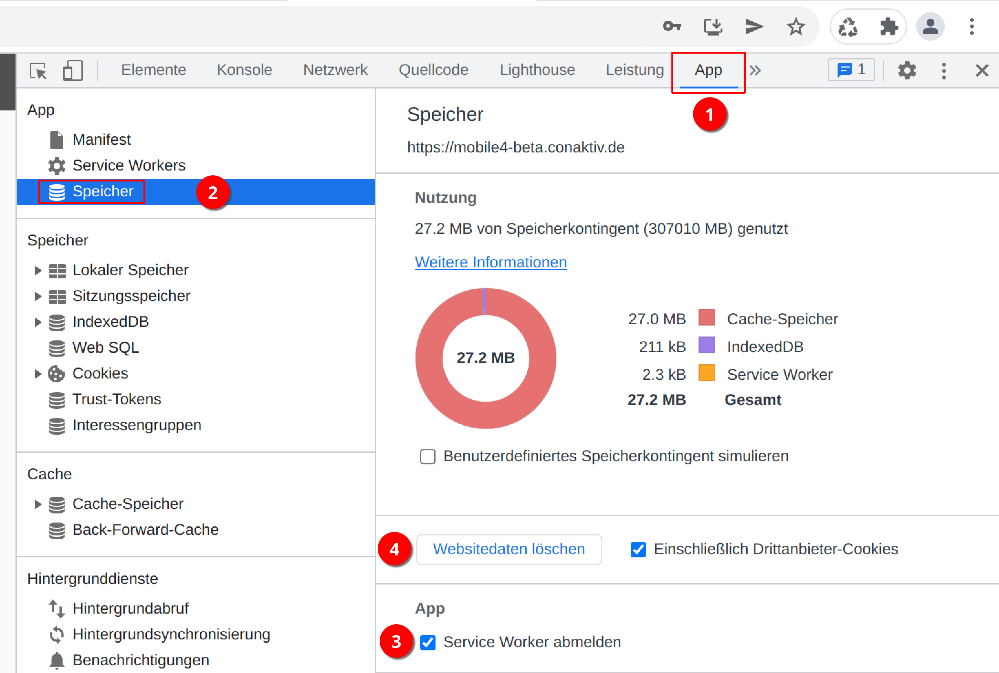

# Aktualisierung erzwingen

Wenn eine Aktualisierung des ConAktiv® Servers erfolgt, liegt meist auch eine neue Version der ConAktiv® Mobile4 bei.

Die neue Version der ConAktiv® Mobile4 wird in Ihrem Webbrowser geladen, wenn Sie wie gewohnt die URL zu Ihrer ConAktiv® Mobile4 Installation aufrufen.

In seltenen Fällen kann es vorkommen, dass Ihr Browser nicht automatisch die aktuellste Version der ConAktiv® Mobile4 lädt. In diesem Fall können Sie manuell die Aktualisierung erzwingen.

!!! info "Hinweis"
    Diese Art der Aktualisierung funktioniert dann, wenn Sie die ConAktiv® Mobile4 über eine sichere Verbindung ("https://") aufrufen.

## Aktualisierung im Google Chrome

### Aufruf der Entwicklertools

{ align=right }

Rufen Sie das Chrome-Menü über die drei Punkte rechts oben auf.

{ align=right }

Im Menü wählen Sie den Punkt "Weitere Tools" 1 und "Entwicklertools" 2.

### Die Entwicklertools

Es öffnet sich ein neuer Bereich mit den Entwicklertools.

Betätigen Sie hier den Tab "App" 1 und anschließend die Schaltfläche "Speicher" 2.

Vergewissern Sie sich, dass alle Haken einschließlich "Service Worker abmelden" 3 gesetzt sind.

Anschließend betätigen Sie die Schaltfläche "Websitedaten löschen" 4.

### Schließen der Entwicklertools

{ align=right }

Nun sind alle Daten für diese URL gelöscht. Schließen Sie die Entwicklertools durch Betätigen der Schaltfläche "X" rechts oben.

### Neuladen der ConAktiv® Mobile4

{ align=right }

Laden Sie die ConAktiv® Mobile4 einmal neu durch Drücken der Taste "F5" oder die Schaltfläche "Neu Laden" in der Webbrowser-Leiste.

Damit ist die manuelle Aktualisierung abgeschlossen.

## Aktualisierung im Microsoft Edge

Der Aufruf und Ablauf der manuellen Aktualisierung im Microsoft Edge Browser entspricht der Beschreibung für den Google Chrome Browser.

Unter dem Punkt [Die Entwicklertools](#die-entwicklertools) lautet lediglich die Bezeichnung für den Tab "App" "Anwendung".
