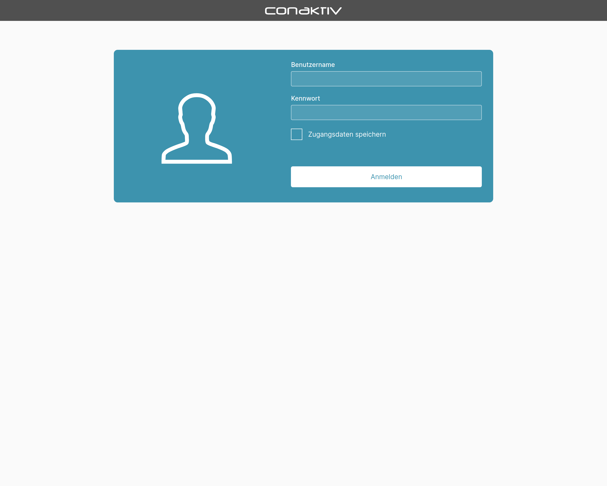
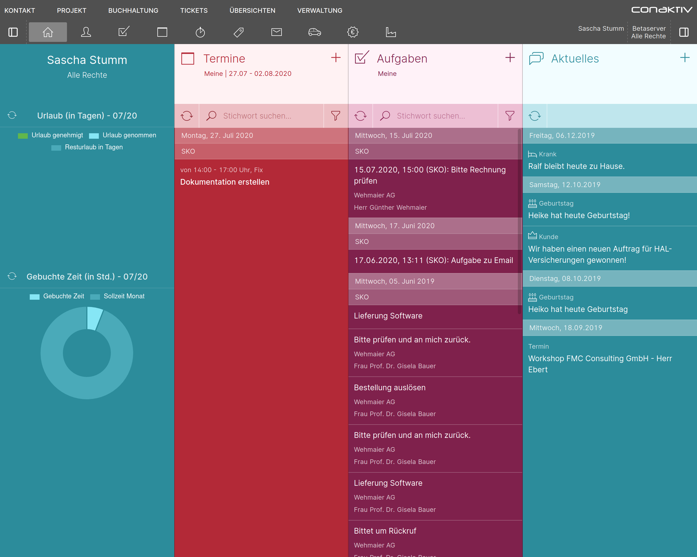

# Anmeldung an ConAktiv®

Starten Sie auf Ihrem Smartphone den Standard-Internetbrowser und geben Sie die Adresse zum Web-Server ein, auf dem ConAktiv® Mobile4 installiert ist.

Die Adresse des Web-Servers setzt sich zusammen aus einer IP-Adresse oder URL, gefolgt von "/mobile4/". Beachten Sie bitte, dass der letzte Schrägstrich unbedingt eingegeben werden muss, andernfalls wird lediglich eine leere Seite angezeigt.

Sollte Ihnen die IP-Adresse oder URL unbekannt sein, wenden Sie sich bitte an Ihren Systemadministrator.

=== "Desktop"
    

=== "Smartphone"
    

Geben Sie in dem sich öffnenden Dialog Ihren vollständigen ConAktiv®-Benutzernamen und Ihr Kennwort ein. Möchten Sie Ihre Zugangsdaten für zukünftige Anmeldungen speichern, dann aktivieren Sie die Checkbox „Zugangsdaten speichern“.

Betätigen Sie die Schaltfläche „Anmelden“.

In einem weiteren Dialog haben Sie die Möglichkeit, den Mandanten zu wählen, an welchen die Anmeldung erfolgen soll, gefolgt von der Benutzergruppe.

=== "Desktop"
    

=== "Smartphone"
    

Betätigen Sie die Schaltfläche „Weiter“, so erfolgt die Anmeldung an ConAktiv® und Sie gelangen auf die Startseite der ConAktiv® Mobile4.

=== "Desktop"
    

=== "Smartphone"
    
