# Arbeiten mit einem Modul

Da die Konfiguration für viele Module das gleiche Schema verfolgt, wird hier am Beispiel der Ansprechpartner erklärt, wie mit einem Modul gearbeitet werden kann.

## Listenfunktionen

### Datensätze anzeigen

Nach der [Navigation](../navigation/index.md) zu der Seite für die Ansprechpartner werden diese als Liste angezeigt.

=== "Desktop"

    

    In der Desktop Ansicht ist der Bildschirm aufgeteilt, mit der Liste der Ansprechpartner auf der linken Seite und rechts daneben die Datensatz Ansicht eines Eintrags.
    
    Die Liste ist so eingestellt, dass initial noch keine Datensätze angezeigt werden. Durch Klick auf den Button "Alle Datensätze anzeigen" werden diese geladen und angezeigt.

    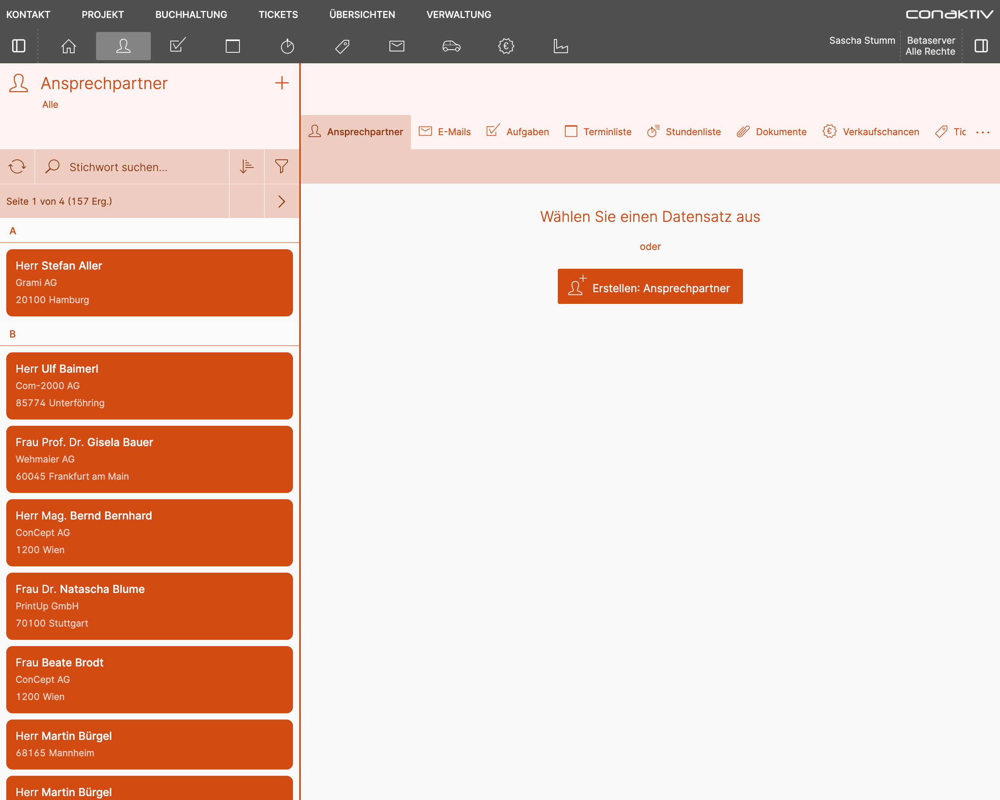

=== "Smartphone"

    ...

### Blättern

Werden mehr Ergebnisse gefunden, als die Liste pro Seite anzeigen kann, wird ein Blättern-Element eingeblendet.

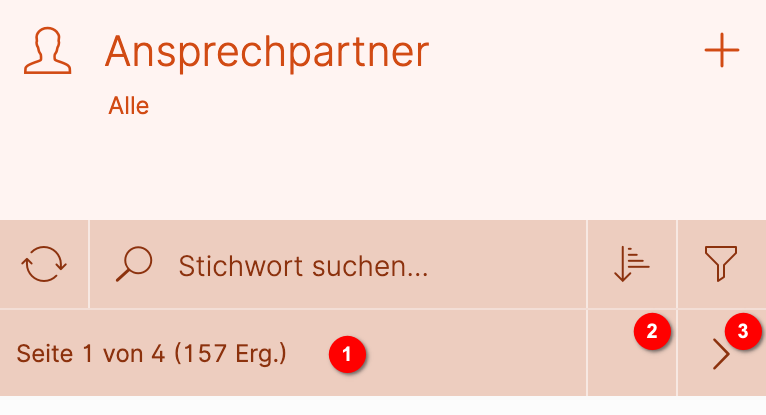

Mit Klick auf 2 wird eine Seite zurück, mit Klick auf 3 eine Seite weitergeblättert.

Durch Klick auf 1 öffnet sich ein Popupfenster, in dem weitere Informationen angezeigt und in größeren Sprüngen zwischen den Seiten navigiert werden kann.

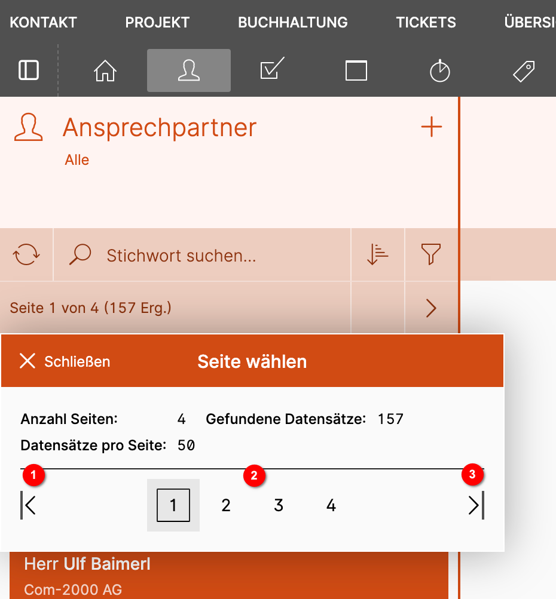

1 springt zur ersten Seite.

3 springt zur letzten Seite.

2 erlaubt den Sprung zu einer der benachbarten Seiten.

### Freitextsuche

Durch Klick auf das Eingabefeld "Stichwort suchen" können Sie eine Freitextsuche in der Liste starten.

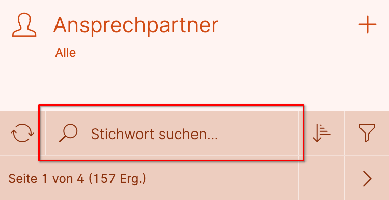

Ein kleines Popup zeigt, in welchen Datensatzfeldern die Suche stattfindet.

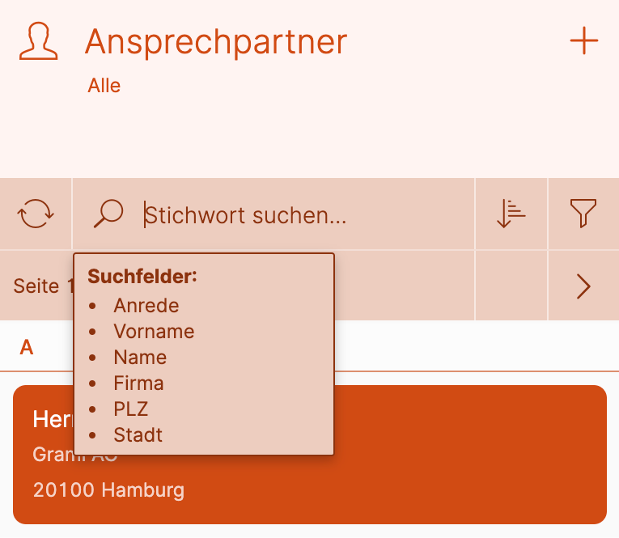

Die Suche ist unscharf, d.h. für die Suche nach "Stefan Aller" können Sie stattdessen auch nur "Stefan" oder  "Ste" oder "Aller" eingeben.

Nach Betätigen der Eingabe- oder Tabtaste erscheinen die Suchergebnisse. Mit Klick auf "X" 1 wird die Freitextsuche zurückgesetzt.

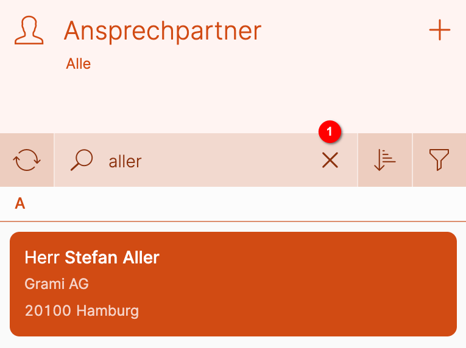

### Filter anwenden

Neben der Freitextsuche gibt es weitere Möglichkeiten, um die Ergebnisse einzuengen.

Diese werden in der ConAktiv® Mobile4 "Filter" genannt und verbergen sich hinter dem Filter-Icon:

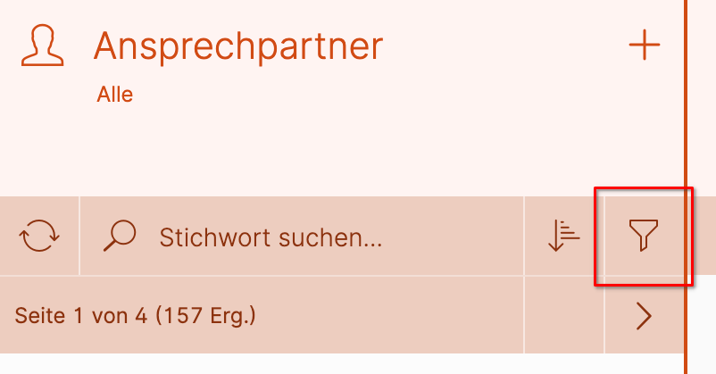

Dieses öffnet nach einem Klick eine Seitenleiste mit den für diese Liste konfigurierten Filtern:

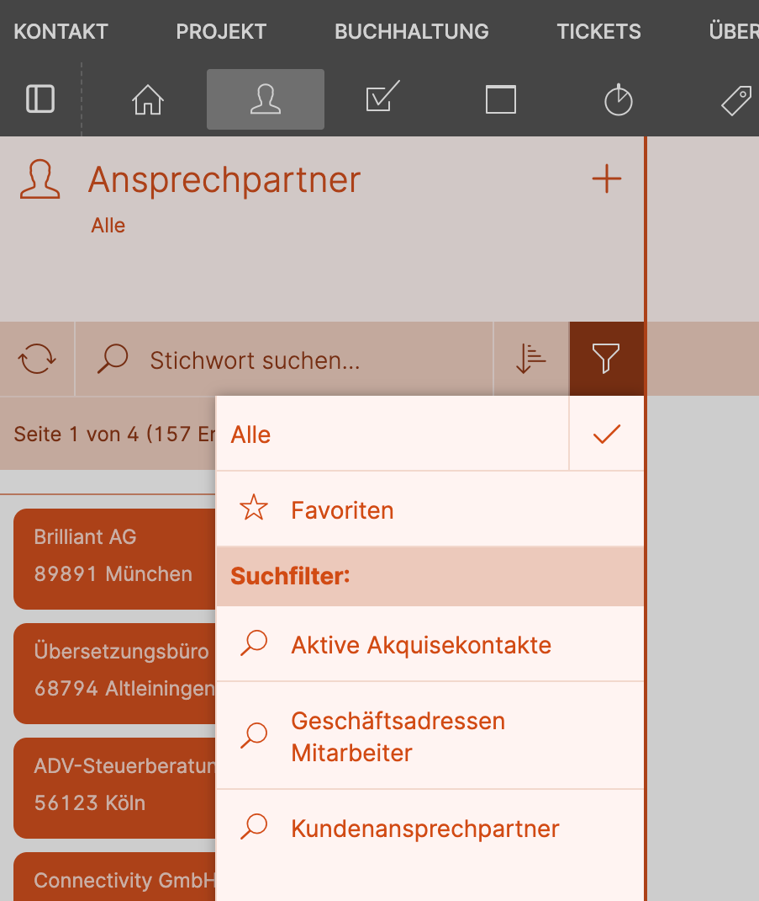

In diesem Beispiel stehen drei Filter zur Verfügung:

1. Alle
2. Favoriten
3. Suchfilter

### Sortierung anzeigen

Die Sortierung einer Liste lässt sich durch einen Klick auf den "Sortierung"-Button anzeigen:

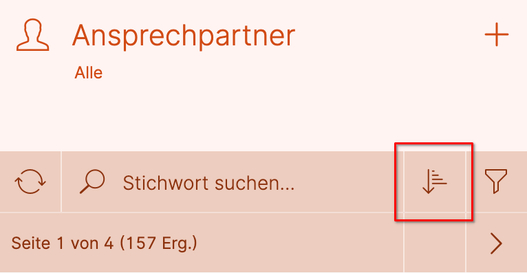

Es erscheint ein Popup, in dem alle Felder aufgeführt sind, nach denen die Liste sortiert ist:

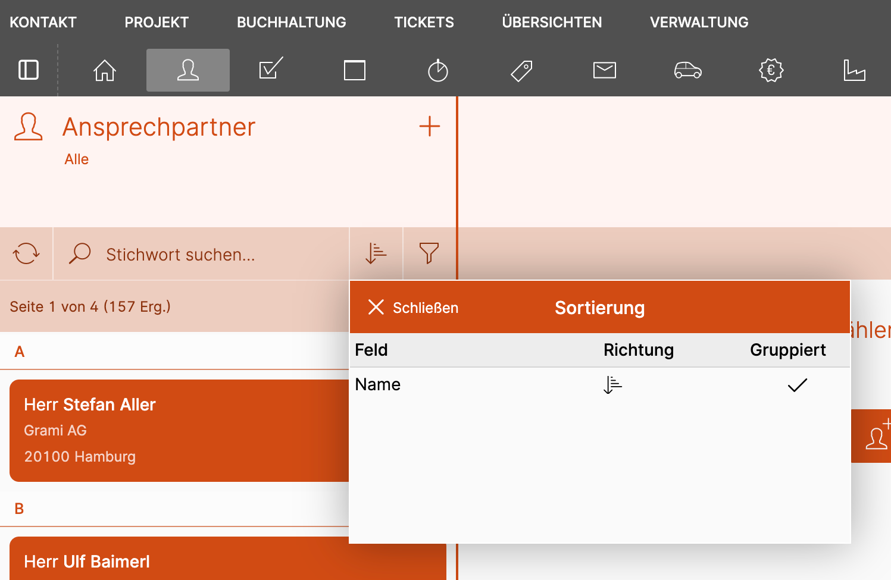

**"Feld"** zeigt den Feldnamen an, wie er in der Struktur vom Anwender hinterlegt wurde.

**"Richtung"** zeigt an, ob auf- oder absteigend sortiert wird.

Wird nach dem Feld gruppiert, zeigt die Spalte **"Gruppiert"** einen Haken an.

## Datensatz

### Anzeige

Um einen Datensatz anzuzeigen und zu ändern, wählen Sie den gewünschten Eintrag in der Liste an.

=== "Desktop"

    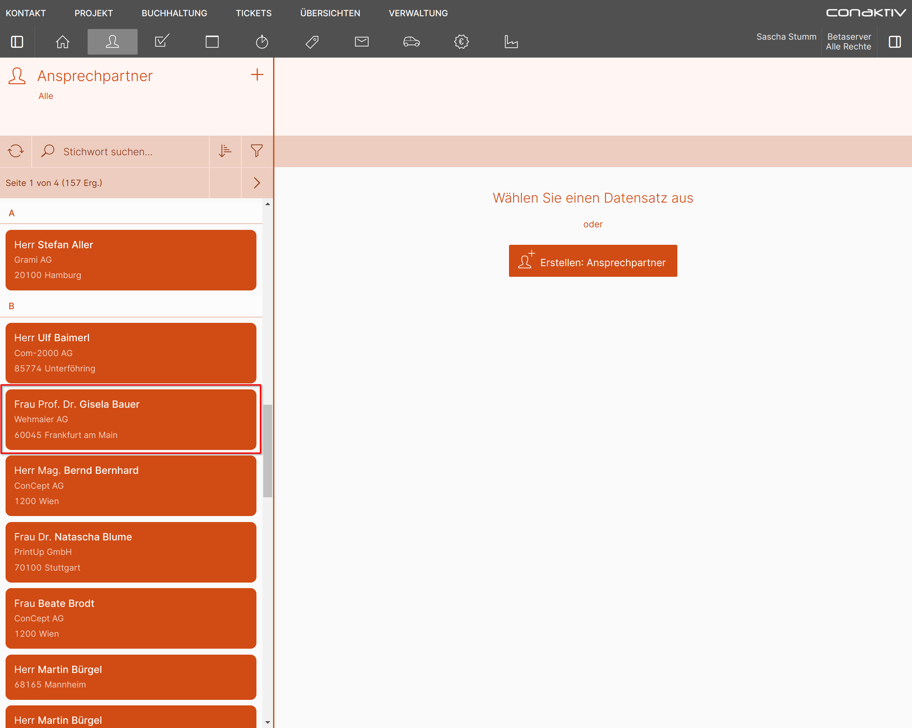

=== "Smartphone"

    ...

Sie gelangen zur Datensatzansicht, die alle Details anzeigt.

=== "Desktop"

    Diese gliedert sich in verschiedene Bereiche:

    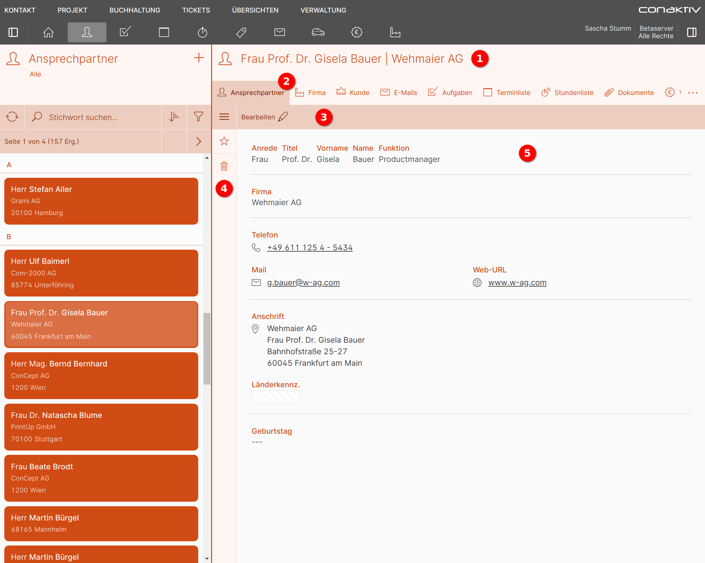

    #### 1 Titel

    Zeigt die wichtigsten Informationen zum geladenen Datensatz an.

    #### 2 Verknüpfte Daten

    Ganz links befindet sich in dieser Tableiste immer der Hauptdatensatz (in diesem Beispiel "Ansprechpartner"). Daneben befinden sich Reiter, die auf mit diesem Hauptdatensatz verknüpfte Daten Zugriff gewähren.

    Sollte der Platz für die verknüpften Daten nicht ausreichen, wird ein Knopf mit drei Punkten angezeigt. Ein Klick auf diesen öffnet ein Popup, in dem alle Verknüpfungen als Liste angezeigt werden.

    

    

    #### 3 Werkzeugleiste

    In dieser Leiste finden sich Knöpfe zum Bearbeiten des Datensatzes oder (im Bearbeitungsmodus) auch zum Speichern. Je nach Modul können hier auch weitere Funktionen angezeigt werden.

    #### 4 Seitenleiste

    Weitere Funktionen finden sich in der Seitenleiste. Diese wird mit Klick auf den Seitenleistenknopf in der Werkzeugleiste geöffnet:

    

    

    #### 5 Datensatz

    Im Datensatz-Bereich wird die Anzeige- und Eingabemaske angezeigt.

=== "Smartphone"

    ...

### Bearbeiten

=== "Desktop"

    Wenn Sie die geöffnete Info bearbeiten möchten, betätigen Sie in der Werkzeugleiste die Schaltfläche "Bearbeiten" 1.

    Oder fahren Sie in der Infoliste mit der Maus über einen Eintrag und wählen die Direktaktion "Bearbeiten" 2.

    ...

    ...

    Die Seite zur Bearbeitung einer Info wird geöffnet und Sie können die gewünschten Änderungen vornehmen.

    Haben Sie alle Änderungen erledigt und möchten Sie diese speichern, dann betätigen Sie die Schaltfläche "Speichern" 1.

    Möchten Sie die getätigten Änderungen verwerfen, dann betätigen Sie die Schaltfläche "Abbrechen" 2.

    ...

    Sie gelangen zurück auf die Infoliste bzw. auf die Datensatzansicht der Info.

=== "Smartphone"

    ...

    Wenn Sie die geöffnete Info bearbeiten möchten, betätigen Sie in der Werkzeugleiste die Schaltfläche "Bearbeiten" 1.

    

    ...

    Oder ziehen Sie in der Infoliste mit dem Finger nach links über einen Eintrag und wählen die Direktaktion "Bearbeiten" 2.

    

    ...

    Die Seite zur Bearbeitung einer Info wird geöffnet und Sie können die gewünschten Änderungen vornehmen.

    Haben Sie alle Änderungen erledigt und möchten Sie diese speichern, dann betätigen Sie die Schaltfläche "Speichern" 1.

    Möchten Sie die getätigten Änderungen verwerfen, dann betätigen Sie die Schaltfläche "Abbrechen" 2.

    

    Sie gelangen zurück auf die Infoliste bzw. auf die Datensatzansicht der Info.

### Erstellen

=== "Desktop"

    Um eine neue Info zu erstellen, betätigen Sie in der Infoliste die Schaltfläche "+" 1.

    ...

    Sie gelangen auf die Seite „Erstellen: Info“, auf der Sie in den zur Verfügung stehenden Feldern die gewünschten Eingaben erledigen können.

    Nach Abschluss der Eingaben betätigen Sie die Schaltfläche "Speichern" 1, um die Info zu speichern. Betätigen Sie die Schaltfläche "Abbrechen" 2, um die erfassten Informationen nicht zu speichern.

    ...

    Sie gelangen zurück in die Infoliste.

=== "Smartphone"

    ...

    Um eine neue Info zu erstellen, betätigen Sie in der Infoliste die Schaltfläche "+" 1.

    

    ...

    Sie gelangen auf die Seite „Erstellen: Info“, auf der Sie in den zur Verfügung stehenden Feldern die gewünschten Eingaben erledigen können.

    Nach Abschluss der Eingaben betätigen Sie die Schaltfläche "Speichern" 1, um die Info zu speichern. Betätigen Sie die Schaltfläche "Abbrechen" 2, um die erfassten Informationen nicht zu speichern.

    

    Sie gelangen zurück in die Infoliste.

### Löschen

=== "Desktop"

    Wenn Sie die geöffnete Info löschen möchten, öffnen Sie die Seitenleiste 1 und klicken Sie auf "Löschen" 2.

    ...

    ...

    Oder fahren Sie in der Infoliste mit der Maus über einen Eintrag und wählen die Direktaktion "Löschen" 3.

    ...

    Sie gelangen auf die Datensatzansicht der Info, wo Sie im Abfragebereich "Löschen" 1 wählen, um die Info endgültig zu löschen, oder "Abbrechen" 2, um zurück auf die Infoliste bzw. auf die Datensatzansicht der Info zu gelangen.

    ...

=== "Smartphone"

    ...

    Wenn Sie die geöffnete Info löschen möchten, öffnen Sie die Seitenleiste ... 1

    

    ...

    und klicken Sie auf "Löschen" 2.

    

    ...

    Oder ziehen Sie in der Infoliste mit dem Finger nach links über einen Eintrag und wählen die Direktaktion "Löschen" 3.

    

    ...

    Sie gelangen auf die Datensatzansicht der Info, wo Sie im Abfragebereich "Löschen" 1 wählen, um die Info endgültig zu löschen, oder "Abbrechen" 2, um zurück auf die Infoliste bzw. auf die Datensatzansicht der Info zu gelangen.

    

