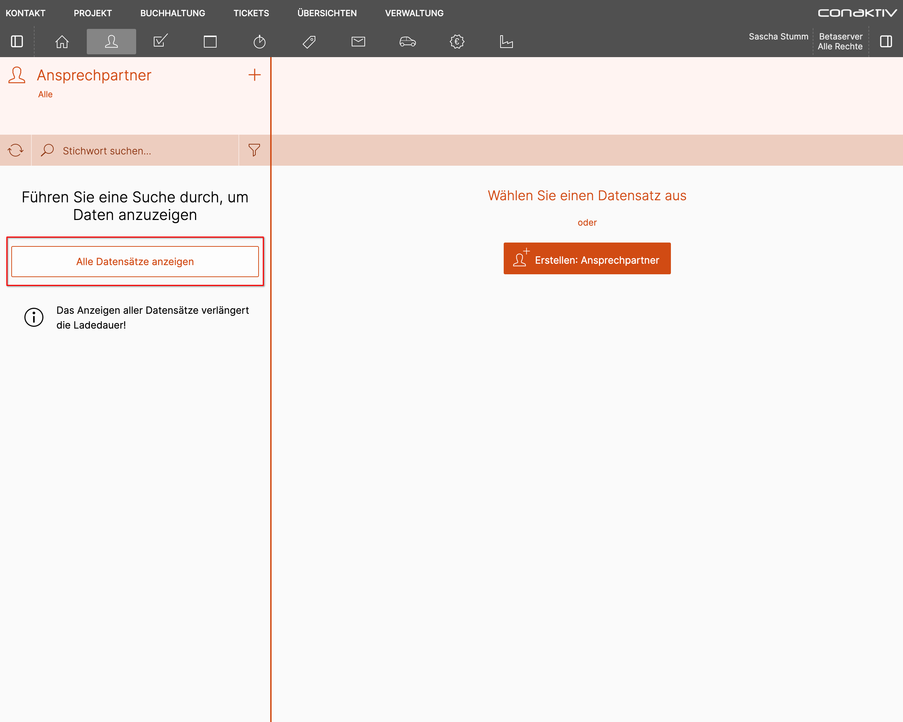
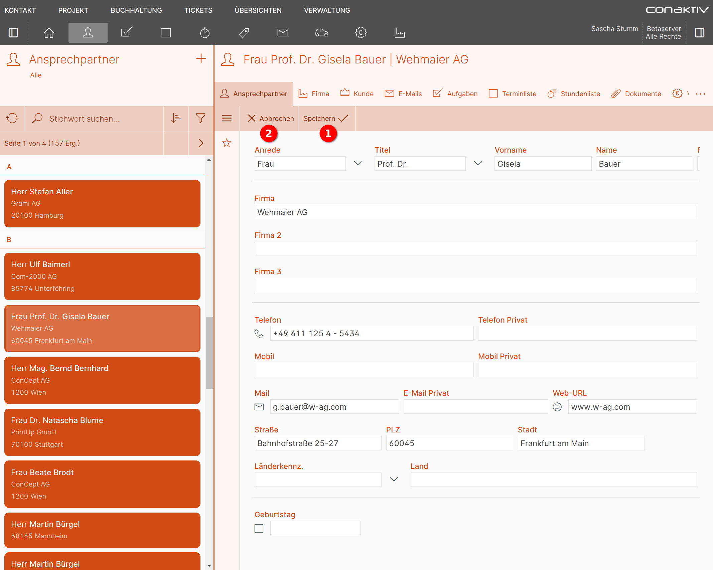

# Arbeiten mit einem Modul

Da die Konfiguration für viele Module das gleiche Schema verfolgt, wird hier am Beispiel der Ansprechpartner erklärt, wie mit einem Modul gearbeitet werden kann.

## Listenfunktionen

### Datensätze anzeigen

Nach der [Navigation](../navigation/index.md) zu der Seite für die Ansprechpartner werden diese als Liste angezeigt.

=== "Desktop"

    

    In der Desktop Ansicht ist der Bildschirm aufgeteilt, mit der Liste der Ansprechpartner auf der linken Seite und rechts daneben die Datensatz Ansicht eines Eintrags.
    
    Die Liste ist so eingestellt, dass initial noch keine Datensätze angezeigt werden. Durch Klick auf den Button "Alle Datensätze anzeigen" werden diese geladen und angezeigt.

    

=== "Smartphone"

    { align=right }

    Diese Liste ist so eingestellt, dass initial noch keine Datensätze angezeigt werden. Durch Klick auf den Button "Alle Datensätze anzeigen" werden diese geladen und angezeigt.

    

    { align=right }

    Die Liste der Ansprechpartner auf dem Smartphone.

    

### Blättern

{align=right}

Werden mehr Ergebnisse gefunden, als die Liste pro Seite anzeigen kann, wird ein Blättern-Element eingeblendet.

Mit Klick auf 2 wird eine Seite zurück, mit Klick auf 3 eine Seite weitergeblättert.

Durch Klick auf 1 öffnet sich ein Popupfenster, in dem weitere Informationen angezeigt und in größeren Sprüngen zwischen den Seiten navigiert werden kann.

{align=right}

1 springt zur ersten Seite.

3 springt zur letzten Seite.

2 erlaubt den Sprung zu einer der benachbarten Seiten.

### Freitextsuche

{align=right}

Durch Klick auf das Eingabefeld "Stichwort suchen" können Sie eine Freitextsuche in der Liste starten.

{align=right}

Ein kleines Popup zeigt, in welchen Datensatzfeldern die Suche stattfindet.

Die Suche ist unscharf, d.h. für die Suche nach "Stefan Aller" können Sie stattdessen auch nur "Stefan" oder  "Ste" oder "Aller" eingeben.

{align=right}

Nach Betätigen der Eingabe- oder Tabtaste erscheinen die Suchergebnisse. Mit Klick auf "X" 1 wird die Freitextsuche zurückgesetzt.

### Filter anwenden

{align=right}

Neben der Freitextsuche gibt es weitere Möglichkeiten, um die Ergebnisse einzuengen.

Diese werden in der ConAktiv® Mobile4 "Filter" genannt und verbergen sich hinter dem Filter-Icon.

{align=right}

Dieses öffnet nach einem Klick eine Seitenleiste mit den für diese Liste konfigurierten Filtern.

In diesem Beispiel stehen drei Filter zur Verfügung:

1. Alle
2. Favoriten
3. Suchfilter

### Sortierung anzeigen

{align=right}

Die Sortierung einer Liste lässt sich durch einen Klick auf den "Sortierung"-Button anzeigen.

{align=right}

Es erscheint ein Popup, in dem alle Felder aufgeführt sind, nach denen die Liste sortiert ist.

**"Feld"** zeigt den Feldnamen an, wie er in der Struktur vom Anwender hinterlegt wurde.

**"Richtung"** zeigt an, ob auf- oder absteigend sortiert wird.

Wird nach dem Feld gruppiert, zeigt die Spalte **"Gruppiert"** einen Haken an.

## Datensatz

### Anzeige

=== "Desktop"

    Um einen Datensatz anzuzeigen, wählen Sie den gewünschten Eintrag in der Liste an.

    

    Dadurch erscheint auf der rechten Seite die Datensatzansicht mit allen Details.

    Diese gliedert sich in verschiedene Bereiche:

    

    **1 Titel**

    Zeigt die wichtigsten Informationen zum geladenen Datensatz an.

    **2 Verknüpfte Daten**

    Ganz links befindet sich in dieser Tableiste immer der Hauptdatensatz (in diesem Beispiel "Ansprechpartner"). Daneben befinden sich Reiter, die auf mit diesem Hauptdatensatz verknüpfte Daten Zugriff gewähren.

    {align=right}

    {align=right}

    Sollte der Platz für die verknüpften Daten nicht ausreichen, wird eine Schaltfläche mit drei Punkten angezeigt. Ein Klick auf diese öffnet ein Popup, in dem alle Verknüpfungen als Liste angezeigt werden.

    

    **3 Werkzeugleiste**

    In dieser Leiste finden sich Knöpfe zum Bearbeiten des Datensatzes oder (im Bearbeitungsmodus) auch zum Speichern. Je nach Modul können hier auch weitere Funktionen angezeigt werden.

    **4 Seitenleiste**

    {align=right}

    {align=right}

    Weitere Funktionen finden sich in der Seitenleiste. Diese wird mit Klick auf die Seitenleisten-Schaltfläche in der Werkzeugleiste geöffnet:

    

    **5 Datensatz**

    Im Datensatz-Bereich wird die Anzeige- und Eingabemaske angezeigt.

=== "Smartphone"

    {align=right}

    Um einen Datensatz anzuzeigen, tippen Sie den gewünschten Eintrag in der Liste an.

    

    Sie gelangen zur Seite für die Datensatzansicht, die alle Details anzeigt. Diese gliedert sich in verschiedene Bereiche:

    {align=right}

    **1 Navigationsleiste**

    Die Navigationsleiste zeigt an, von welchen Seiten man auf die aktuelle Seite gekommen ist. Durch Klick auf einen Eintrag oder den Pfeil ganz links gelangt man eine Seite zurück.

    **2 Titel**

    Zeigt die wichtigsten Informationen zum geladenen Datensatz an.

    **3 Werkzeugleiste mit Seitenleisten-Schaltfläche**

    In dieser Leiste finden sich Knöpfe zum Bearbeiten des Datensatzes oder (im Bearbeitungsmodus) auch zum Speichern. Je nach Modul können hier auch weitere Funktionen angezeigt werden.

    **4 Datensatz**

    Im Datensatz-Bereich wird die Anzeige- und Eingabemaske angezeigt.

    

### Bearbeiten

=== "Desktop"

    {align=right}

    Um den geöffneten Datensatz zu bearbeiten, betätigen Sie in der Werkzeugleiste die Schaltfläche "Bearbeiten" 1.

    

    {align=right}

    Oder fahren Sie in der Liste mit der Maus über einen Eintrag und wählen die Direktaktion "Bearbeiten" 2.

    

    Im Datensatz-Bereich wird die Bearbeitungsmaske geöffnet.

    

    Haben Sie alle Änderungen erledigt und möchten diese speichern, dann betätigen Sie die Schaltfläche "Speichern" 1.

    Um die getätigten Änderungen zu verwerfen, betätigen Sie die Schaltfläche "Abbrechen" 2.

    Sie gelangen in beiden Fällen zurück in den Ansichtsmodus.

=== "Smartphone"

    {align=right}

    Um den geöffneten Datensatz zu bearbeiten, betätigen Sie in der Werkzeugleiste die Schaltfläche "Bearbeiten" 1.

    

    {align=right}

    Oder ziehen Sie in der Liste mit dem Finger nach links und tippen Sie auf die Direktaktion "Bearbeiten" 2.

    

    Im Datensatz-Bereich wird die Bearbeitungsmaske geöffnet.

    {align=right}

    Haben Sie alle Änderungen erledigt und möchten Sie diese speichern, dann betätigen Sie die Schaltfläche "Speichern und Schließen" 1.

    Möchten Sie die getätigten Änderungen verwerfen, dann betätigen Sie die Schaltfläche "X" 2.

    Sind Sie über die Liste gekommen, gelangen Sie nun dorthin zurück, andernfalls in die Datensatzansicht.

    

### Erstellen

=== "Desktop"

    Um einen neuen Datensatz zu erstellen, betätigen Sie in der Liste die Schaltfläche "+" 1 oder in der Datensatz-Ansicht die Schaltfläche "Erstellen: Ansprechpartner" 2.

    

    In der Datensatz-Ansicht öffnet sich die Eingabemaske, in der Sie in den zur Verfügung stehenden Feldern die gewünschten Eingaben erledigen können.

    

    Nach Abschluss der Eingaben betätigen Sie die Schaltfläche "Speichern" 1, um den Datensatz zu speichern. Betätigen Sie die Schaltfläche "Abbrechen" 2, um die erfassten Informationen nicht zu speichern.

=== "Smartphone"

    {align=right}

    Um eine neue Info zu erstellen, betätigen Sie in der Liste die Schaltfläche "+".

    

    {align=right}

    Sie gelangen auf die Seite "Erstellen: Ansprechpartner", auf der Sie in den zur Verfügung stehenden Feldern die gewünschten Eingaben erledigen können.

    Nach Abschluss der Eingaben betätigen Sie die Schaltfläche "Speichern" 1, um den Datensatz zu speichern.

    Klicken Sie in der Navigationsleiste auf den Pfeil nach links 2, um die erfassten Informationen nicht zu speichern.

    

    Sie gelangen zurück in die Liste.

### Löschen

=== "Desktop"

    {align=right}

    Um den geöffneten Datensatz zu löschen, fahren Sie mit der Maus in der Seitenleiste über das Mülleimer-Symbol 1.

    

    {align=right}

    Dieses erweitert sich und zeigt den Text "Löschen" an 2.

    Klicken Sie nun, um in die Löschen-Ansicht zu gelangen.

    

    !!! info "Manche Listen bieten auch eine Direktaktion zum Löschen, die beim Überfahren des Listeneintrags angezeigt wird."

    

    Wählen Sie hier "Löschen" 1, um den Datensatz endgültig zu löschen, oder "Abbrechen" 2.

=== "Smartphone"

    {align=right}

    Um den geöffneten Datensatz zu löschen, öffnen Sie zunächst die Seitenleiste über das Hamburger-Symbol.

    

    {align=right}

    In der geöffneten Seitenleiste tippen Sie die Schaltfläche "Löschen" an.

    

    !!! info "Manche Listen bieten auch eine Direktaktion zum Löschen, die durch Ziehen nach links über dem Listeneintrag angezeigt wird."

    {align=right}

    Wählen Sie hier "Löschen" 1, um den Datensatz endgültig zu löschen, oder "Abbrechen" 2.

    

