# Arbeiten mit Infos

=== "Desktop"

    Direkt auf der Startseite werden Ihnen in der Standardauslieferung der ConAktiv® Mobile die Infos angezeigt 1.

    Natürlich gibt es auch eine eigene Seite für die Infos, die über die [Menüleiste](../navigation/) erreichbar ist 2.

    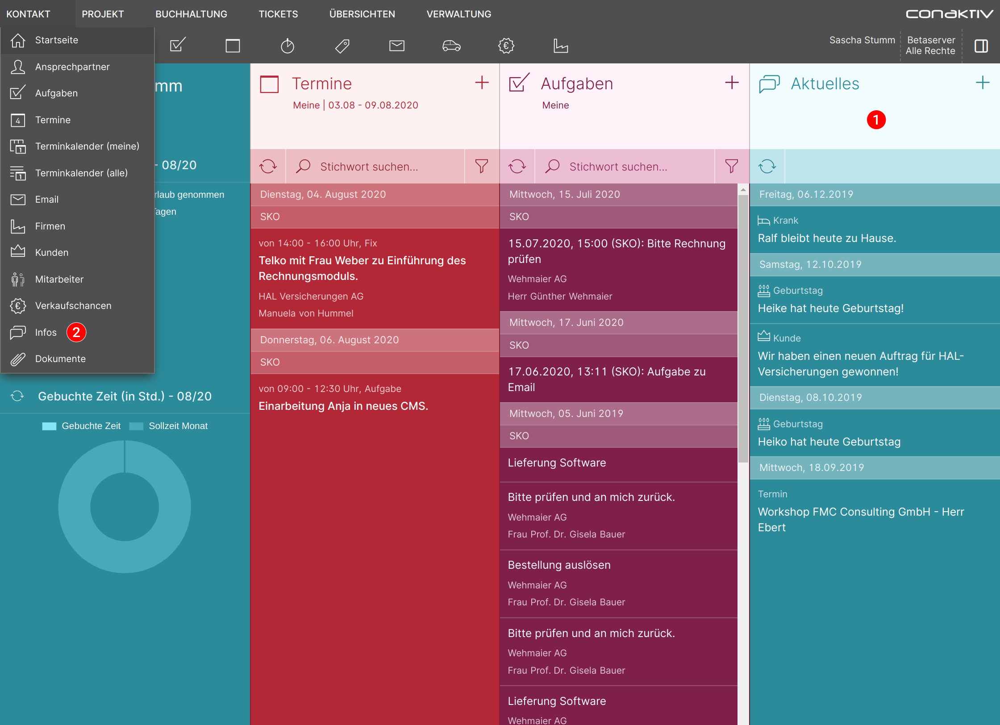

=== "Smartphone"

    Die Infos werden Ihnen in der Standardauslieferung der ConAktiv® Mobile direkt als erste Seite nach dem Anmelden angezeigt.

    

## Anzeigen

Um eine Info anzuzeigen und zu ändern, wählen Sie den gewünschten Eintrag in der Infoliste an.

=== "Desktop"

    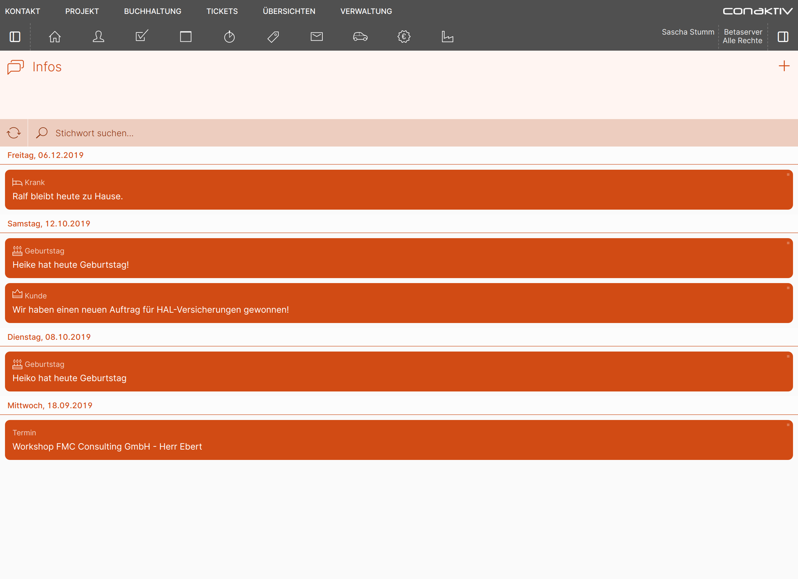

=== "Smartphone"

    

Sie gelangen zur Datensatzansicht der Info, die alle Details anzeigt.

Möchten Sie wieder zurück zur Infoliste, betätigen Sie die Schaltfläche "Zur Liste" 1.

=== "Desktop"

    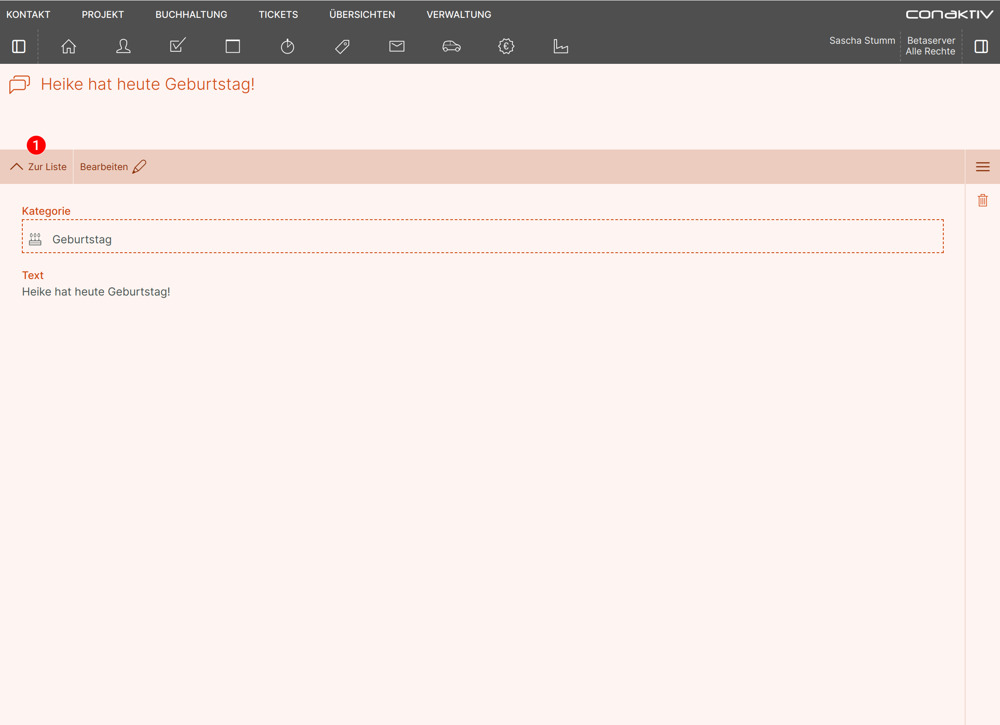

=== "Smartphone"

    

## Bearbeiten

=== "Desktop"

    Wenn Sie die geöffnete Info bearbeiten möchten, betätigen Sie in der Werkzeugleiste die Schaltfläche "Bearbeiten" 1.

    Oder fahren Sie in der Infoliste mit der Maus über einen Eintrag und wählen die Direktaktion "Bearbeiten" 2.

    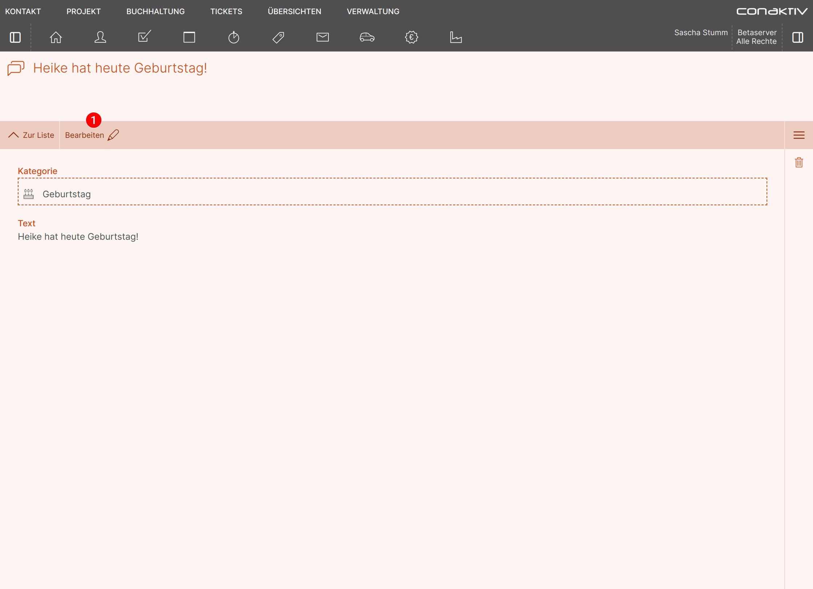

    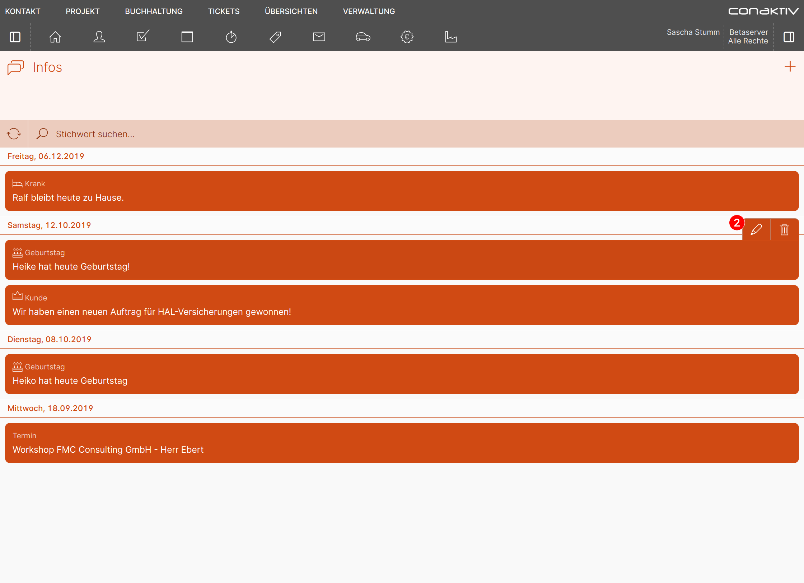

    Die Seite zur Bearbeitung einer Info wird geöffnet und Sie können die gewünschten Änderungen vornehmen.

    Haben Sie alle Änderungen erledigt und möchten Sie diese speichern, dann betätigen Sie die Schaltfläche "Speichern" 1.

    Möchten Sie die getätigten Änderungen verwerfen, dann betätigen Sie die Schaltfläche "Abbrechen" 2.

    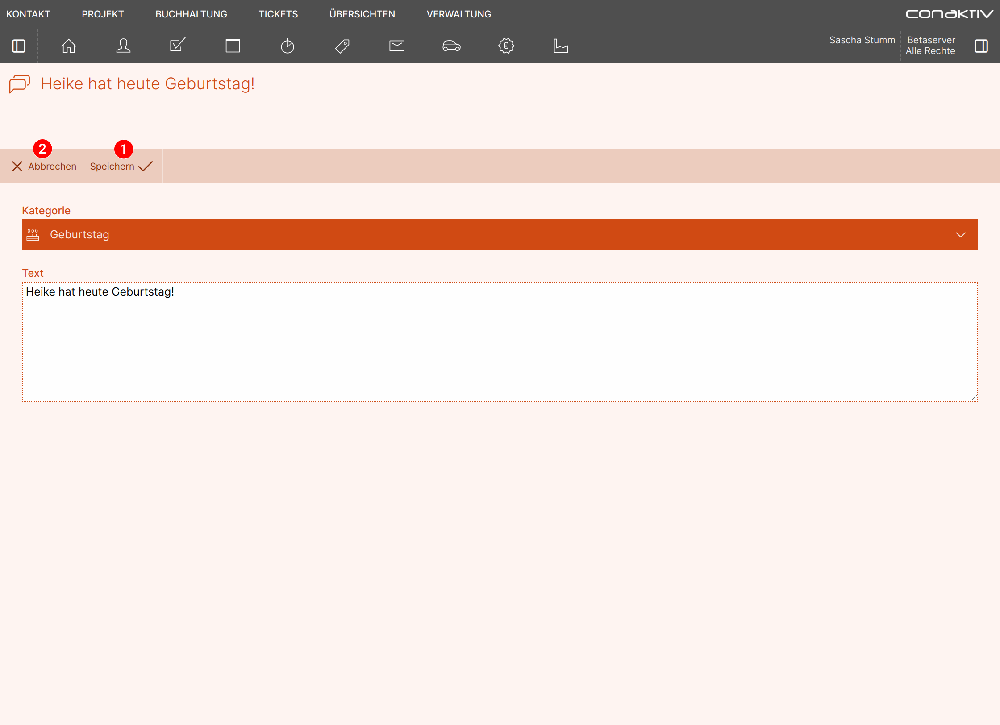

    Sie gelangen zurück auf die Infoliste bzw. auf die Datensatzansicht der Info.

=== "Smartphone"

    { align=right }

    Wenn Sie die geöffnete Info bearbeiten möchten, betätigen Sie in der Werkzeugleiste die Schaltfläche "Bearbeiten" 1.

    

    { align=right }

    Oder ziehen Sie in der Infoliste mit dem Finger nach links über einen Eintrag und wählen die Direktaktion "Bearbeiten" 2.

    

    { align=right }

    Die Seite zur Bearbeitung einer Info wird geöffnet und Sie können die gewünschten Änderungen vornehmen.

    Haben Sie alle Änderungen erledigt und möchten Sie diese speichern, dann betätigen Sie die Schaltfläche "Speichern" 1.

    Möchten Sie die getätigten Änderungen verwerfen, dann betätigen Sie die Schaltfläche "Abbrechen" 2.

    

    Sie gelangen zurück auf die Infoliste bzw. auf die Datensatzansicht der Info.

## Erstellen

=== "Desktop"

    Um eine neue Info zu erstellen, betätigen Sie in der Infoliste die Schaltfläche "+" 1.

    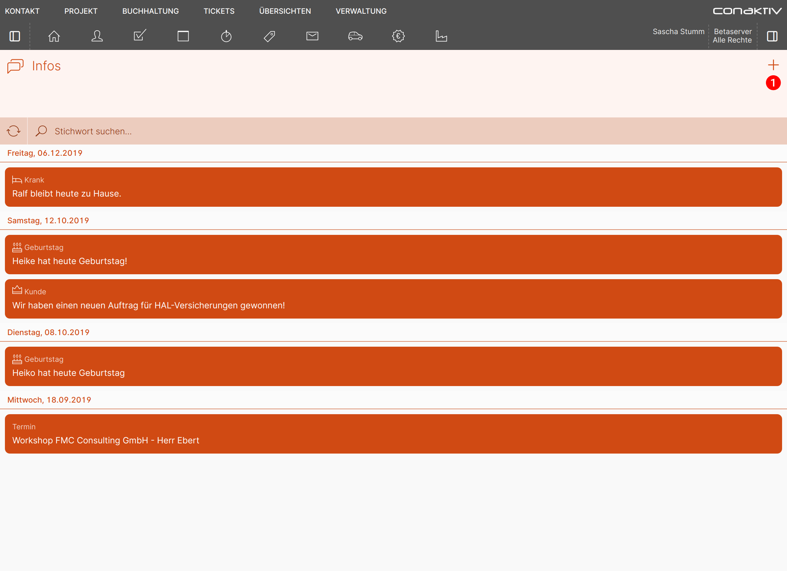

    Sie gelangen auf die Seite „Erstellen: Info“, auf der Sie in den zur Verfügung stehenden Feldern die gewünschten Eingaben erledigen können.

    Nach Abschluss der Eingaben betätigen Sie die Schaltfläche "Speichern" 1, um die Info zu speichern. Betätigen Sie die Schaltfläche "Abbrechen" 2, um die erfassten Informationen nicht zu speichern.

    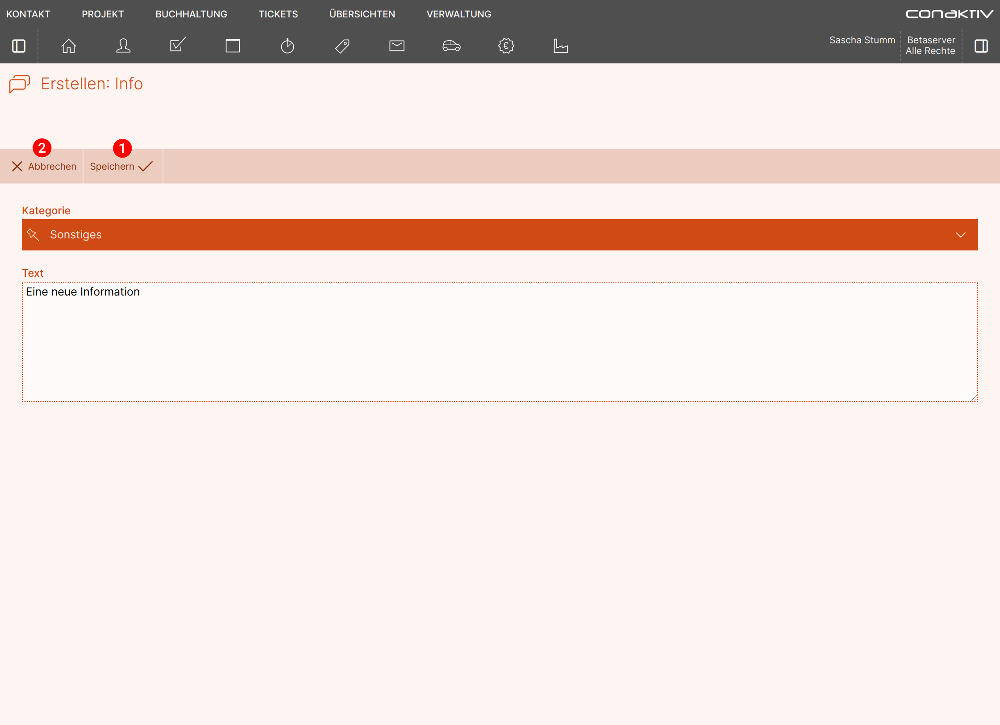

    Sie gelangen zurück in die Infoliste.

=== "Smartphone"

    { align=right }

    Um eine neue Info zu erstellen, betätigen Sie in der Infoliste die Schaltfläche "+" 1.

    

    { align=right } 

    Sie gelangen auf die Seite „Erstellen: Info“, auf der Sie in den zur Verfügung stehenden Feldern die gewünschten Eingaben erledigen können.

    Nach Abschluss der Eingaben betätigen Sie die Schaltfläche "Speichern" 1, um die Info zu speichern. Betätigen Sie die Schaltfläche "Abbrechen" 2, um die erfassten Informationen nicht zu speichern.

    

    Sie gelangen zurück in die Infoliste.

## Löschen

=== "Desktop"

    Wenn Sie die geöffnete Info löschen möchten, öffnen Sie die Seitenleiste 1 und klicken Sie auf "Löschen" 2.

    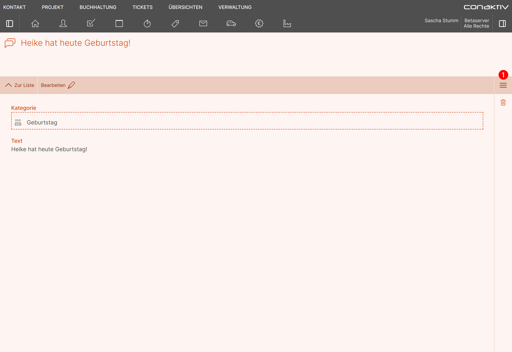

    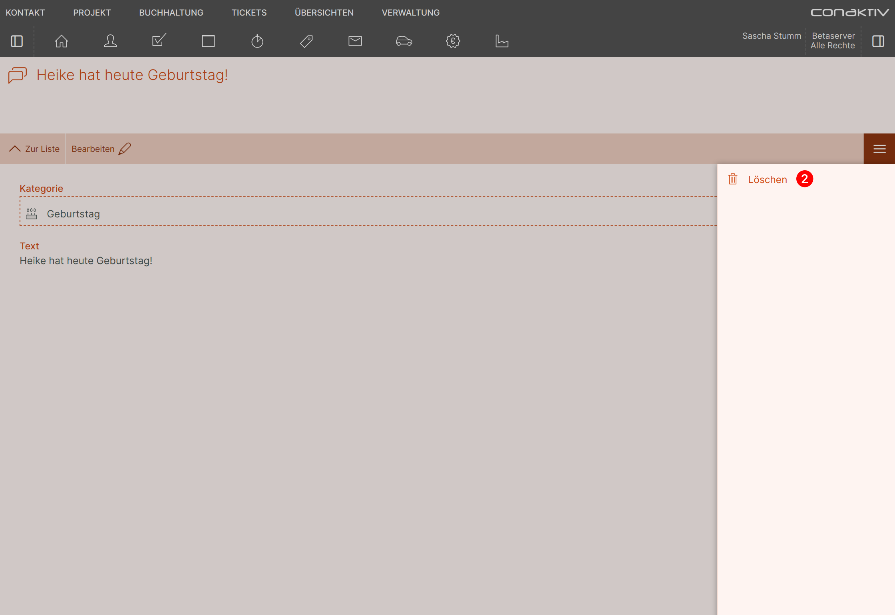

    Oder fahren Sie in der Infoliste mit der Maus über einen Eintrag und wählen die Direktaktion "Löschen" 3.

    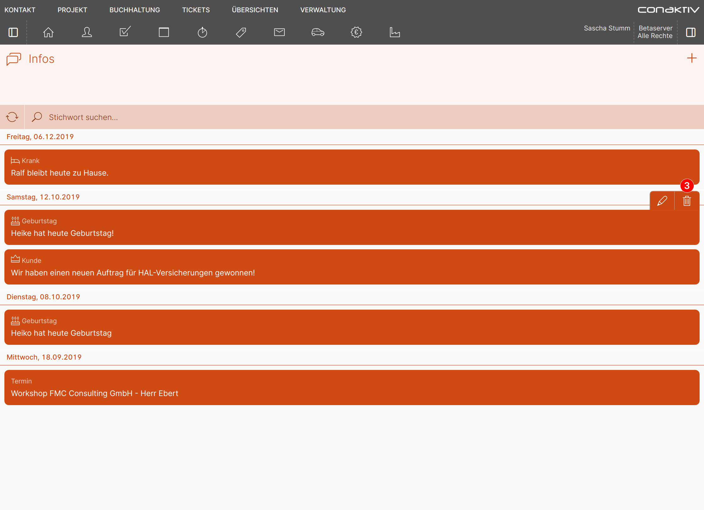

    Sie gelangen auf die Datensatzansicht der Info, wo Sie im Abfragebereich "Löschen" 1 wählen, um die Info endgültig zu löschen, oder "Abbrechen" 2, um zurück auf die Infoliste bzw. auf die Datensatzansicht der Info zu gelangen.

    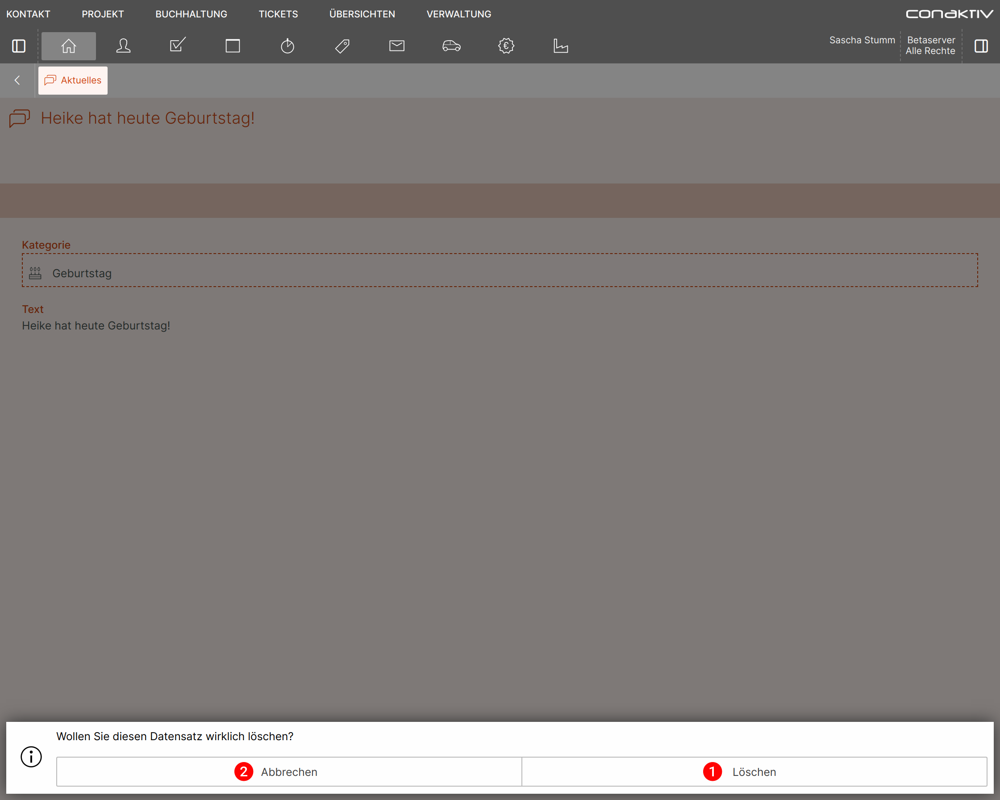

=== "Smartphone"

    { align=right } 

    Wenn Sie die geöffnete Info löschen möchten, öffnen Sie die Seitenleiste ... 1

    

    { align=right } 

    und klicken Sie auf "Löschen" 2.

    

    { align=right } 

    Oder ziehen Sie in der Infoliste mit dem Finger nach links über einen Eintrag und wählen die Direktaktion "Löschen" 3.

    

    { align=right } 

    Sie gelangen auf die Datensatzansicht der Info, wo Sie im Abfragebereich "Löschen" 1 wählen, um die Info endgültig zu löschen, oder "Abbrechen" 2, um zurück auf die Infoliste bzw. auf die Datensatzansicht der Info zu gelangen.

    

## Suchen

{ align=right }

Durch Tippen auf das Eingabefeld "Stichwort suchen" 1 können Sie eine Freitextsuche in der Infoliste starten. Ein kleines Popup 2 zeigt, in welchen Datensatzfeldern die Suche stattfindet.

Die Suche ist unscharf, d.h. für die Suche nach "Geburtstag" können Sie stattdessen auch nur "geburt" oder "tag" eingeben.

{ align=right }

Nach Betätigen der Eingabe- oder Tabtaste erscheinen die Suchergebnisse. Mit Klick auf "X" 1 wird die Freitextsuche zurückgesetzt.

