# Vom Bildschirm aufs Papier - das Druckcenter

Die ConAktiv® Mobile4 bietet mit dem Druckcenter eine zentrale Stelle, um Dokumente zu drucken.

Folgende Dokumente können gedruckt werden:

- [Vom Bildschirm aufs Papier - das Druckcenter](#vom-bildschirm-aufs-papier---das-druckcenter)
  - [Die Druckfunktion einrichten](#die-druckfunktion-einrichten)
  - [Das Druckcenter aufrufen](#das-druckcenter-aufrufen) - [Stundennachweis](#stundennachweis)
  - [Monatszettel](#monatszettel)
  - [Leistungsnachweis](#leistungsnachweis)
  - [Reisekosten](#reisekosten)

## Die Druckfunktion einrichten
Um das Druckcenter in ConAktiv® Mobile4 nutzen zu können, müssen einmalig ein paar wenige Konfigurationsschritte in ConAktiv® erledigt werden.

### Druckordner anlegen
Auf dem ConAktiv® Server muss ein Ordner vorhanden sein, in welchem ein Ausdruck temporär abgelegt werden kann.
Sofern es auf dem Server bereits ein solcher Ordner existiert (z.B. C:\Temp), dann verwenden Sie diesen, wenn nicht, legen Sie den Ordner neu an.

### Druckordnerpfad und Drucker definieren und aktivieren
Über einen ConAktiv® Client müssen Sie in den Systemparametern ConAktiv® mitteilen, wo sich der temporäre Ordner befindet. Darüber hinaus legen Sie hier fest, welcher Drucker zur Erstellung des PDF-Ausdrucks verwendet werden soll.

Melden Sie sich mit einer Administratorenrolle an ConAktiv® an und öffnen Sie die Systemparameter und dort als erstes die Pfad-Einstellungen 1. 

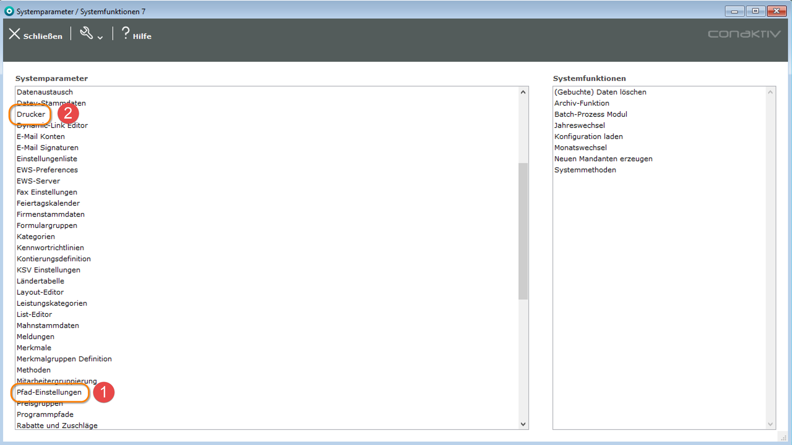

Legen Sie eine neue Einstellung an. In dem Eingabedialog wählen Sie als Pfad-Typ "Server" und als Dokument-Art "PDF Web Service" 1.

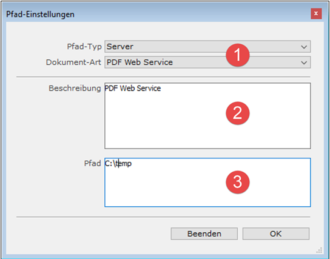

Geben Sie der Pfadeinstellung im Feld "Beschreibung" 2 einen aussagekräftigen Namen und hinterlegen Sie den Pfad im Feld "Pfad" 3.

Klicken Sie abschließend auf den Knopf "OK" um den Pfad zu speichern. Verlassen Sie die Pfadeinstellungen.

Öffnen Sie im nächsten Schritt in den Systemparametern die Druckereinstellungen 2.

Legen Sie eine neue Einstellung an.  

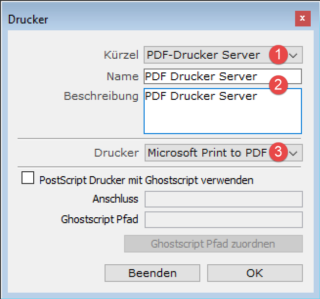

In dem Eingabedialog wählen Sie als Kürzel "PDF-Drucker Server" 1 aus.

Geben Sie der Druckereinstellung in den Feldern "Name" und "Beschreibung" 2 eine aussagekräftige Bezeichnung.
Wählen Sie aus dem PopUp-Menü "Drucker" den Drucker "Microsoft Print to PDF" aus 3.
Klicken Sie abschließend auf den Knopf "OK" um die Druckereinstellung zu speichern. Verlassen Sie die Druckereinstellungen und die Systemparameter.

!!! info "Hinweis"
    Sofern Ihr Server den Microsoft Print to PDF-Drucker nicht unterstützt, können Sie alternativ die Ghostscriptlösung einsetzen. Weitere Informationen hierzu finden Sie im [ConAktiv® Handbuch.](http://handbuch.conaktiv.de/wiki/version-17-6/kontaktmodule/e-mail/einrichtung-des-moduls-e-mail/belegversand-als-e-mail-anhang/variante-3-microsoft-windows-7-und-8-und-10-mit-ghostscript/installation-ghostscript-zur-erstellung-der-pdf-datei/)

### Druckordnerpfad und Drucker zur Verfügung stellen
Im letzten Schritt müssen Sie den Drucker und den Druckordnerpfad in den allgemeinen Einstellungen für die Mastergruppe (=für alle Benutzer) aktivieren.
Öffnen Sie die Einstellungen, markieren Sie die Mastergruppe 1 und klicken Sie auf der rechten Seite der Einstellungen auf den Knopf "Allgemeine Einstellungen" 2.

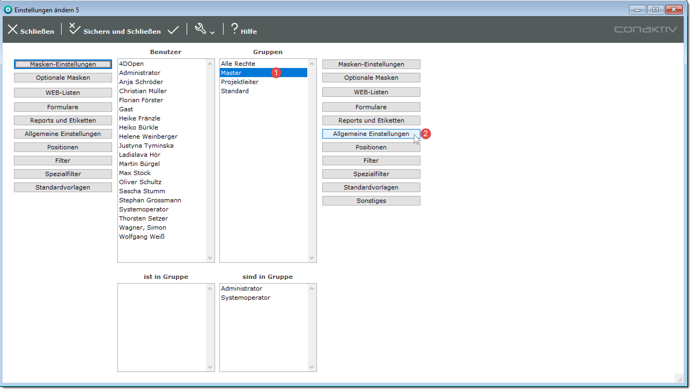

In den allgemeinen Einstellungen erweitern Sie die Rubrik "System" und aktivieren die Druckereinstellung 1  und die Pfadeinstellung 2 durch Doppelklick, sodass die betreffenden Einträge fett dargestellt werden.

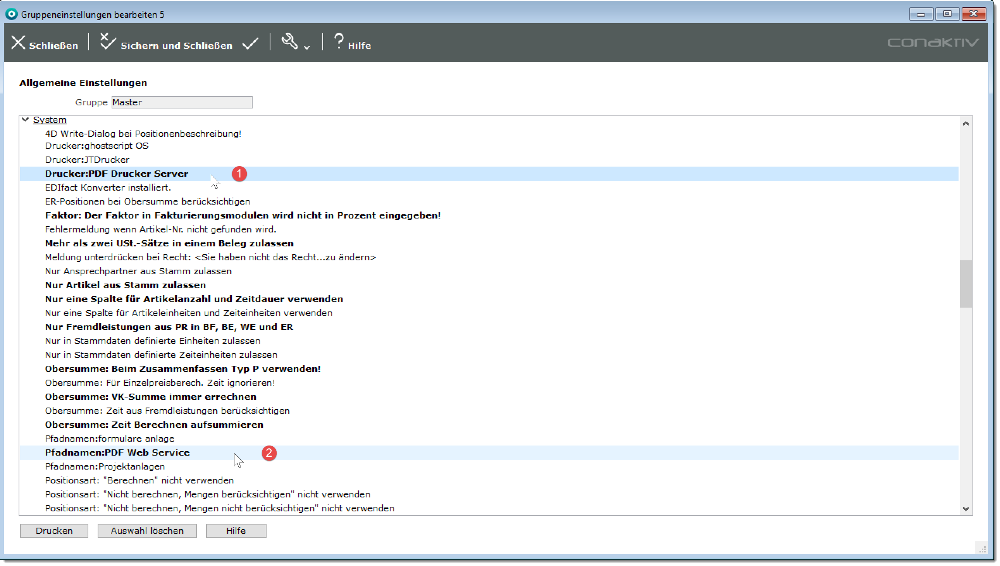

Schließen und sichern Sie die Einstellungen und führen Sie einen Benutzer- oder Gruppenwechsel durch, um die Einstellungen zu aktivieren.

Damit ist die Druckfunktion eingerichtet und Sie können über das Druckcenter in ConAktiv® Mobile4 Stunden- und Leistungsnachweise sowie Monatszettel drucken.

## Das Druckcenter aufrufen

=== "Desktop"

    Über das Menü "Verwaltung" 1 rufen Sie das Druckcenter 2 auf:

    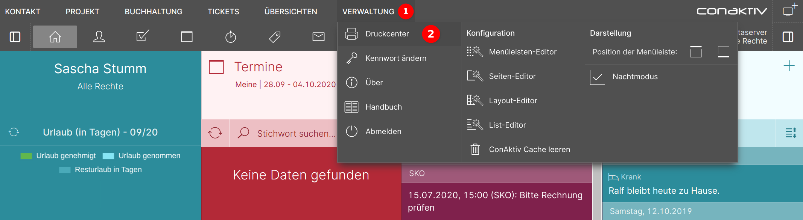

=== "Smartphone"

    { align=right }

    Öffnen Sie zunächst die Menüleiste 1.

    

    { align=right }

    Dort rufen Sie über das Menü "Verwaltung" das Druckcenter 2 auf.

    

## Stundennachweis

Der Stundennachweis wird für den angemeldeten Mitarbeiter für einen Monat zusammengefasst.

=== "Desktop"

    Über die Schaltflächen "Jahr" 1 und "Monat" 2 lässt sich der entsprechende Monat auswählen.

    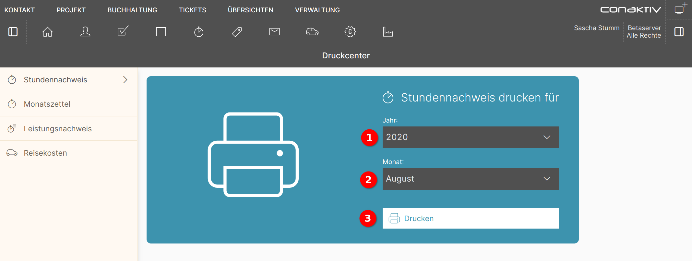

    Über die Schaltfläche "Drucken" 3 wird das Dokument vom Server angefordert.

    Nach einer kurzen Wartezeit erscheint eine neue Schaltfäche "Dokument anzeigen".

    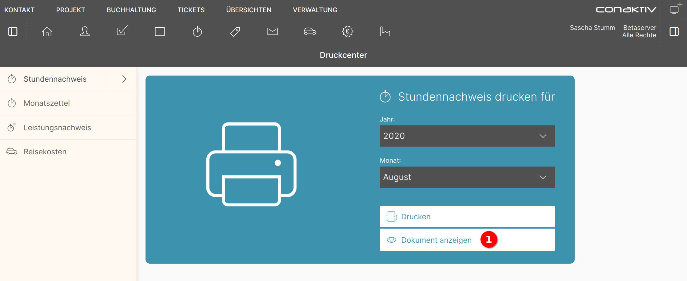

    Mittels Klick auf die Schaltfläche "Dokument anzeigen" 1 wird das Dokument aufgerufen.

    Abhängig von Ihrem Endgerät kann dies im Browser oder in einer passenden Anzeige-App passieren.

    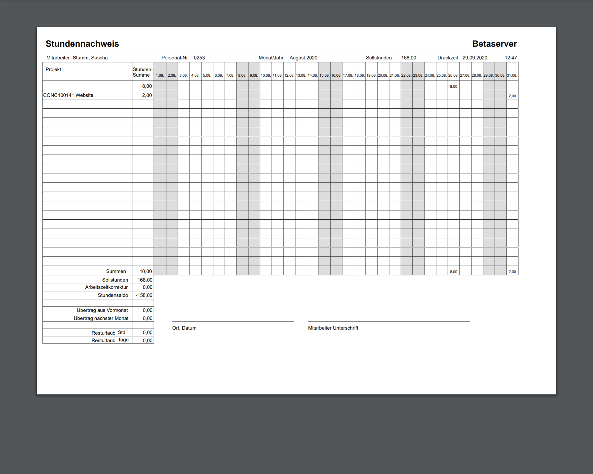

=== "Smartphone"

    { align=right }

    Über die Schaltflächen "Jahr" 1 und "Monat" 2 lässt sich der entsprechende Monat auswählen.

    Über die Schaltfläche "Drucken" 3 wird das Dokument vom Server angefordert.

    

    { align=right }

    Nach einer kurzen Wartezeit erscheint eine neue Schaltfäche "Dokument anzeigen".

    Mittels Klick auf die Schaltfläche "Dokument anzeigen" 1 wird das PDF-Dokument aufgerufen.

    

    Abhängig von Ihrem Endgerät kann dies im Browser oder in einer passenden Anzeige-App passieren.

    

## Monatszettel

Der Monatszettel wird für den angemeldeten Mitarbeiter in einer Monatsübersicht dargestellt.

=== "Desktop"

    Über die Schaltflächen "Jahr" 1 und "Monat" 2 lässt sich der gewünschte Monat auswählen, für den Sie den Monatszettel drucken möchten.

    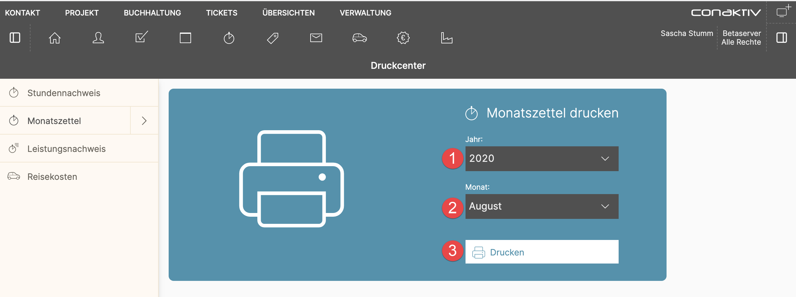

    Über die Schaltfläche "Drucken" 3 wird das Dokument vom Server angefordert.

    Nach einer kurzen Wartezeit erscheint eine weitere Schaltfäche "Dokument anzeigen".

    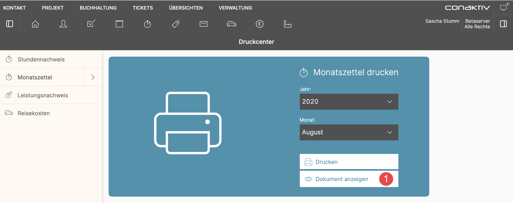

    Mittels Klick auf die Schaltfläche "Dokument anzeigen" 1 wird das Dokument aufgerufen.

    Abhängig von Ihrem Endgerät kann dies im Browser oder in einer passenden Anzeige-App erfolgen.

    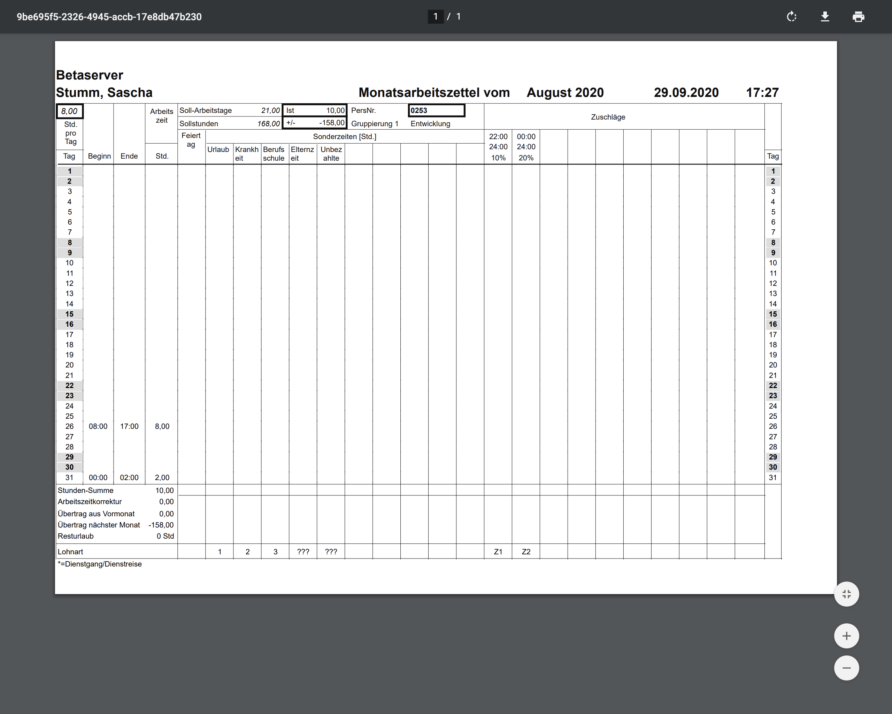

=== "Smartphone"

    { align=right }

    Über die Schaltflächen "Jahr" 1 und "Monat" 2 lässt sich der gewünschte Monat auswählen, für den Sie den Monatszettel drucken möchten.

    Über die Schaltfläche "Drucken" 3 wird das Dokument vom Server angefordert.

    

    { align=right }

    Nach einer kurzen Wartezeit erscheint eine weitere Schaltfäche "Dokument anzeigen".

    Mittels Klick auf die Schaltfläche "Dokument anzeigen" 1 wird das PDF-Dokument aufgerufen.

    

    Abhängig von Ihrem Endgerät kann dies im Browser oder in einer passenden Anzeige-App erfolgen.

    

## Leistungsnachweis

=== "Desktop"

    Über die Schaltflächen "Jahr" 1 und "Monat" 2 lässt sich der gewünschte Monat auswählen, für den Sie den Leistungsnachweis drucken möchten.
    
    Das Projekt zu dem Sie den Leistungsnachweis drucken möchten, wählen Sie mithilfe der Schaltfläche "Projekt" 3 aus.

    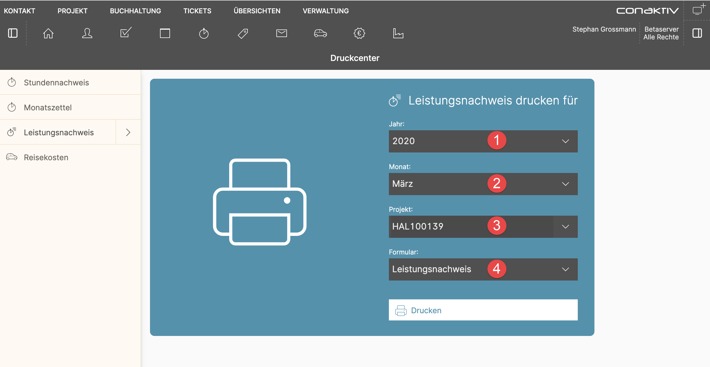

    Für die Leistungsnachweise können Sie verschiedene Formulare bereitstellen und im Druckcenter über die Schaltfläche "Formular" 4 auswählen.

    Über die Schaltfläche "Drucken" 5 wird das Dokument vom Server angefordert.

    Nach einer kurzen Wartezeit erscheint eine weitere Schaltfäche "Dokument anzeigen".

    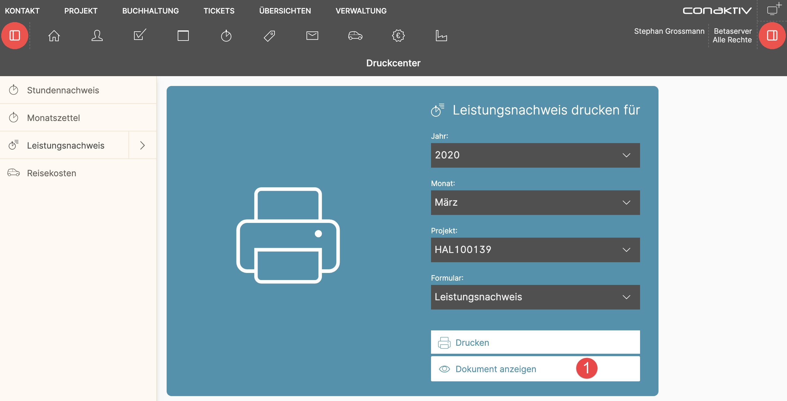

    Mittels Klick auf die Schaltfläche "Dokument anzeigen" 1 wird das Dokument aufgerufen.

    Abhängig von Ihrem Endgerät kann dies im Browser oder in einer passenden Anzeige-App erfolgen.

    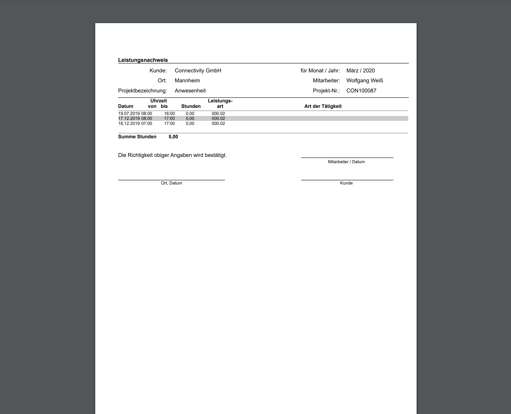

=== "Smartphone"

    Über die Schaltflächen "Jahr" 1 und "Monat" 2 lässt sich der gewünschte Monat auswählen, für den Sie den Leistungsnachweis drucken möchten.
    
    Das Projekt zu dem Sie den Leistungsnachweis drucken möchten, wählen Sie mithilfe der Schaltfläche "Projekt" 3 aus.

    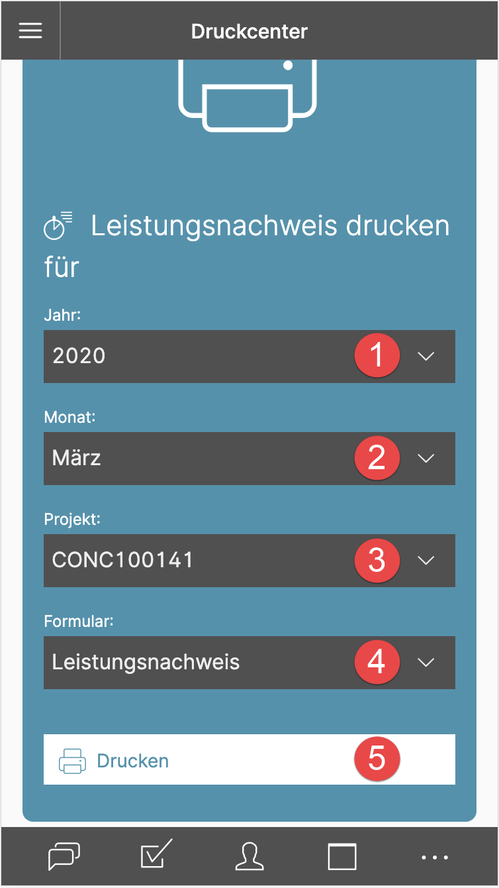

    Für die Leistungsnachweise können Sie verschiedene Formulare bereitstellen und im Druckcenter über die Schaltfläche "Formular" 4 auswählen.

    Über die Schaltfläche "Drucken" 5 wird das Dokument vom Server angefordert.

    Nach einer kurzen Wartezeit erscheint eine weitere Schaltfäche "Dokument anzeigen".

    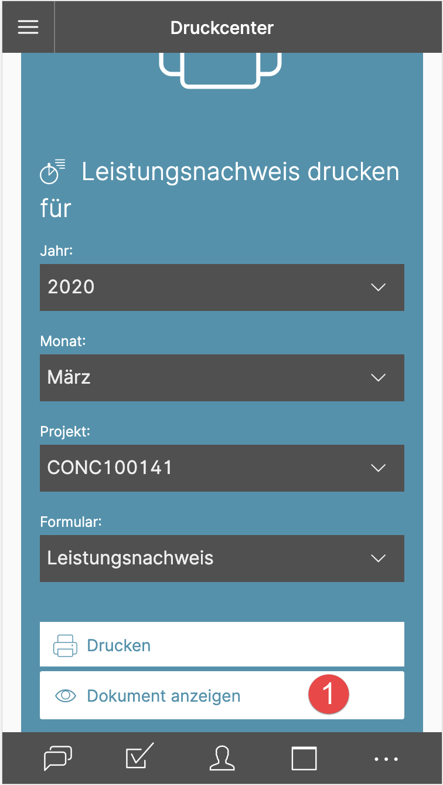

    Mittels Klick auf die Schaltfläche "Dokument anzeigen" 1 wird das Dokument aufgerufen.

    Abhängig von Ihrem Endgerät kann dies im Browser oder in einer passenden Anzeige-App erfolgen.

    

    
## Reisekosten

=== "Desktop"

    Über die Schaltflächen "Jahr" 1 und "Monat" 2 lässt sich der gewünschte Monat auswählen, für den Sie die Reisekostenabrechnung drucken möchten.
    
    Die Reise, zur der Sie die Reisekostenabrechnung drucken möchten, wählen Sie mithilfe der Schaltfläche "Reise" 3 aus.

    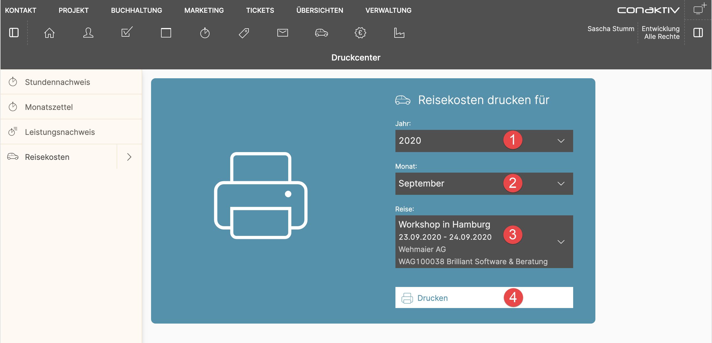

    Über die Schaltfläche "Drucken" 4 wird das Dokument vom Server angefordert.

    Nach einer kurzen Wartezeit erscheint eine weitere Schaltfäche "Dokument anzeigen".

    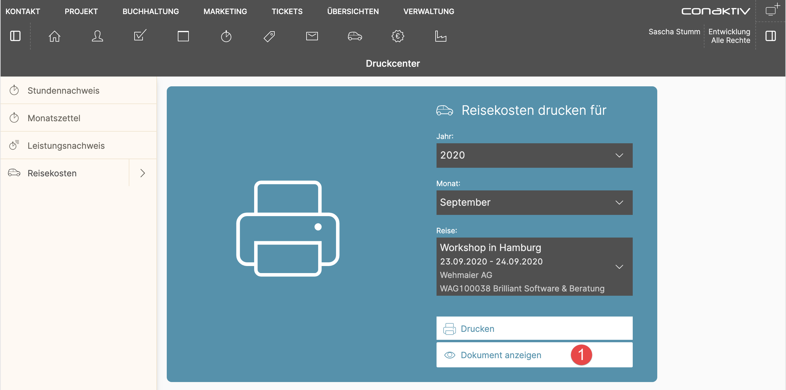

    Mittels Klick auf die Schaltfläche "Dokument anzeigen" 1 wird das Dokument aufgerufen.

    Abhängig von Ihrem Endgerät kann dies im Browser oder in einer passenden Anzeige-App erfolgen.

    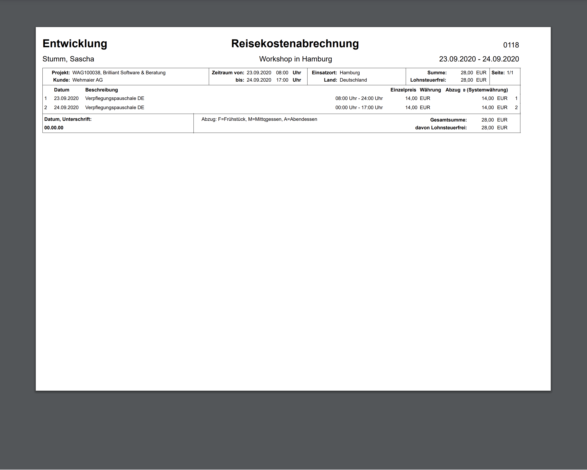

=== "Smartphone"

    Über die Schaltflächen "Jahr" 1 und "Monat" 2 lässt sich der gewünschte Monat auswählen, für den Sie die Reisekostenabrechnung drucken möchten.
    
    Die Reise, zur der Sie die Reisekostenabrechnung drucken möchten, wählen Sie mithilfe der Schaltfläche "Reise" 3 aus.

    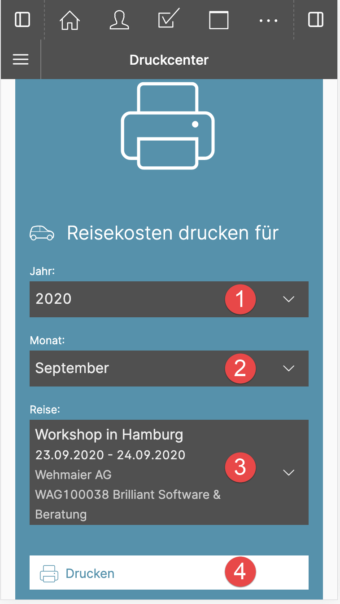

    Über die Schaltfläche "Drucken" 4 wird das Dokument vom Server angefordert.

    Nach einer kurzen Wartezeit erscheint eine weitere Schaltfäche "Dokument anzeigen".

    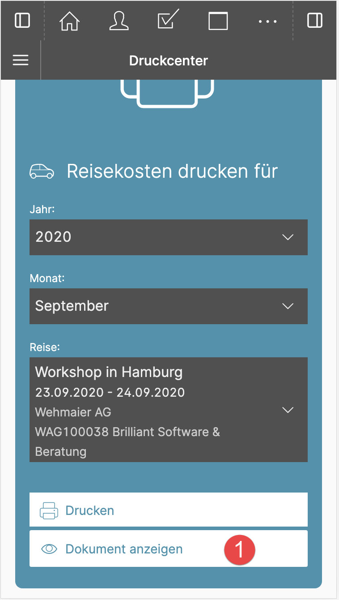

    Mittels Klick auf die Schaltfläche "Dokument anzeigen" 1 wird das Dokument aufgerufen.

    Abhängig von Ihrem Endgerät kann dies im Browser oder in einer passenden Anzeige-App erfolgen.

    