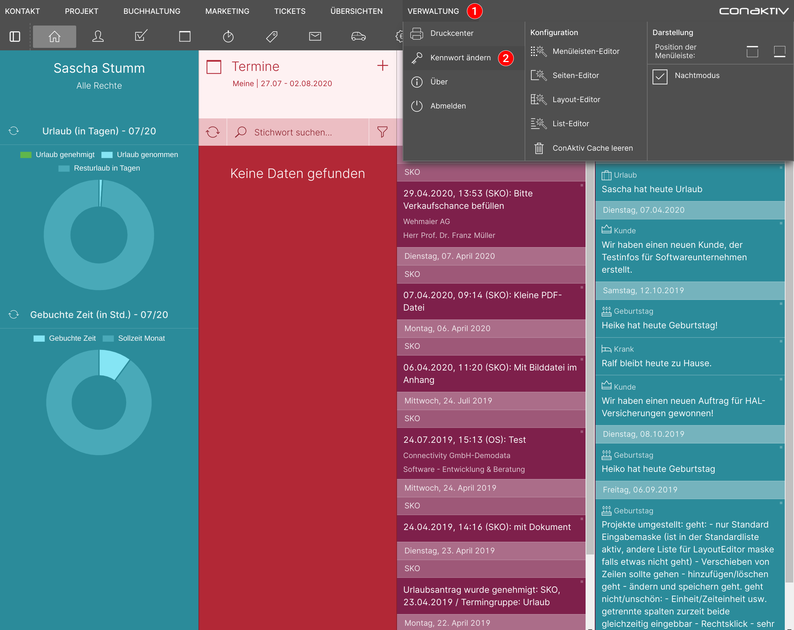

# Kennwort ändern

Um das Kennwort zu ändern, mit dem Sie sich an ConAktiv® und an ConAktiv® Mobile anmelden, öffnen Sie zunächst das Menü "Verwaltung" und betätigen die Schaltfläche "Kennwort ändern".

