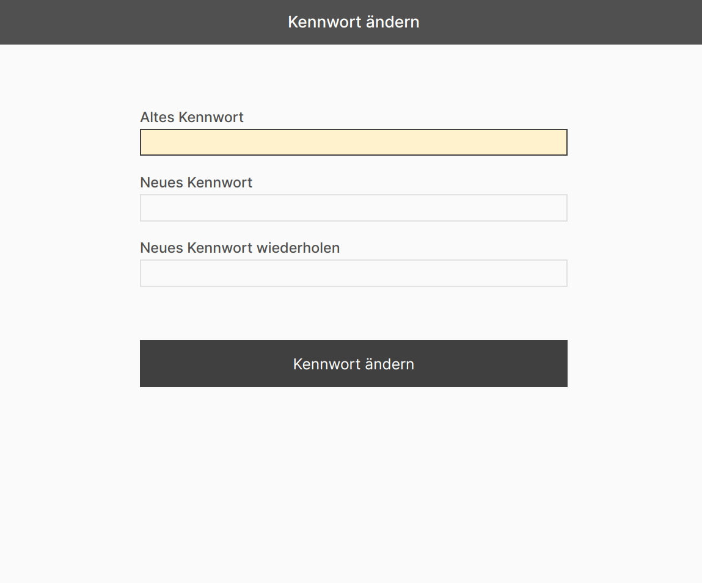

# Kennwort ändern

Hier wird beschrieben, wie Sie das Kennwort ändern, mit dem Sie sich an ConAktiv® und an ConAktiv® Mobile anmelden.

=== "Desktop"
    Öffnen Sie zunächst das Menü "Verwaltung" und betätigen die Schaltfläche "Kennwort ändern".

    

=== "Smartphone"
    Tippen Sie zunächst auf die drei Punkte in der rechten oberen Ecke, um das Mobile4 Menü zu öffnen.

    

    Wählen Sie dann im Menü "Verwaltung" die Schaltfläche "Kennwort ändern".

    

Eine Maske zur Änderung des Kennworts wird geöffnet.

Geben Sie zuerst Ihr bisheriges Kennwort ein und dann das neue. Wiederholen Sie danach die Eingabe des neuen Kennworts.

Betätigen Sie abschließend die Schaltfläche „Kennwort ändern“. Das Kennwort wird geändert.
