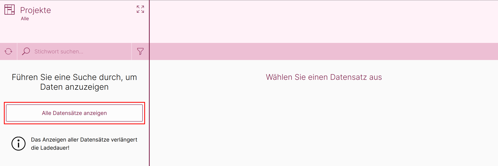

# Merkmale aus der Anwendersicht

In diesem Kapitel wird davon ausgegangen, dass die Konfiguration der Merkmale in der ConAktiv® Desktop App und der ConAktiv® Mobile4, wie in den vorhergehenden Kapiteln besprochen, erfolgt ist.

## Aufruf der Projekte-Seite

Rufen Sie als erstes die Projekte-Seite über das Menü "Projekt" 1 -> "Projekte" 2 auf.

Um die Projekteliste anzuzeigen, betätigen Sie die Schaltfläche "Alle Datensätze anzeigen".

## Merkmalliste zu einem Projekt-Datensatz anzeigen

Wählen Sie einen beliebigen Datensatz aus der Liste aus 1.

Der Datensatz öffnet sich rechts neben der Liste. Neben dem Reiter "Projektpositionen" befindet sich der von uns eingebaute Reiter "Ansprechpartner" 2 mit der Merkmalliste für die Ansprechpartner.

## Neues Merkmal anlegen

Nach Betätigen des Reiters "Ansprechpartner" sehen wir, dass noch keine Merkmale in der Liste enthalten sind.

Um ein neues Merkmal anzulegen, Klicken sie auf das "Plus"-Zeichen im Reiter "Ansprechpartner".

Es öffnet sich eine neue Seite mit dem von uns angelegten Layout.

Über das Feld "Bereich" 1 kann (optional) eine Merkmaluntergruppe gewählt werden.

Das Eingabefeld "Funktion" 2 lässt abhängig von der Merkmaluntergruppe die Auswahl eines Merkmals zu.

Über das Auswahlfeld für den Ansprechpartner 2 kann schließlich noch ein verknüpfter Datensatz aus dem Modul "Ansprechpartner" gewählt werden.

Wenn Sie Ihre Eingaben abgeschlossen haben, speichern Sie den Datensatz über die Werkzeugleisten-Schaltfläche "Speichern und Schließen" 4.

Damit ist der erste Ansprechpartner als Merkmal angelegt.

