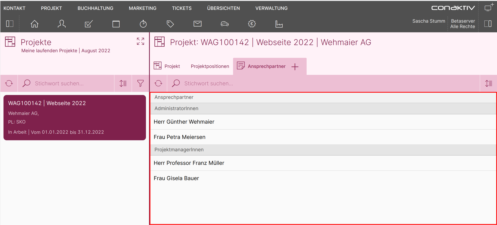
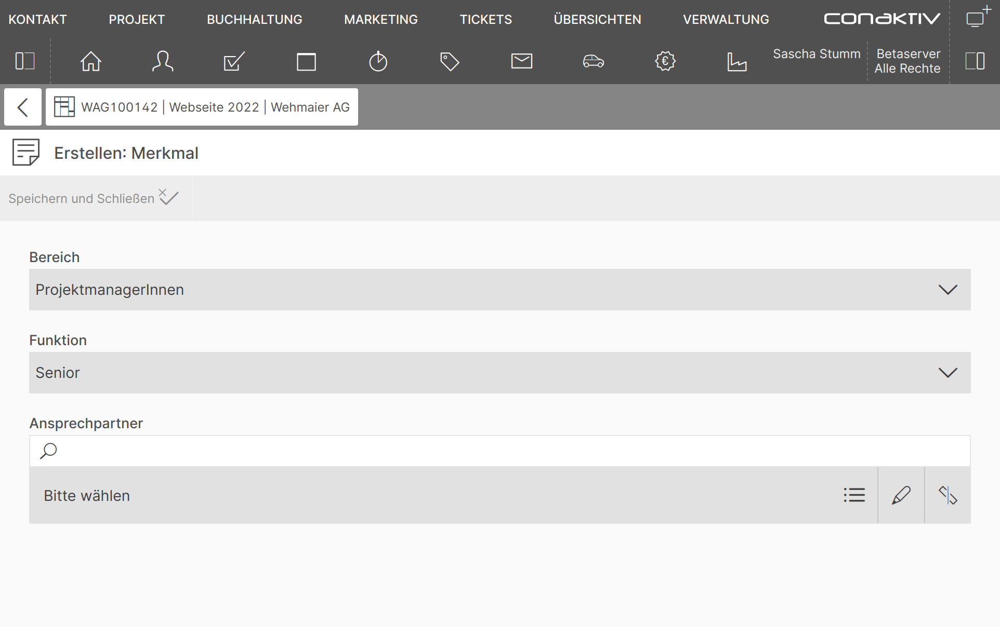

# Merkmale verwenden

!!! version "Hinweis"
	Merkmale in der ConAktiv® Mobile4 werden ab der ConAktiv® Version 19.0.31.a unterstützt. Verwenden Sie für dieses Tutorial jedoch bitte die Version **19.0.33.a**, um alle Funktionen zur Verfügung zu haben.

## Was sind Merkmale?

Mit Merkmalen können zusätzliche Informationen, die ConAktiv® nicht von Haus aus bietet, zu Datensätzen erfasst werden.

Dazu werden in der ConAktiv® Desktop App Merkmalgruppen, Merkmaluntergruppen und Merkmale definiert.

Diese können in der ConAktiv® Mobile4 über die Editoren für Seiten, Listen und Layouts eingebunden werden.

## Praktisches Beispiel

Wir wollen für das Modul Projekte eine Liste mit Ansprechpartnern einbauen, welche der Anwender dann selbst befüllen kann.

Dazu legen wir die Merkmalstruktur in der ConAktiv® Desktop App an und führen anschließend die Konfiguration in der ConAktiv® Mobile4 durch.

Das Ziel sieht folgendermaßen aus:

**Liste der Ansprechpartner**

**Eingabemaske für Ansprechpartner**

### Merkmalstruktur in der ConAktiv® Desktop App anlegen

[Lesen Sie hier, wie die Merkmalstruktur in der ConAktiv® Desktop App angelegt wird.](./merkmal-struktur-anlegen/index.md)

### Merkmale in der ConAktiv® Mobile4 konfigurieren

[Lesen Sie hier, wie die Merkmale in der ConAktiv® Mobile4 konfiguriert werden.](./merkmale-in-mobile4-konfigurieren/index.md)
