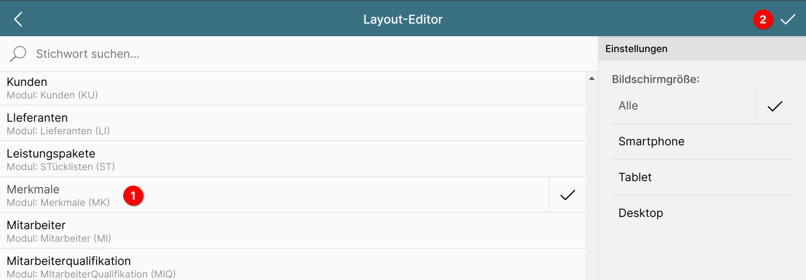
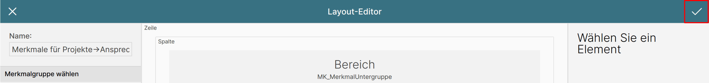

# Layout anlegen

## Layout-Editor aufrufen

{ align=right }

Wählen Sie im Menü "Verwaltung" 1 den Punkt "Layout-Editor" 2 an.

## Leeres Layout anlegen

{ align=right }

Dort wählen Sie die Option "Neues Layout anlegen".

Es öffnet sich eine Liste mit den zur Verfügung stehenden Modulen. Wählen Sie hier das Modul "Merkmale" 1 aus und betätigten Sie anschließend die Schaltfläche mit dem Haken rechts oben 2, um zum eigentlichen Editor zu gelangen.

## Layout importieren

Wir gehen an dieser Stelle nicht die komplette Konfiguration durch, sondern beschränken uns auf die Besonderheiten hinsichtlich der Merkmale.

Dazu laden Sie im ersten Schritt eine vorbereitete Layout-Definition herunter und importieren diese im zweiten Schritt.

1. Laden Sie sich die [vorbereitete Layout-Definition hier](./Layout Merkmale für Projekte-Ansprechpartner.txt) herunter und speichern Sie sie auf Ihrem Rechner (per Rechtsklick -> "Link Speichern unter" oder "Ziel speichern unter").

2. Betätigen Sie auf der linken Seite des Editors die Schaltfläche "Importieren".

{ align=right }

{ align=right }

Es öffnet sich der Import-Dialog. Betätigen Sie die Schaltfläche "Datei auswählen" 1 und wählen Sie anschließend die in Schritt 1 gespeicherte Datei aus. Bestätigen Sie den Import, indem Sie den Haken rechts oben 2 anklicken.

Damit ist das Layout importiert und wir gehen an unsere Anpassungen.

## Anpassungen am Layout vornehmen

### Name des Layouts anpassen

{ align=right }

Geben Sie in das Feld "Name" links folgenden Wert ein:

	Merkmale für Projekte->Ansprechpartner

!!! info
	Dieser Schritt ist wichtig, damit wir im weiteren Verlauf unseres Beispielprojekts dieses Layout über seinen Namen in die Seite einbinden können.

### Merkmalgruppe zuweisen

Im Kapitel "[Merkmalstruktur in der ConAktiv® Desktop App anlegen](../../merkmal-struktur-anlegen/index.md)" haben wir für das Modul Projekte die Merkmalsgruppe "Ansprechpartner" angelegt.

{ align=right }

Da unser Layout für diese Merkmalgruppe vorgesehen ist, wählen Sie bitte auf der linken Seite im Bereich "Merkmalgruppe wählen" unter dem Modul "Projekte" die Merkmalgruppe "Ansprechpartner" aus.

## Layout speichern

Zu guter Letzt speichern wir unser Layout durch Betätigen der "Speichern"-Schaltfläche rechts oben im Editor.
