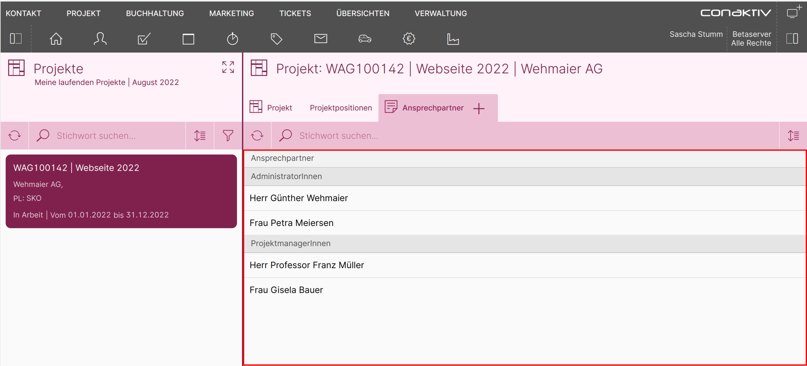

# Liste anlegen

!!! info
	Das Anlegen einer Liste für Merkmale läuft fast genau so ab, wie für jedes andere Modul auch. Die Besonderheit ist, dass eine Merkmalgruppe zugewiesen werden muss ([siehe weiter unten im Text](#merkmalgruppe-zuweisen)).

In diesem Beispiel wollen wir folgende Liste erstellen:

## List-Editor aufrufen

{ align=right }

Wählen Sie im Menü "Verwaltung" 1 den Punkt "List-Editor" 2 an.

## Leere Liste anlegen

{ align=right }

Dort wählen Sie die Option "Neue Liste anlegen".

Es öffnet sich eine Liste mit den zur Verfügung stehenden Modulen. Wählen Sie hier das Modul "Merkmale" 1 aus und betätigten Sie anschließend die Schaltfläche mit dem Haken rechts oben 2, um zum eigentlichen Editor zu gelangen.

## Liste importieren

Wir gehen an dieser Stelle nicht die komplette Konfiguration durch, sondern beschränken uns auf die Besonderheiten hinsichtlich der Merkmale.

Dazu laden Sie im ersten Schritt eine vorbereitete Listen-Definition herunter und importieren diese im zweiten Schritt.

1. Laden Sie sich die [vorbereitete Listen-Definition hier](./Liste Merkmale für Projekte-Ansprechpartner.txt) herunter und speichern Sie sie auf Ihrem Rechner (per Rechtsklick -> "Link Speichern unter" oder "Ziel speichern unter").

2. Betätigen Sie auf der linken Seite des Editors die Schaltfläche "Importieren".

{ align=right }

{ align=right }

Es öffnet sich der Import-Dialog. Betätigen Sie die Schaltfläche "Datei auswählen" 1 und wählen Sie anschließend die in Schritt 1 gespeicherte Datei aus. Bestätigen Sie den Import, indem Sie den Haken rechts oben 2 anklicken.

Damit ist die Liste importiert und wir gehen an unsere Anpassungen.

## Anpassungen an der Liste vornehmen

### Name der Liste anpassen

{ align=right }

Geben Sie in das Feld "Name" links folgenden Wert ein:

	Merkmale für Projekte->Ansprechpartner

!!! info
	Dieser Schritt ist wichtig, damit wir im weiteren Verlauf unseres Beispielprojekts diese Liste über ihren Namen in die Seite einbinden können.

### Merkmalgruppe zuweisen

Die Liste für Merkmale hat die Besonderheit, dass ihr eine Merkmalgruppe zugewiesen werden muss. Dafür existiert ein eigener Bereich "Merkmalegruppe wählen" im Listen-Editor, der nur angezeigt wird, wenn die Liste für das Modul "Merkmale" erstellt wird.

Im Kapitel "[Merkmalstruktur in der ConAktiv® Desktop App anlegen](../../merkmal-struktur-anlegen/index.md)" haben wir für das Modul Projekte die Merkmalsgruppe "Ansprechpartner" angelegt.

{ align=right }

Da unsere Liste für diese Merkmalgruppe vorgesehen ist, wählen Sie bitte auf der linken Seite im Bereich "Merkmalgruppe wählen" unter dem Modul "Projekte" die Merkmalgruppe "Ansprechpartner" aus.

## Liste speichern

Zu guter Letzt speichern wir unsere Liste durch Betätigen der "Speichern"-Schaltfläche rechts oben im Editor.

[Im letzten Abschnitt](../seite-anlegen/index.md) geht es an die Erstellung der Seite, in der das Layout und die Liste eingebunden werden.
