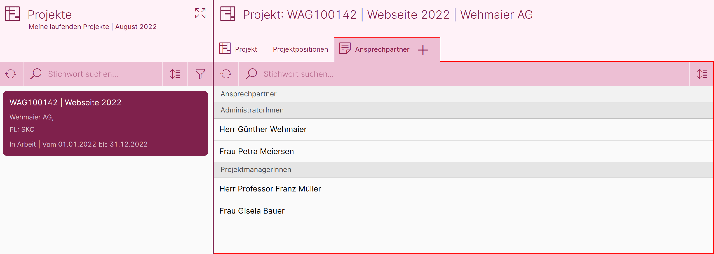
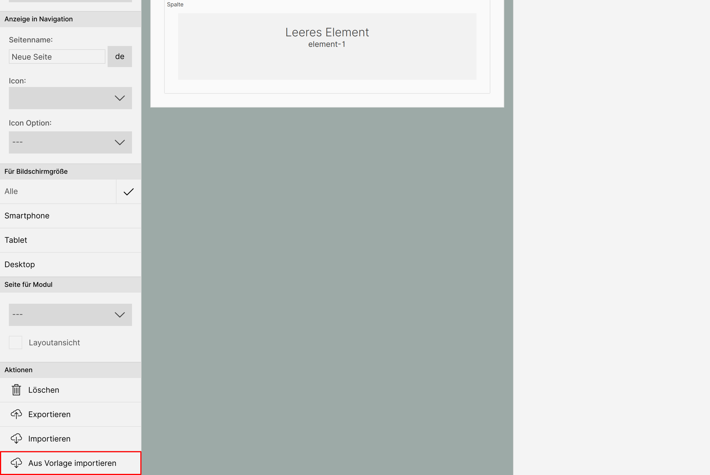
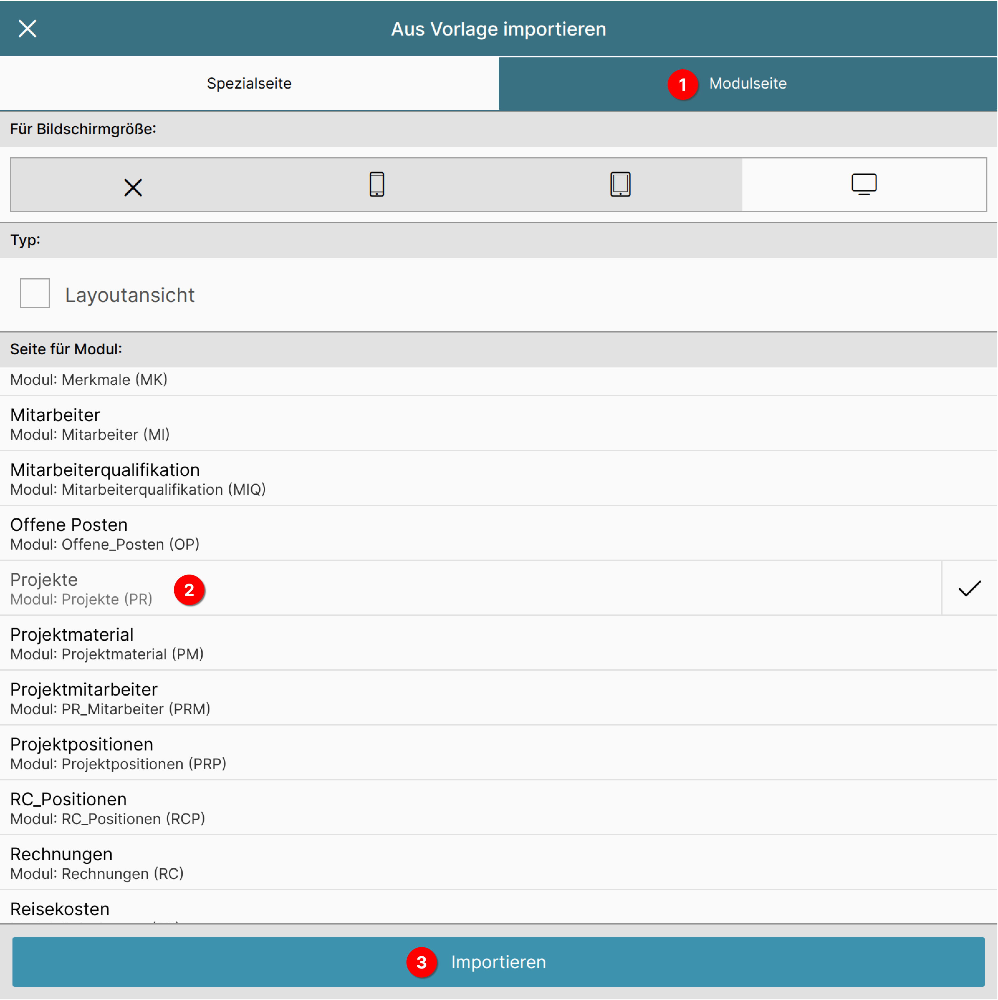
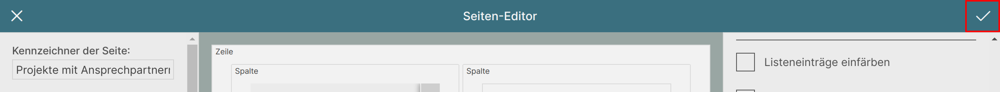

# Seite für Projekte anlegen und um Merkmalliste erweitern

Um die Merkmalliste und das Layout anzuzeigen, müssen diese noch eingebunden werden.

Dazu erweitern wir die Projekte-Seite so, dass in einem neuen Tab die Merkmalliste mit den Ansprechpartnern angezeigt wird. Bei Klick auf einen Ansprechpartner wird das Layout geöffnet.

## Seiten-Editor aufrufen

{ align=right }

Wählen Sie im Menü "Verwaltung" 1 den Punkt "Seiten-Editor" 2 an.

## Neue Seite anlegen

{ align=right }

Dort wählen Sie die Option "Neue Seite anlegen".

## Seite aus Vorlage importieren

Sie gelangen direkt in den Seiten-Editor. Um die Projekte-Seite zu bearbeiten, müssen wir nicht ganz von vorn beginnen, sondern können uns eine Vorlage importieren.

Dazu betätigen Sie im linken Bereich ganz unten die Schaltfläche "Aus Vorlage importieren".

Es öffnet sich der Dialog zum Importieren einer Vorlage.

Wählen Sie den Reiter "Modulseite" 1 an, um eine Liste mit allen Modulen der ConAktiv® Mobile4 anzeigen zu lassen.

In dieser Liste klicken Sie bitte auf den Eintrag "Projekte" 2.

Daraufhin erscheint am unteren Ende des Dialogs eine Schaltfläche mit der Beschriftung "Importieren" 3. Betätigen Sie diese, um den Import durchzuführen.

## Name der Seite eingeben

{ align=right }

Geben Sie im linken Bereich ganz oben den Namen der Seite ein (dieser dient zur internen Zuordnung). Für unser Beispielprojekt geben Sie bitte folgendes ein:

	Projekte mit Ansprechpartnern

## Neuen Reiter "Ansprechpartner" einfügen

Im nächsten Schritt fügen wir den Reiter "Ansprechpartner" ein, der unsere Merkmalliste für die Ansprechpartner enthalten soll.

Dazu legen wir eine neue Spalte an und konfigurieren deren Element als Merkmalliste.

### Neue Spalte für Liste anlegen

{ align=right }

Wählen Sie im mittleren Bereich des Seiten-Editors die Spalte für die Positionen aus, indem Sie in den Bereich klicken, der mit "Spalte" betitelt ist (im Bild rot hinterlegt).

{ align=right }

Im rechten Bereich des Editors erscheinen daraufhin die Optionen für die Spalte.

Betätigen Sie die Schaltfläche "Neue Spalte rechts".

{ align=right }

Daraufhin wird im mittleren Bereich des Editors eine neue Spalte rechts von der Positionsspalte angelegt.

### Element in der Spalte konfigurieren

Nun geht es an die Konfiguration des Elements innerhalb der Spalte.

{ align=right }

Wählen Sie innerhalb der neu erstellten Spalte das Element aus (im Bild rot hinterlegt).

#### Typ des Elements wählen

{ align=right }

Auf der rechten Seite des Editors erscheinen nun die Einstellmöglichkeiten für das gewählte Element.

Da wir eine Liste darstellen möchten, müssen wir als erstes den Typ des Elements auf "Liste" stellen.

Betätigen Sie also die Schaltfläche "Typ" -> "Leeres Element".

{ align=right }

Es öffnet sich eine Aufklappfenster, in dem Sie den Eintrag "Liste" wählen.

#### Anzeige konfigurieren

{ align=right }

Durch das Setzen des Typs erscheinen eine Menge neuer Optionen unterhalb der Schaltfläche.

Im ersten Schritt vergeben wir für unseren neuen Reiter einen Namen. Geben Sie in das Feld "Eigener Titel" folgenden Text ein:

	Ansprechpartner

{ align=right }

Aktivieren Sie 	als nächstes die Darstellungsoption "Großen Kopfbereich verwenden".

Diese sorgt dafür, dass unser neuer Reiter optisch zu den vorhandenen Reitern passt.

#### Verhalten bei Klick einstellen

{ align=right }

Als nächstes definieren wir, was passieren soll, wenn der Anwender auf einen Datensatz klickt.

Dazu gehen wir ganz nach unten in den Bereich "Einstellungen". Betätigen Sie dort die Schaltfläche "Bei Klick auf Datensatz" -> "Nichts machen".

{ align=right }

Es öffnet sich ein Aufklappfenster, in welchem wir den Eintrag "Standardseite aufrufen" anwählen.

#### Modul wählen

{ align=right }

Damit unsere Liste weiß, aus welchem Modul sie Einträge darstellen soll, müssen wir ihr noch ein Modul zuweisen - in unserem Fall das Modul "Merkmale".

Dazu betätigen Sie die Schaltfläche "Modul" im Bereich "Einstellungen".

{ align=right }

In dem sich öffnenden Aufklappfenster wählen Sie den Eintrag "Merkmale".

Damit sagen wir, dass unser Listen-Element Einträge aus dem Modul "Merkmale" anzeigen soll.

#### Abhängigkeit des Elements definieren

Unser Listen-Element weiß momentan zwar, dass es Merkmale laden soll, aber nicht, welche.

Unser Ziel ist es, dass unsere Merkmalliste alle Merkmale zu einem Projekt-Datensatz anzeigt.

Das lässt sich bewerkstelligen, indem wir sie an ein anderes Element "anbinden", nämlich an die Datensatz-Anzeige (also das Layout) des Projekts.

{ align=right }

Dazu gehen wir wieder ganz nach oben; betätigen Sie dort die Schaltfläche "Abhängigkeit hinzufügen".

{ align=right }

Der mittlere Bereich des Editors schaltet sich dadurch in den Auswahlmodus. Klicken Sie das Element "PRojekte Layout" an.

{ align=right }

Es öffnet sich ein Dialogfenster mit verschiedenen Optionen.

Wählen Sie den Eintrag "Datensatz im Kontext laden" 1 und schließen Sie das Dialogfenster über den Haken rechts oben 2.

#### Merkmale konfigurieren

Damit kommen wir zum letzten Schritt unserer Anpassungen, in dem wir folgendes festlegen:

* welche Merkmalgruppe zeigt unsere Liste an
* welche Listendefinition wird verwendet
* welche Layoutdefinition wird verwendet

{ align=right }

Dazu gehen Sie im rechten Bereich wieder ganz nach unten zu den "Einstellungen" und betätigen Sie die Schaltfläche "Merkmale konfigurieren".

{ align=right }

Es öffnet sich ein Konfigurationsfenster, das eine Liste mit allen Merkmalsgruppen zeigt.

Im Kapitel ["Merkmalstruktur in der ConAktiv® Desktop App anlegen"](../../merkmal-struktur-anlegen/index.md) haben wir die Merkmalsgruppe "Ansprechpartner" erstellt.

Wählen Sie diese aus der Liste aus, um die Einstellungsmöglichkeiten anzuzeigen.

{ align=right }

Zuerst legen wir fest, dass die Merkmalsgruppe "Ansprechpartner" in dieser Liste angezeigt werden soll.

Aktivieren Sie dazu im unteren Bereich des Fensters die Option "Anzeigen".

{ align=right }

Danach bestimmen wir, welche Listendefinition für die Anzeige verwendet werden soll.

Betätigen Sie dazu die Schaltfläche "Layout für Liste".

{ align=right }

Es öffnet sich ein weiteres Fenster mit allen Listendefinitionen für das Modul "Merkmale".

Wählen Sie den Eintrag "Merkmale für Projekte -> Ansprechpartner" (diesen hatten wir im Kapitel ["Liste anlegen"](../liste-anlegen/index.md) erstellt).

{ align=right }

Nun legen wir fest, welche Layoutdefinition für die Anzeige verwendet werden soll.

Betätigen Sie dazu die Schaltfläche "Layout für Eingabemaske".

{ align=right }

Damit ist unsere Merkmalkonfiguration abgeschlossen und wir können die Änderungen durch Betätigen des Hakens rechts oben im Fenster übernehmen.

## Seite speichern

Damit alle Änderungen in die Datenbank übernommen werden, müssen wir noch unsere Seite durch Klick auf den Haken rechts oben übernehmen.

## Seite einer Benutzergruppe zuweisen

Jetzt befindet sich unsere Seite in der Datenbank. Allerdings wird sie noch niemand zu Gesicht bekommen, weil sie noch keiner Gruppe bzw. keinem Benutzer zugeordnet wurde.

Die Zuordnung geschieht über die ConAktiv® Desktop App und ist im Kapitel ["Eine Seite einer Gruppe oder einem Benutzer zuordnen"](../../../../konfiguration/seiten-editor/seite-zuordnen/index.md) beschrieben.

!!! info
	Beachten Sie bitte, dass Sie im Abschnitt "Die Seite zuordnen" das Modul "Projekte" und unter "Seite Mobil Browser" den Eintrag "Projekte mit Ansprechpartnern" wählen.

!!! info
	Nachdem die Seite zugeordnet wurde, ist es erforderlich, sich einmal in der ConAktiv® Mobile4 ab- und wieder anzumelden, um die Änderung sehen zu können.

Wie die Seite für Ihre Anwender aussieht, können Sie im nächsten Kapitel ["Merkmale aus der Anwendersicht"](../../anwendersicht/index.md) sehen.
