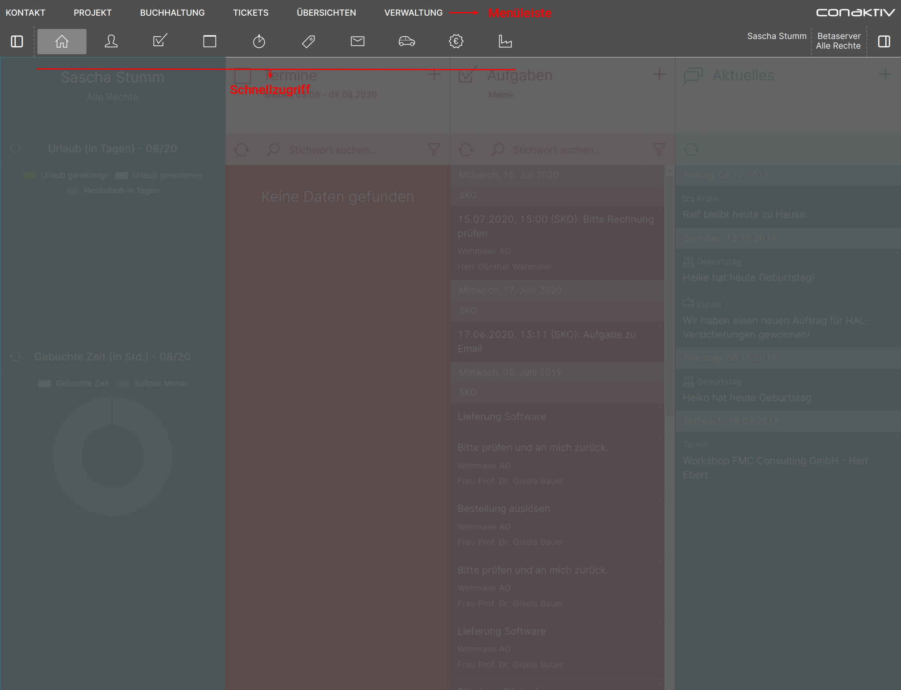
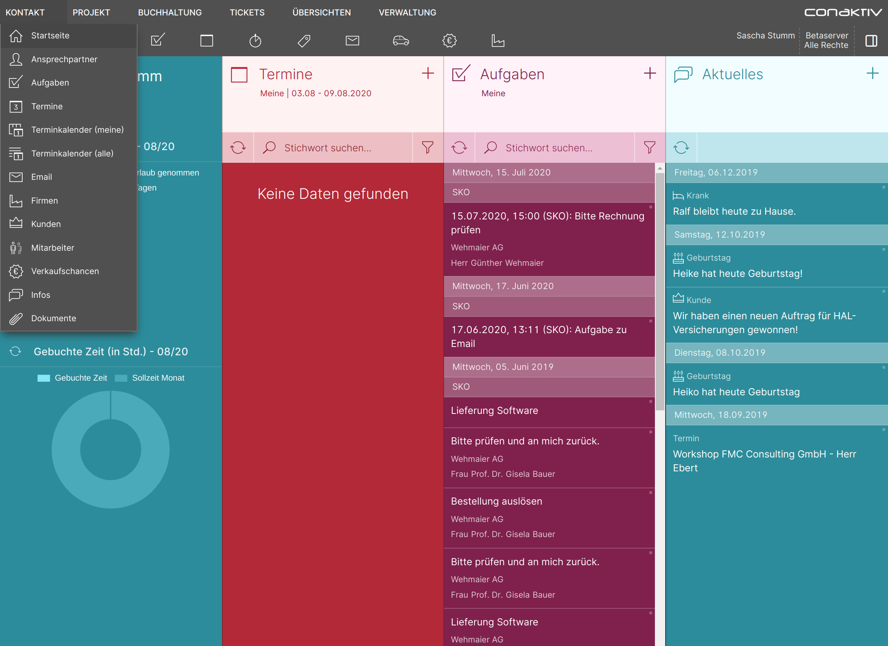
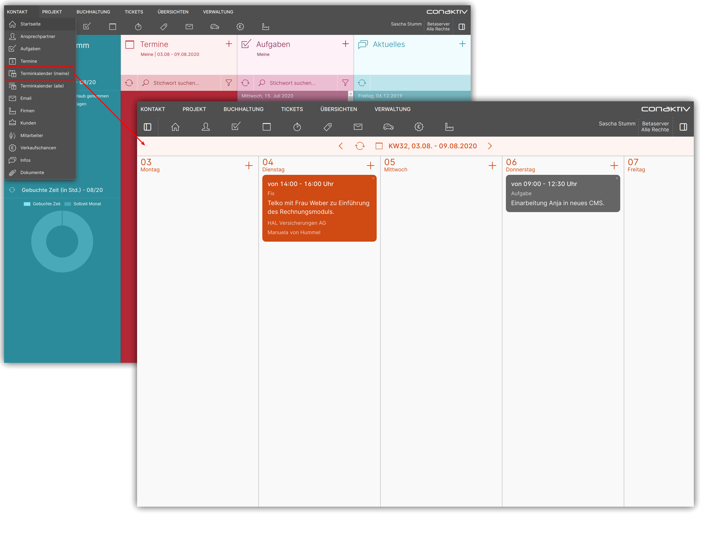

# Navigation

## Navigationsmöglichkeiten

=== "Desktop"

    Die ConAktiv Mobile4 bietet in der **Schnellzugriffleiste** die meist benötigten Seiten an.

    

    Alle weiteren Seiten (sowie die Seiten aus dem Schnellzugriff) sind über die **Menüleiste** erreichbar.

    Diese ist in Menüs unterteilt.

    Durch Überfahren eines Menüs mit dem Mauszeiger werden die Seiten dieses Menüs angezeigt.

    

=== "Smartphone"

    { align=right }

    Die ConAktiv Mobile4 bietet in der **Schnellzugriffleiste** die meist benötigten Seiten an.

    

    { align=right }

    Alle weiteren Seiten (sowie die Seiten aus dem Schnellzugriff) lassen sich über den **Menüschalter** aufrufen.

    

    
    { align=right }

    Der Klick auf den Menüschalter öffnet das Hauptmenü der ConAktiv Mobile4, in dem alle Seiten angezeigt werden, die in dieser Konfiguration verfügbar sind.

    Der Übersichtlichkeit halber sind die Seiten in Menüs (z.B. "Kontakt", "Projekt", etc.) gruppiert.

    

## Beispiel Navigation

Durch Klick auf die Seite "Terminkalender (Meine)" öffnet sich die Übersichtseite für meinen Kalender.

## Konfiguration

Die Einträge im Schnellzugriff sowie die Menüs und Seiten im Hauptmenü sind sowohl für die Smartphone- wie auch die Desktopvariante vollständig konfigurierbar.

Der dafür zuständige Editor ist der **"Menüleisten-Editor"**.
