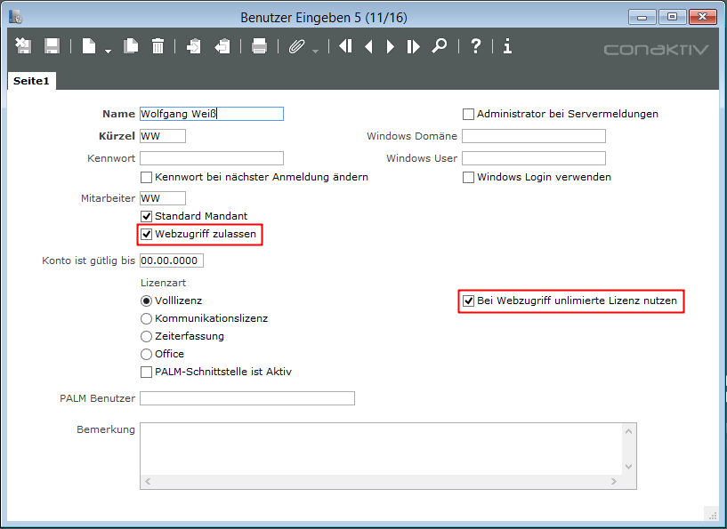

# Einstellungen in ConAktiv®

## Benutzereinstellungen

Damit ein Benutzer überhaupt auf ConAktiv® Mobile zugreifen kann, muss in dessen Benutzerdatensatz die Möglichkeit des Webzugriffs aktiviert werden. Öffnen Sie hierzu entweder aus dem Rechtedialog (über den Knopf „Benutzer“) oder in den Systemparametern (über den Eintrag „Benutzer anlegen/bearbeiten“) das Benutzermodul.

Suchen Sie dort den gewünschten Benutzerdatensatz heraus und öffnen Sie diesen. Aktivieren Sie das Ankreuzfeld „Webzugriff zulassen“.

Sollte die ConAktiv® Web-Lizenz, die bis einschließlich ConAktiv® 9 erhältlich war, in Ihrer ConAktiv® Konfiguration enthalten sein, dann können sich beliebig viele Benutzer an ConAktiv® Mobile anmelden, ohne dass dabei eine Voll-, Kommunikations- oder Zeiterfassungslizenz belegt wird . Damit ein Benutzer eine unlimitierte Lizenz verwendet, aktivieren Sie in dessen Benutzerdatensatz das Ankreuzfeld „Bei Webzugriff unlimitierte Lizenz nutzen“ .

## Rechte und allgemeine Einstellungen

Grundsätzlich greifen für die Bearbeitung von Adressen, Terminen, Aufgaben zur Zeit- und Materialerfassung über ConAktiv® Mobile sämtliche Rechte und Einstellungen, die auch für den Client-Betrieb zur Verfügung stehen. Welche Rechte und Einstellungen dies konkret sind, entnehmen Sie bitte den Kapiteln [„Adressen“](https://handbuch.conaktiv.de/wiki/version-17/kontaktmodule/ansprechpartner/), [„Terminliste“](https://handbuch.conaktiv.de/wiki/version-17/kontaktmodule/terminliste/), [„Aufgaben“](https://handbuch.conaktiv.de/wiki/version-17/kontaktmodule/aufgaben/), [„Stunden eingeben“](https://handbuch.conaktiv.de/wiki/version-17/projektmodule/stunden-eingeben/) und [„Material eingeben“](https://handbuch.conaktiv.de/wiki/version-17/projektmodule/material-eingeben/) sowie dem Kapitel [„Rechte“](https://handbuch.conaktiv.de/wiki/version-17/systemmodule/rechtedialog/).

Darüber hinaus gibt es ein weiteres Recht, das konkret in ConAktiv® Mobile greift. Aktivieren Sie das Recht „Mobil: Adressen Bearbeiten“ für Adressen, dann kann ein Benutzer bzw. die Benutzer einer Benutzergruppe in ConAktiv® Mobile überhaupt erst Adressen ändern und neu anlegen.