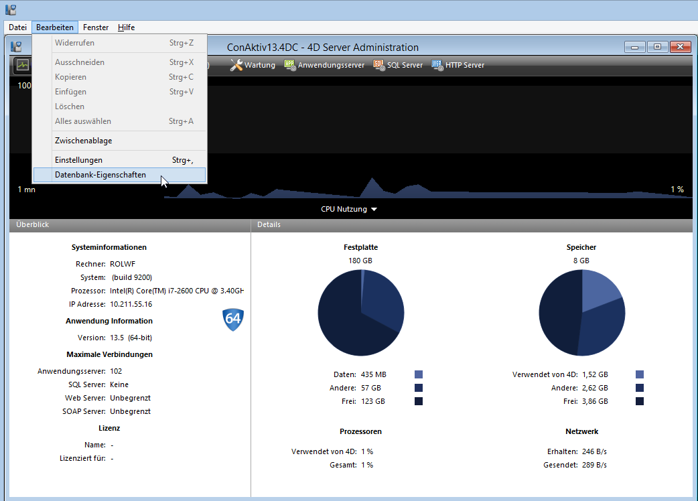
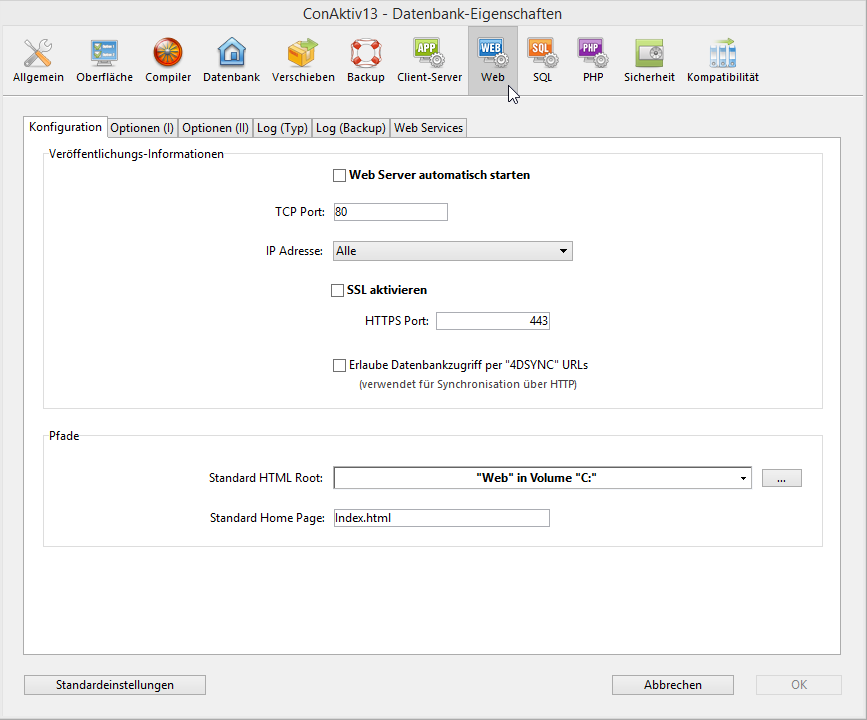

# Einstellungen des ConAktiv® Web-Servers

Um den ConAktiv®-Server für den Zugriff über ConAktiv® Mobile zu konfigurieren, öffnen Sie am Server unter dem Bearbeiten-Menü die Datenbank-Eigenschaften.

Klicken Sie auf Web-Schaltfläche. Sie gelangen auf die Registerkarte „Konfiguration“ der Web-Einstellungen.

Der Web-Server soll in der Regel mit dem Start des ConAktiv® Servers ebenfalls gestartet werden. Aktivieren Sie dazu das Ankreuzfeld „Web Server automatisch starten“.

Tragen Sie in das Feld „TCP Port:“ den Port ein, über den der Web-Server erreichbar sein wird. Standardmäßig wird hier Port 80 vorgeschlagen.

Soll die Verbindung zwischen Browser und ConAktiv® Mobile mit einer SSL-Verschlüsselung erfolgen, aktivieren Sie das Ankreuzfeld „SSL aktivieren“. Beachten Sie, dass dazu entsprechende Zertifikatsdateien notwendig sind, siehe Abschnitt „Zugriff“. Über welchen Port die verschlüsselte Verbindung laufen soll, geben Sie im Feld „HTTPS Port:“ an. Standardmäßig wird Port 443 vorgeschlagen.

Haben Sie die notwendigen Optionen angepasst, klicken Sie auf den Knopf „OK“ im Fuß des Fensters der Datenbank-Eigenschaften. Führen Sie ggf. einen Neustart des ConAktiv® Servers durch.

Sofern Sie nicht die Option „Web Server automatisch starten“ aktiviert haben, müssen Sie den Web-Server manuell starten. Klicken Sie hierzu auf dem Administrationsfenster des ConAktiv® Servers auf den Knopf „HTTP Server“.

Klicken Sie auf der sich öffnenden Administrationsseite auf den Knopf „Start HTTP server“.

Der Server wird gestartet.

Starten Sie den ConAktiv® Server neu, muss der Web-Server ebenfalls neu gestartet werden.
