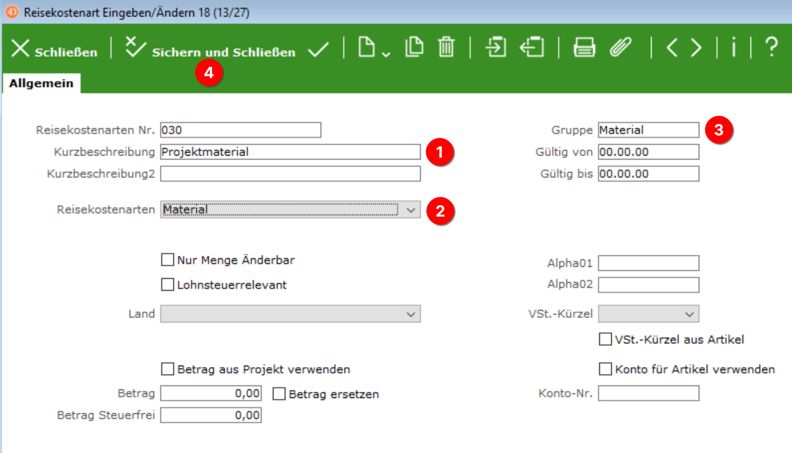
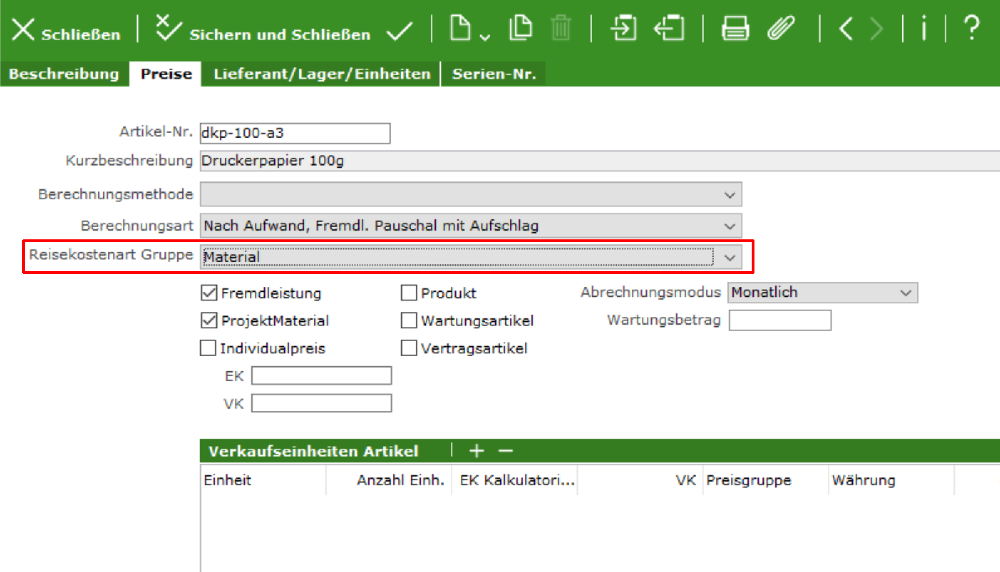

# Projektmaterialerfassung: warum sind Artikel nicht sichtbar?

## Problembeschreibung

{ align=right }

Sie haben einen Artikel angelegt, der in der Projektmaterialerfassungsmaske im Feld "Artikel" angezeigt werden soll. Dort taucht er aber nicht auf.

## Mögliche Ursache

Eine häufige Ursache für nicht angezeigte Artikel ist eine fehlende Zuordnung der Artikel zu einer Reisekostenarten-Gruppe.

## Behebung

### Reisekostenart für "Material" erstellen

{ align=right }

In der ConAktiv® Desktop App rufen wir über das Menü "Datei" 1 die "Systemparameter" 2 auf.

{ align=right }

Wählen Sie in der Liste den Eintrag "Reisekostenarten" aus.

{ align=right }

Es öffnet sich ein Fenster für die Reisekostenarten, in dem Sie die Schaltfläche "Neu" betätigen.

In der Eingabemaske für die neue Reisekostenart geben Sie folgende Werte ein:

- in das Feld "Kurzbeschreibung" den Wert "Projektmaterial" 1
- im Aufklappmenü "Reisekostenarten" wählen Sie "Material" aus 2
- in das Eingabefeld "Gruppe" tragen Sie den Wert "Material" ein 3

Anschließend betätigen Sie die Schaltfläche "Sichern und schließen" 4.

### Artikel zu Gruppe "Material" zuordnen

Im letzten Schritt müssen die nicht sichtbaren Artikel der Reisekostenart-Gruppe "Material" zugeordnet werden:

Nachdem die Änderungen gespeichert sind, sollten die Artikel in der Projektmaterialerfassungsmaske auftauchen.

