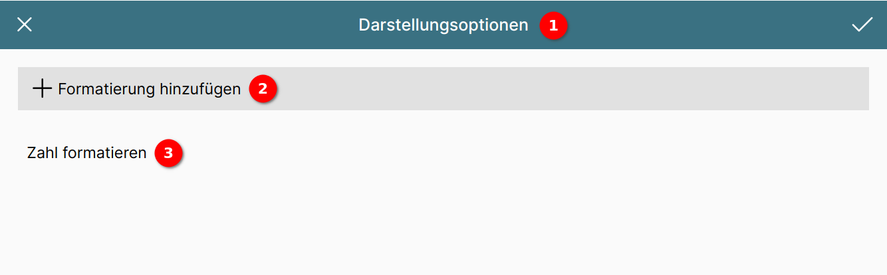

# Der Darstellungsoptionen-Editor

Die ConAktiv® Mobile4 bietet in verschiedenen Editoren die Möglichkeit, anhand eines Datenbankfeldwertes die Darstellung zu ändern.

Diese Änderung kann neben vielen anderen das Einstellen der Vorder- oder Hintergrundfarbe sein, das Einblenden eines Icons oder die Formatierung einer Zahl.

Die Konfiguration erfolgt im Darstellungsoptionen-Editor.

## Aufteilung des Editors

1 Die Werkzeugleiste

2 Schaltfläche zum Hinzufügen einer Darstellungsoption

3 Liste der Darstellungsoptionen
