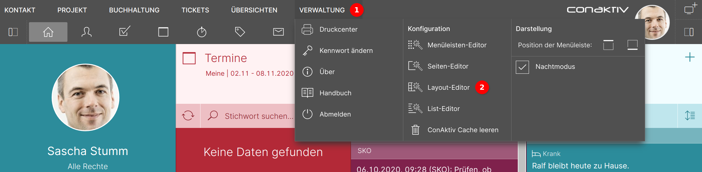
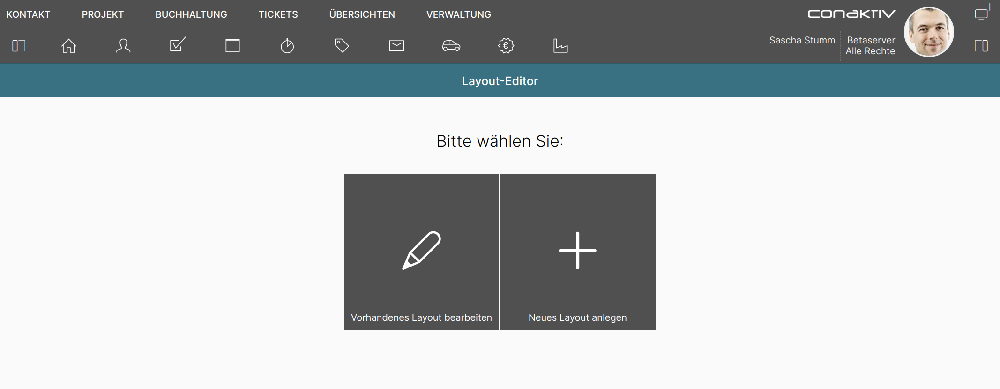

# Der ConAktiv® Mobile4 Layout-Editor

## Gestaltungsmöglichkeiten mit Eingabemasken

Jedes Eingabemaske in der ConAktiv® Mobile4 kann mit dem Layout-Editor nahezu beliebig angepasst werden.

Es ist auch möglich, für verschiedene Gruppen und Benutzer jeweils eigene Eingabemasken anzulegen und zuzuweisen.

## Aufruf des Editors

Über das Menü "Verwaltung" 1 wird der Layout-Editor 2 aufgerufen.

## Neu anlegen oder bearbeiten?

!!! info "Hinweis"
    Die ConAktiv® Mobile4 wird mit einer Vielzahl an Layouts ausgeliefert. Diese sind allerdings nicht in der Datenbank hinterlegt, sondern kommen aus dem Dateisystem. Damit sind diese Layouts nicht unter "Vorhandenes Layout bearbeiten" sichtbar.

Unter "Vorhandenes Layout bearbeiten" tauchen nur solche Layouts auf, die Sie selbst angelegt haben.

Wenn Sie ein neues Layout anlegen wollen, bedeutet das aber nicht, bei Null zu starten. In diesem Fall wird das für Ihren Benutzer eingestellte Standardlayout als Vorlage bereitgestellt.
