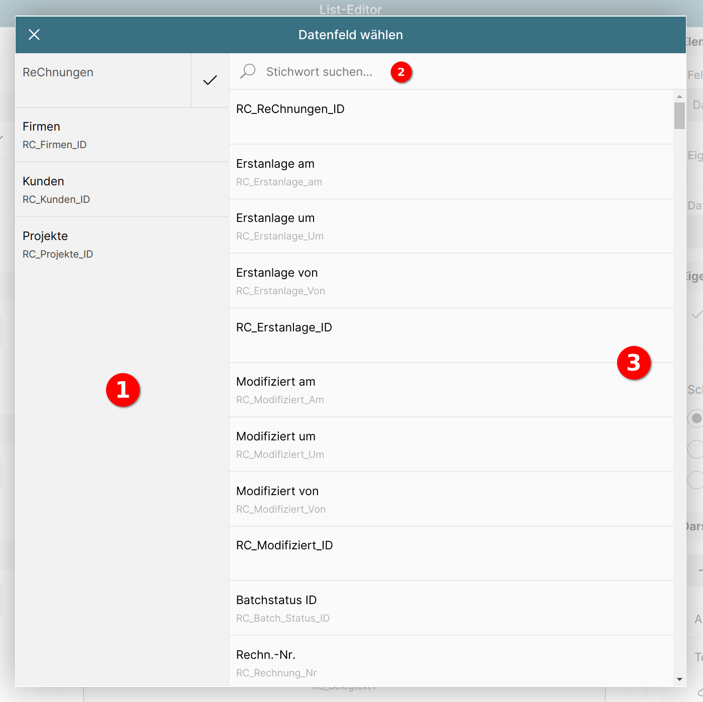
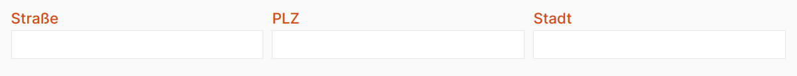
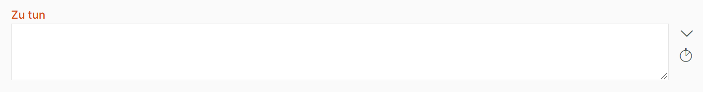
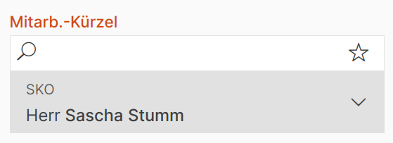
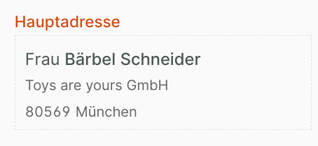
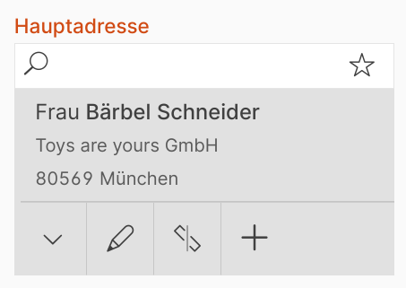
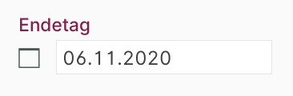

# Datenbankfeld in Liste anzeigen

{ align=right }

Die Anzeige eines Datenbankfeld-Wertes lässt sich über den Feldtyp "Datenbankfeld" realisieren.

Über das Eingabefeld "Eigener Titel" 1 lässt sich die Beschriftung für dieses Feld speziell für die Anzeige an dieser Stelle ändern.

Mit Klick auf "Datenbankfeld" 2 öffnet sich ein Dialog zur Auswahl des gewünschten Datenbankfeldes.

## Datenbankfeld für die Anzeige auswählen

Das Popup zur Auswahl des Datenbankfelds teilt sich in drei Bereiche auf:

1 **Modulauswahl**

Das Datenbankfeld kann nicht nur aus den Feldern des Listenmoduls gewählt werden, sondern auch aus denen anderer Module. Alle Module, die mit dem Listenmodul verknüpft sind, tauchen in der Modulauswahl auf.

Ein Klick auf ein Modul lädt dessen Datenbankfelder in der Datenbankfeldliste.

2 **Stichwortsuche nach Datenbankfeldname**

{ align=right }

Mit der Stichwortsuche wird eine unscharfe Suche nach dem Datenbankfeldname und dem vom Benutzer vergebenen Feldnamen durchgeführt.

Durch Eingabe von "summe" in das Suchfeld und Betätigen der Tab- oder Eingabetaste werden für das Modul "Rechnungen" alle Felder gefunden, in denen dieses Wort vorkommt.

3 **Datenbankfeldliste**

In der Datenbankfeldliste tauchen alle Felder des in der Modulauswahl aktiven Moduls auf.

{ align=right }

Durch Klick auf ein Feld wird dieses markiert 1 und es erscheint die Schaltfläche "Übernehmen" in der Popup-Titelleiste 2.

Durch Klick auf diese Schaltfläche wird das Datenbankfeld übernommen und das Popup geschlossen.

Um die Änderungen nicht zu übernehmen, betätigen Sie die Schaltfläche "Abbrechen" 3.

## Eingabefeld wählen

{ align=right }

Jedes Datenbankfeld hat einen Datentyp, z.B. "Text", "Zahl" oder "Datum". Je nach Datentyp gibt es mehrere Eingabfelder, die in der Eingabemaske für das Datenbankfeld angezeigt werden können.

Gibt es für einen Datentyp nur ein einziges Eingabefeld, wird der Abschnitt "Eingabefeld wählen" nicht angezeigt.

Nachfolgend erfolgt eine Aufzählung der möglichen Eingabefelder.

### Textfeld einzeilig

Für den Datentyp "Text" steht das einzeilige Textfeld zur Verfügung.

_Drei einzeilige Textfelder in der Eingabemaske_

#### Optionen

{ align=right }

Das einzeilige Textfeld stellt einige spezielle Einstellungen zur Verfügung.

##### 1 Email-Icon

{ align=right }

Enthält das Textfeld voraussichtlich eine Email-Adresse, kann diese Option gewählt werden, um in der Eingabemaske links neben dem Textfeld ein Icon anzuzeigen, das bei Betätigung ein Emailprogramm öffnet und den Inhalt des Textfelds als Empfänger übergibt.

##### 2 Telefon-Icon

{ align=right }

Enthält das Textfeld voraussichtlich eine Telefonnummer, kann diese Option gewählt werden, um in der Eingabemaske links neben dem Textfeld ein Icon anzuzeigen, das bei Betätigung versucht, auf Desktop-Geräten ein TAPI-Programm zu öffnen, auf Mobilgeräten das eingestellte Telefonprogramm.

##### 3 Web-URL-Icon

{ align=right }

Enthält das Textfeld voraussichtlich eine Webseiten-URL, kann diese Option gewählt werden, um in der Eingabemaske links neben dem Textfeld ein Icon anzuzeigen, das bei Betätigung die Webseite in einem neuen Fenster zu öffnen.

##### 4 / 5 Platzhalter

Über diese Funktion kann links oder rechts neben dem Textfeld eine leere Fläche eingeblendet werden, um das Textfeld mit darüber oder darunter liegenden Feldern, die z.B. Email-Icons enthalten, in eine Linie zu bringen.

### Textfeld mehrzeilig

Für den Datentyp "Text" steht das mehrzeilige Textfeld zur Verfügung.

_Mehrzeiliges Textfeld in der Eingabemaske_

#### Optionen

{ align=right }

Das mehrzeilige Textfeld stellt einige spezielle Einstellungen zur Verfügung.

##### 1 Link zu Google-Maps

{ align=right }

Enthält das Textfeld voraussichtlich eine Adresse, kann diese Option gewählt werden, um in der Eingabemaske links neben dem Textfeld ein Icon anzuzeigen, das bei Betätigung die Google Maps Webseite in einem neuen Fenster öffnet.

##### 2 / 4 Platzhalter

Über diese Funktion kann links oder rechts neben dem Textfeld eine leere Fläche eingeblendet werden, um das Textfeld mit darüber oder darunter liegenden Feldern, die z.B. Email-Icons enthalten, in eine Linie zu bringen.

##### 3 Zeitstempel-Icon

{ align=right }

Um während der Eingabe in der Eingabemaske einen Zeitstempel einzufügen, kann diese Option aktiviert werden.
Betätigt der Anwender das Icon, wird in das Textfeld ein Zeitstempel mit Datum, Uhrzeit und dem Benutzerkürzel eingetragen.

##### 5 Anzahl Zeilen

Für die Darstellung während der Eingabe kann die Anzahl der Zeilen eingestellt werden. Diese Einstellung wirkt sich also auf die Höhe des Textfelds aus.

##### 6 Rahmen anzeigen

{ align=right }

Für die Darstellung in der Datensatzansicht kann um das Textfeld ein Rahmen angezeigt werden.

##### 7 Schrift mit fester Laufweite

{ align=right }

Für die Darstellung in der Datensatzansicht kann die Schrift im Textfeld mit fester Laufweite eingestellt werden.

### Suchfeld

Für den Datentyp "Text" steht das Suchfeld zur Verfügung.

 
_Suchfeld in der Eingabemaske_

Das Suchfeld bietet die Möglichkeit, einen vorhandenen Datensatz zu verknüpfen. Im Gegensatz zum [Verknüpfungsfeld](#verknupfungsfeld) beschränkt sich seine Funktionalität im Bearbeitenmodus auf die Auswahl eines vorhandenen Datensatzes.

#### Optionen

{ align=right }

Das Suchfeld stellt einige spezielle Einstellungen zur Verfügung.

##### 1 Suchergebnisse in Liste anzeigen

{ align=right }

Suchfelder werden im Standard so dargestellt, dass die Liste mit Suchergebnissen als Popup dargestellt wird (im Screenshot siehe Feld "Kunden_StammNr").

Alternativ lässt sich durch Aktivierung dieser Option die Liste mit Suchergebnissen direkt in der Eingabemaske anzeigen (im Screenshot siehe Felder "Projekt" und "Tätigkeit").

##### 2 Höhe (in Pixel)

Ist die Option "In Liste anzeigen" aktiv, kann die Höhe der Liste in der Eingabemaske in Pixeln festgelegt werden.

### Verknüpfungsfeld

Für den Datentyp "Zahl" steht das Verknüpfungsfeld zur Verfügung.

 
_Verknüpfungsfeld in der Eingabemaske im Ansichtmodus_

 
_Verknüpfungsfeld in der Eingabemaske im Bearbeitenmodus_

Anders als das [Suchfeld](#suchfeld) bietet das Verknüpfungsfeld im Bearbeitungsmodus die Möglichkeit, den gewählten Datensatz direkt zu bearbeiten, einen anderen Datensatz zu verknüpfen oder die Verknüpfung zu lösen.

#### Optionen

{ align=right }

Das Verknüpfungsfeld stellt einige spezielle Einstellungen zur Verfügung.

##### 1 "Lösen" anzeigen

{ align=right }

Ist diese Option aktiv, wird in der Eingabemaske im Bearbeitenmodus die Schaltfläche zum Lösen des Datensatzes angezeigt.

Damit kann der Anwender eine bestehende Verknüpfung löschen.

##### 2 "Bearbeiten" anzeigen

{ align=right }

Ist diese Option aktiv, wird in der Eingabemaske im Bearbeitenmodus die Schaltfläche zum Bearbeiten des verknüpften Datensatzes angezeigt (wenn der Anwender das entsprechende Recht besitzt).

Damit kann der Anwender den verknüpften Datensatz bearbeiten.

##### 3 "Neu" anzeigen

{ align=right }

Ist diese Option aktiv, wird in der Eingabemaske im Bearbeitenmodus die Schaltfläche zum Anlegen eines Datensatzes angezeigt (wenn der Anwender das entsprechende Recht besitzt).

Damit kann der Anwender einen neuen verknüpften Datensatz anlegen.

##### 4 Layout wählen

Über diese Schaltfläche lässt sich das Listenlayout wählen, das für die Anzeige der Suchergebnisse verwendet werden soll.

##### 5 Voreingestellte Suche

Mit dieser Schaltfläche kann aus den verfügbaren gespeicherten Suchen eine ausgewählt werden, die bei der Suche angewendet werden soll. Diese lässt sich vom Anwender in der Eingabemaske weder einsehen noch deaktivieren.

### Datumfeld

Für den Datentyp "Datum" steht das Datumfeld zur Verfügung.

 
_Datumfeld in der Eingabemaske im Ansichtmodus_

#### Optionen

{ align=right }

Für das Datumfeld kann eingestellt werden, ob in der Bearbeitungsmaske zwei Schaltflächen zum Vor- und Zurückblättern angezeigt werden sollen.

{ align=right }

Dies stellt zusätzlich zum Kalenderpopup eine weitere Möglichkeit zum Wechseln des Datums für den Anwender in der Eingabemaske dar.

### Zeitfeld

{ align=right }

Für den Datentyp "Zeit" steht das Zeitfeld zur Verfügung.

Das Zeitfeld stellt eine Uhrzeit im Format "HH:MM" dar. Es bietet keine speziellen Optionen.

### Checkbox für Ja/Nein Werte

{ align=right }

Für den Datentyp "Boolean" steht das Checkbox-Feld zur Verfügung.

Es stellt ein Ankreuzfeld zur Verfügung, das den Zustand des Feldes (wahr/falsch, ja/nein) visualisiert.

Es bietet keine speziellen Optionen.

