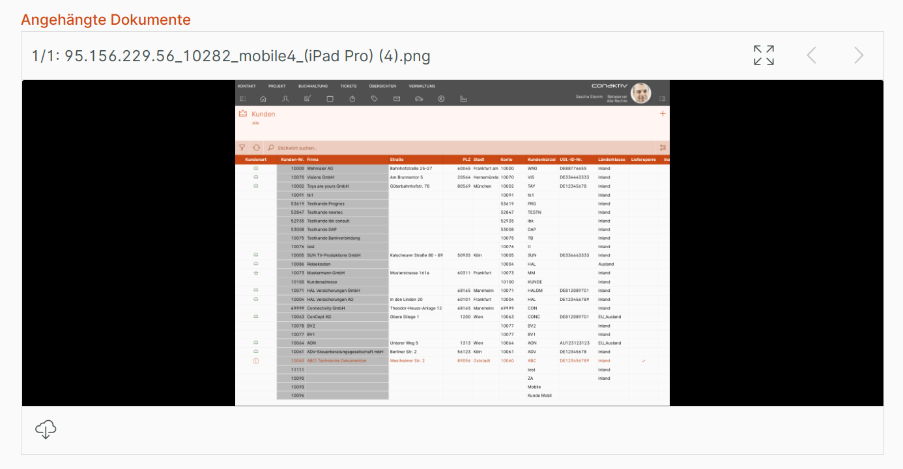
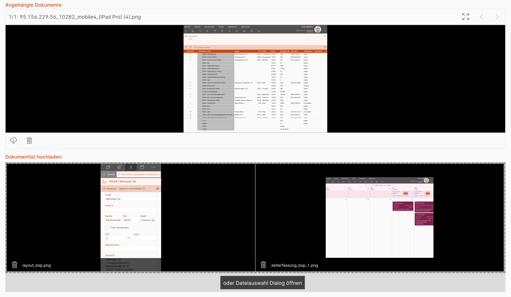

# Dokumentenfeld

An jeden Datensatz in ConAktiv® können direkt Dokumente angehängt werden. Das Dokumentenfeld in Eingabemasken bietet dem Anwender Zugriff auf diese angehängten Dokumente und erlaubt es, diese zu löschen oder neue hochzuladen.

!!! warning "Hinweis"
    Für dieses Feld ist keine Lizenz für das Modul "Dokumente" erforderlich. In seiner Umsetzung entspricht es der [Büroklammer-Funktion im ConAktiv® Client](https://handbuch.conaktiv.de/wiki/version-17-6/kontaktmodule/dokumente/externe-dokumente-an-datensatz-anheften/anwendung/neues-dokument-anhaengen/).

## Konfiguration

{ align=right }

Über das Eingabefeld "Eigener Titel" 1 kann eine eigene Beschriftung für das Feld in der Eingabemaske vergeben werden.

Außerdem lassen sich Darstellungsoptionen für das Feld definieren 2; dieser Abschnitt wird unter [Darstellungsoptionen](../../../../darstellungsoptionen/index.md) erläutert.

## Beispiele für das Dokumentenfeld in der Eingabemaske

_Das Dokumentenfeld in der Eingabemaske in der Datensatz-Ansicht_

_Das Dokumentenfeld in der Eingabemaske in der Bearbeitungs-Ansicht._
