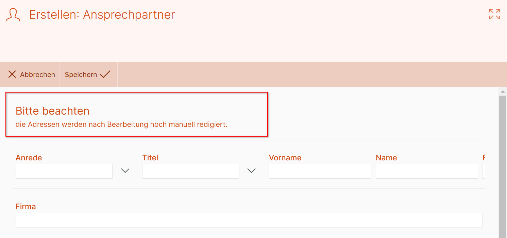

# Freitextfeld

Mit dem Freitextfeld lassen sich beliebige Texte (auch mit HTML-Markup versehen) in einer Eingabemaske anzeigen.

## Konfiguration

{ align=right }

Über das Eingabefeld "Eigener Titel" 1 kann eine eigene Beschriftung für das Feld in der Eingabemaske vergeben werden.

Der anzuzeigende Text wird in das Eingabefeld "Freitext" 2 eingegeben.

Außerdem lassen sich Darstellungsoptionen für das Feld definieren 3; dieser Abschnitt wird unter [Darstellungsoptionen](../../../../darstellungsoptionen/index.md) erläutert.

## Beispiel Freitextfeld

_Anwendung des Freitextfelds in einer Eingabemaske_
