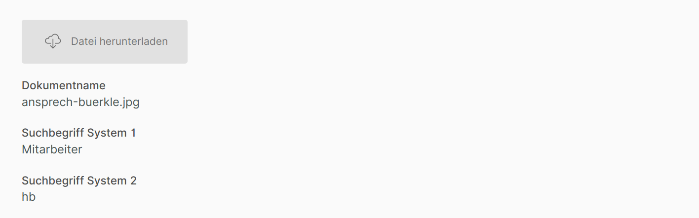
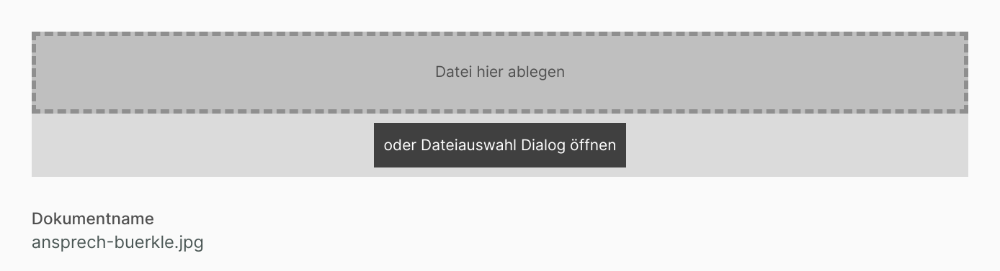

# Hochladenfeld

Ein Datensatz aus dem Modul "Dokumente" kann eine angehängte Datei haben. Diese Datei kann über das Hochladenfeld vom Anwender verwaltet werden.

!!! warning "Hinweis"
    Dieses Feld macht nur im Modul "Dokumente" Sinn. Um angehängte Dokumente in anderen Modulen zugreifbar zu machen, verwenden Sie bitte das ["Dokumentenfeld"](../dokumentenfeld/index.md).

## Konfiguration

{ align=right }

Über das Eingabefeld "Eigener Titel" 1 kann eine eigene Beschriftung für das Feld in der Eingabemaske vergeben werden.

Außerdem lassen sich Darstellungsoptionen für das Feld definieren 2; dieser Abschnitt wird unter [Darstellungsoptionen](../../../../darstellungsoptionen/index.md) erläutert.

## Beispiele für das Hochladenfeld in der Eingabemaske

_Das Hochladenfeld in der Eingabemaske in der Datensatz-Ansicht_

_Das Hochladenfeld in der Eingabemaske in der Bearbeitungs-Ansicht._
