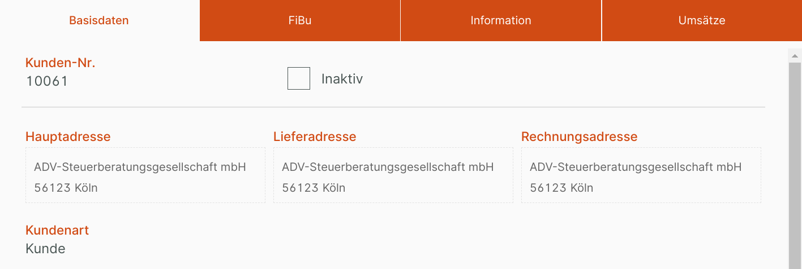
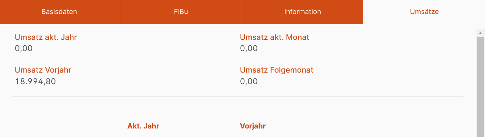

# Tabsektion

Mit Tabsektionen kann eine Eingabemaske mit viele Feldern übersichtlich gegliedert werden.

Alle Felder unter dem als Tabsektion definierten Feld werden in dieser Tabsektion einsortiert, bis zu dem nächsten Feld vom Typ Tabsektion.

## Konfiguration

{ align=right }

Über das Eingabefeld "Eigener Titel" 1 kann eine eigene Beschriftung für den Tab in der Eingabemaske vergeben werden.

## Beispiele für Tabsektionen in der Eingabemaske

_Eingabemaske mit aktiver Tabsektion "Basisdaten"_

_Eingabemaske mit aktiver Tabsektion "Umsätze"_
