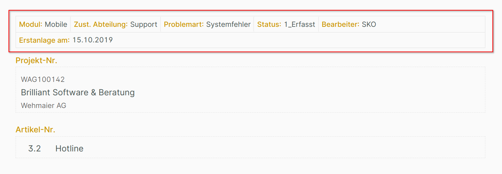

# Zeilen bearbeiten

{ align=right }

Nachdem in der [Strukturansicht eine Zeile ausgewählt](../layoutstruktur/index.md#auswahl-einer-zeile) wurde, erscheint deren Bearbeitungsansicht auf der [rechten Seite des Layout-Editors](../index.md).

Die Bearbeitungsansicht ist in fünf Abschnitte untergliedert.

## 1 Neu/Verschieben/Löschen

Folgende Aktionen lassen sich in diesem Abschnitt ausführen:

- **Neue Zeile oben**

    Hiermit wird über der ausgewählten eine neue Zeile eingefügt. Die neue Zeile enthält eine Spalte mit einem Element.

- **Neue Zeile unten**

    Hiermit wird unter der ausgewählten eine neue Zeile eingefügt. Die neue Zeile enthält eine Spalte mit einem Element.

- **Nach oben schieben**

    Dieser Punkt ist nur aktiv, wenn die ausgewählte Zeile nicht die oberste Zeile in der Struktur ist.

    Nach Betätigen der Schaltfläche wird die ausgewählte Zeile um eine Position nach oben verschoben.

- **Nach unten schieben**

    Dieser Punkt ist nur aktiv, wenn die ausgewählte Zeile nicht die unterste Zeile in der Struktur ist.

    Nach Betätigen der Schaltfläche wird die ausgewählte Zeile um eine Position nach unten verschoben.

- **Löschen**

    Löscht die ausgewählte Zeile mit allen Inhalten (Spalten und Elemente).

## 2 Umbruch abhängig von Bildschirm

{ align=right }

Die Spalten innerhalb einer Zeile werden normalerweise nicht umgebrochen, d.h. sie stehen immer nebeneinander (Standardeinstellung "Kein Umbruch").

Ist der zur Verfügung stehende Platz begrenzt, muss in der Eingabemaske gescrollt werden.

{ align=right }

Um das zu vermeiden, kann festgelegt werden, dass ab einer bestimmten Bildschirmgröße die Spalten innerhalb der Zeile umgebrochen werden (hier: Umbruch "auf Smartphone").

## 3 Abstände

{ align=right }

Für jede Zeile lässt sich ein Abstand nach oben oder unten aktivieren. Im Beispiel ist der Abstand nach oben aktiviert.

## 4 Rahmen

{ align=right }

Außerdem ist es möglich, für jede Zeile eine Linie oben und / oder unten anzuzeigen. Im Beispiel ist der untere Rahmen eingeschaltet.

## 5 Darstellung

{ align=right }

Wird die komprimierte Darstellung für eine Zeile aktiviert, so werden deren Spalten in einer platzsparenden Weise angezeigt.

Ohne Angabe einer festen Breite 1 richtet sich die Breite der Feldbeschriftungen nach ihrem Inhalt.

Beispiel für eine komprimierte Darstellung (ohne Angabe einer festen Breite für die Feldbeschriftungen) in der Eingabemaske.

