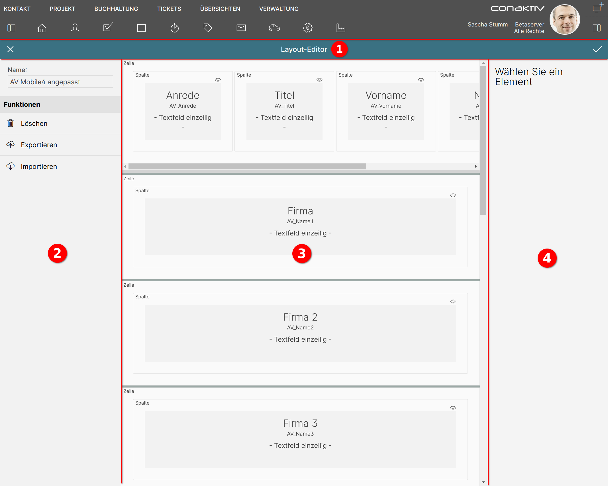

# Eingabemaske bearbeiten

Nach dem Erstellen einer neuen oder dem Laden einer vorhanden Eingabemaske landet man im Bildschirm für die Bearbeitung einer Eingabemaske.

Dieser ist in vier Bereiche unterteilt:

1 [Werkzeugleiste](./werkzeugleiste/index.md)

Hier kann die Eingabemaske gespeichert werden.

2 [Konfiguration der Eingabemaske](./konfiguration/index.md)

Konfiguration und Aktionen (Export, Import, Löschen) finden sich unter diesem Punkt.

3 [Darstellung der Eingabemaskenstruktur](./layoutstruktur/index.md)

Die schematische Darstellung der Eingabemaskenstruktur mit Auswahl des zu bearbeitenden Elements.

4 Bearbeitungsansichten

Zeigt Einstellungen für die ausgewählte [Zeile](./bearbeitungsansichten/zeilen.md), [Spalte](./bearbeitungsansichten/spalten.md) oder das ausgewählte [Element](./bearbeitungsansichten/elemente.md).
