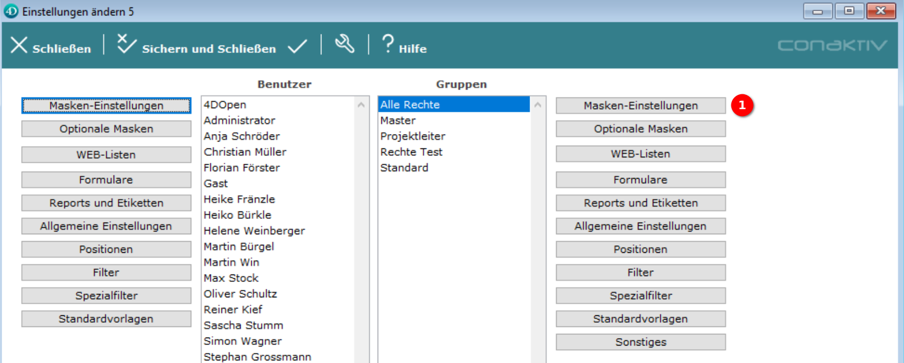

# Eine Eingabemaske einer Gruppe oder einem Benutzer zuordnen

Bevor eine neu angelegte Eingabemaske verwendet werden kann, muss sie einem Benutzer oder einer Gruppe zugeordnet werden.

## Einstellungen im ConAktiv® Client aufrufen

{ align=right }

Dies geschieht im ConAktiv® Client. Rufen Sie dort im Menü "Datei" 1 den Punkt "Einstellungen" 2 auf.

## Maskeneinstellungen aufrufen

Es öffnet sich ein Popup, in dem Sie den Benutzer oder die Gruppe auswählen, denen die Eingabemaske zugeordnet werden soll (im Beispiel ist die Gruppe "Alle Rechte" ausgewählt).

Nach der Auswahl gelangt man durch Betätigen der Schaltfläche "Masken-Einstellungen" 1 in den Bereich für die Maskeneinstellungen.

## Die Eingabemaske zuordnen

{ align=right }

Um z.B. eine neue Ansprechpartner-Eingabemaske zuzuordnen, navigiert man in der Modulliste zum Punkt "Ansprechpartner" 1.

Dort erscheint erscheint nach dem Aufklappen der Bereich "Eingabemaske mobil" 2, unter dem wir unsere neue Eingabemaske "AV Mobile4 angepasst" finden 3.

Um die Eingabemaske zuzuordnen, muss ein Doppelklick auf den Eingabemaskennamen durchgeführt werden. Wenn der Name in Fettschrift erscheint, ist die Zuordnung erfolgreich gewesen.

Um die Zuordnung zu speichern, betätigen Sie die Schaltfläche "Sichern und Schließen" oder "Sichern" 4.

## Eingabemaske in der ConAktiv® Mobile4 anschauen

Um die zugeordnete Eingabemaske in der ConAktiv® Mobile4 anzuschauen, ist es erforderlich, sich einmal ab- und neu anzumelden.
