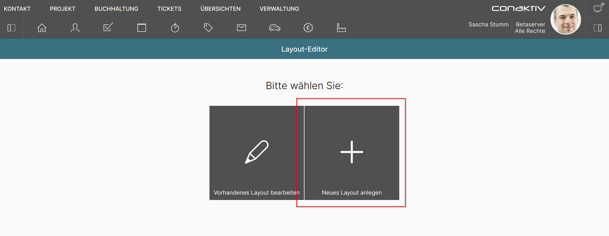
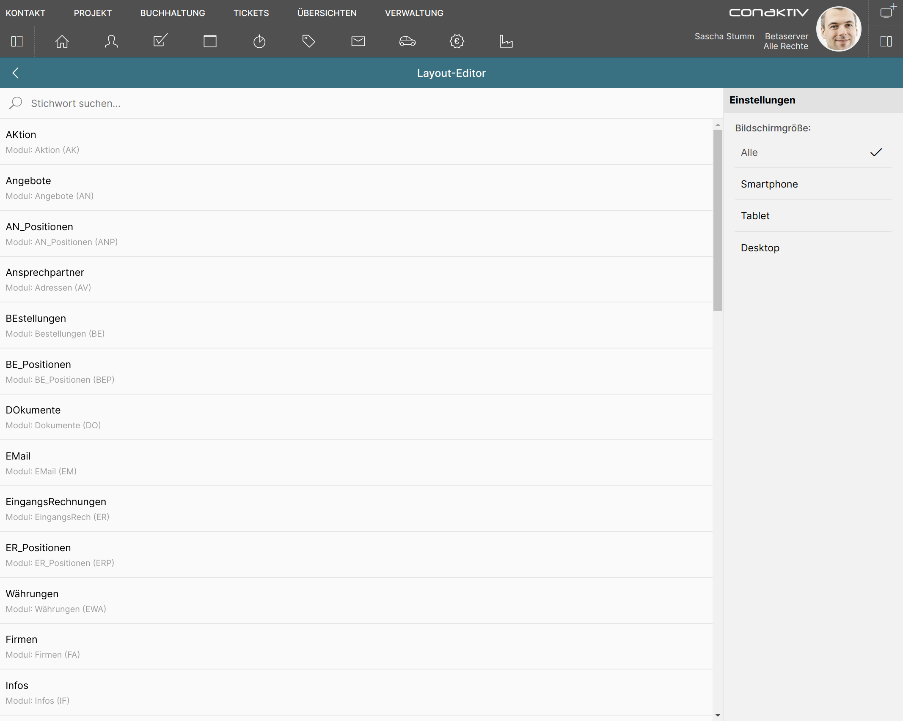
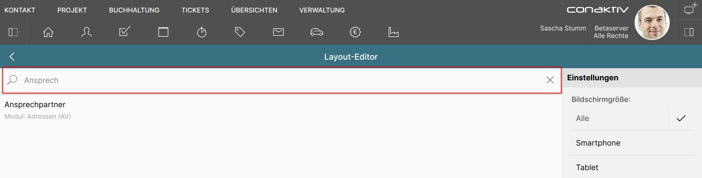
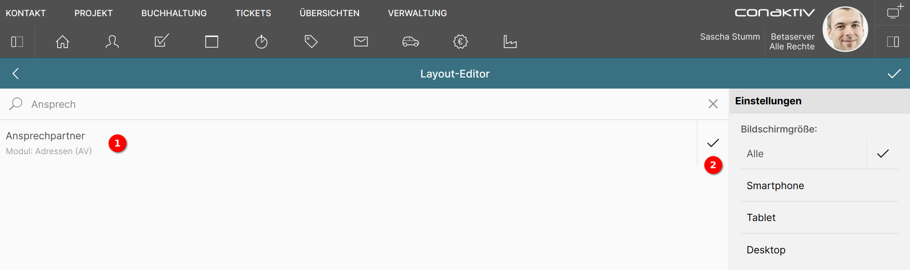
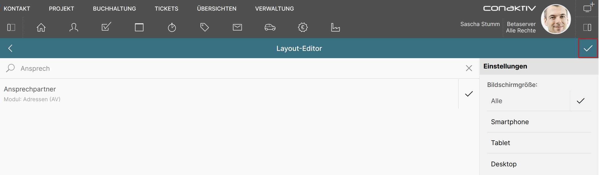

# Eine neue Eingabemaske anlegen

Betätigen Sie die Schaltfläche "Neues Layout anlegen", um zum Auswahlbildschirm für neue Eingabemasken zu gelangen.

Auf dem Auswahlbildschirm wird festgelegt, für welches Modul die neue Eingabemaske gelten soll und für welche Bildschirmgröße sie geeignet ist.

## Modulauswahl mit Schnellsuche eingrenzen

Die Liste der zur Auswahl stehenden Module kann sehr lang sein. Über die Schnellsuche kann die Anzahl der Module eingegrenzt werden.

Geben Sie in das Suchfeld z.B. "Ansprech" ein und drücken die Tab- oder Eingabetaste, verkürzt sich die Liste auf das Modul "Ansprechpartner".

Die Suche arbeitet also unscharf, d.h. es genügt, einen Teil eines Modulnamens einzugeben.

## Modul auswählen

Klicken Sie in der Liste auf das Modul "Ansprechpartner" 1.

Dadurch erscheint ein Haken rechts neben dem Modulnamen 2 der signalisiert, dass das Modul ausgewählt ist.

## Bildschirmgröße festlegen

{ align=right }

Die ConAktiv® Mobile4 weiß, welche Anzeigegröße ihr zur Verfügung steht.

Wird die Bildschirmgröße "Alle" gewählt, wird die Eingabemaske unabhängig von der Anzeigegröße benutzt.

Eine andere Auswahl führt dazu, dass die Eingabemaske nur herangezogen wird, wenn ihre gewählte Bildschirmgröße zur Anzeigegröße der ConAktiv® Mobile4 passt.

## Eingabemaske erstellen

Wenn alle Einstellungen getroffen sind, klicken Sie in der türkis hinterlegten Werkzeugleiste auf den Haken ganz rechts, um die Eingabemaske zu erstellen.

Damit wird die Vorlage für das Modul und die Einstellungen geladen und Sie gelangen in den Bearbeitungsmodus.
