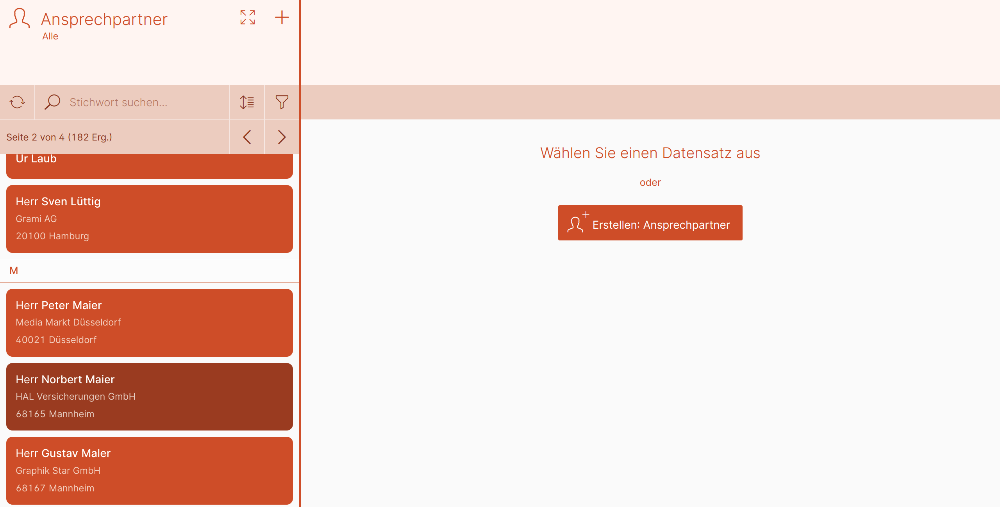
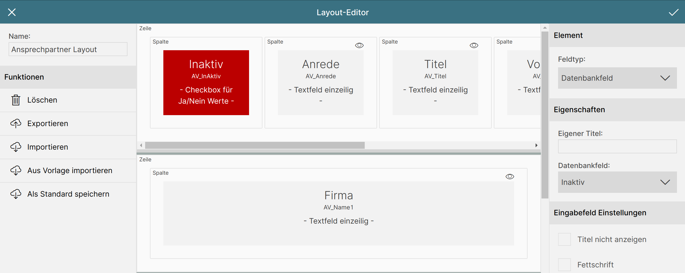
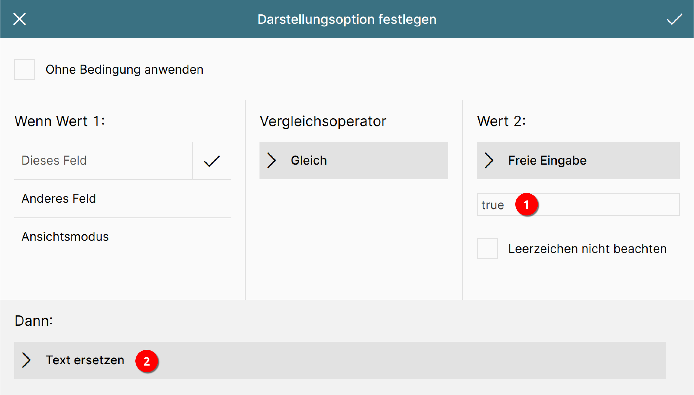
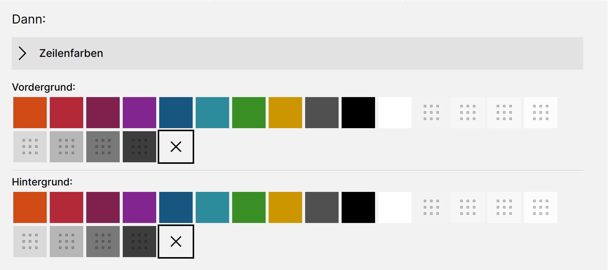
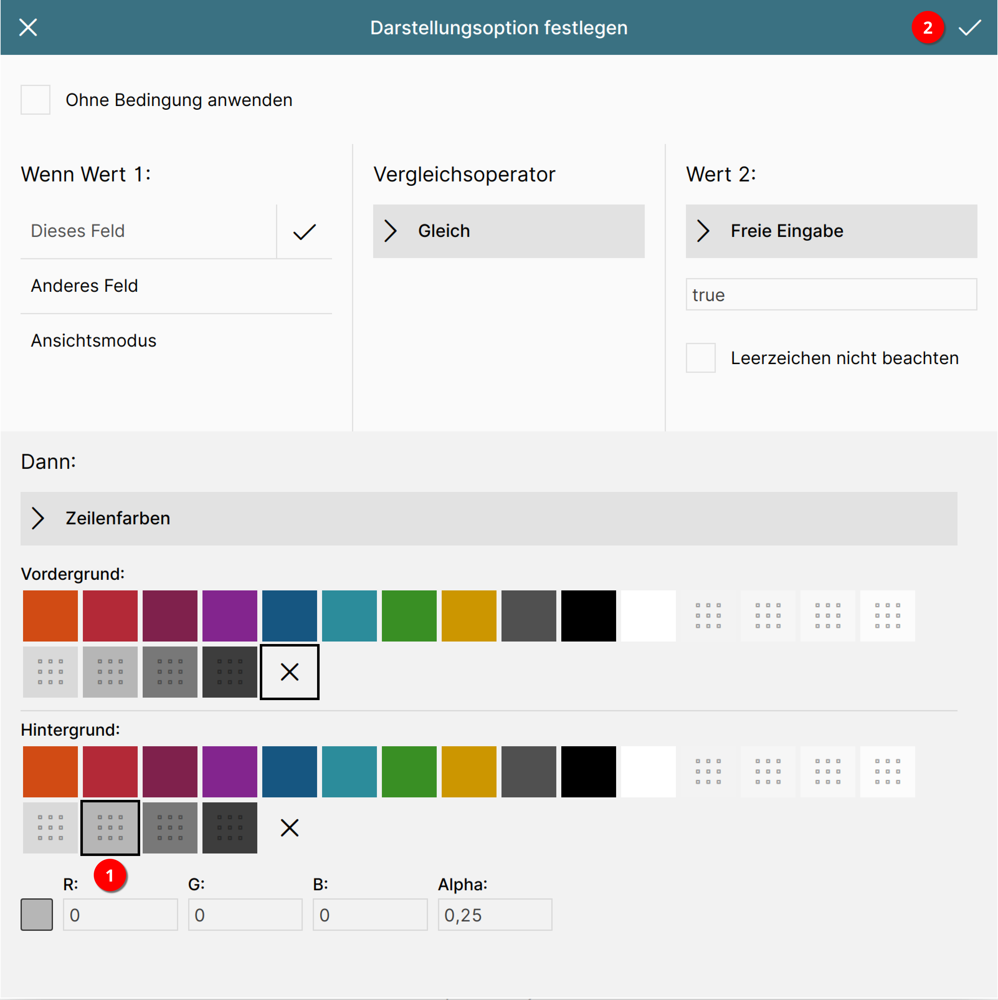
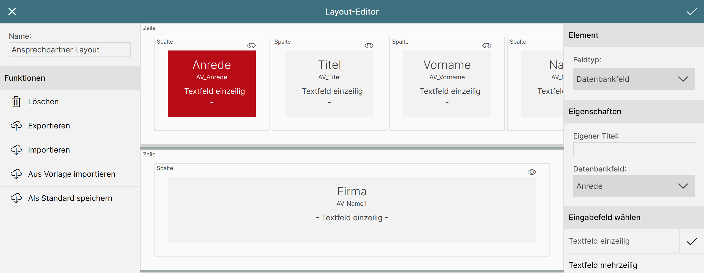
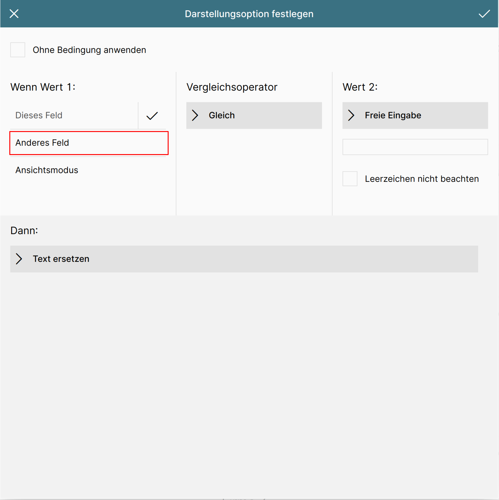
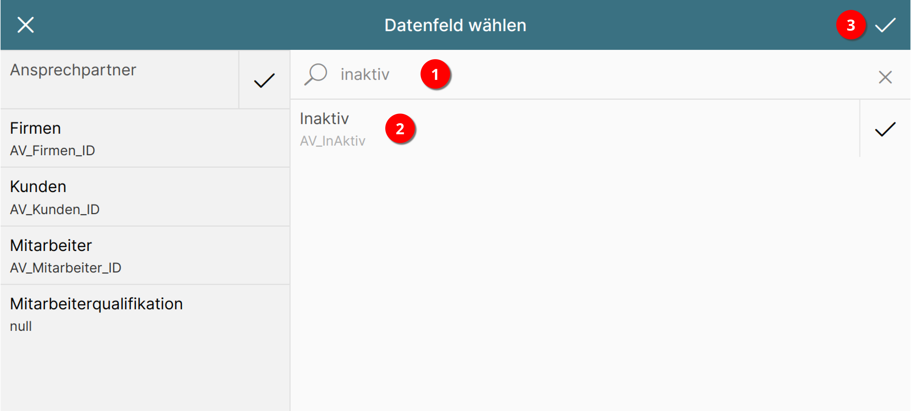
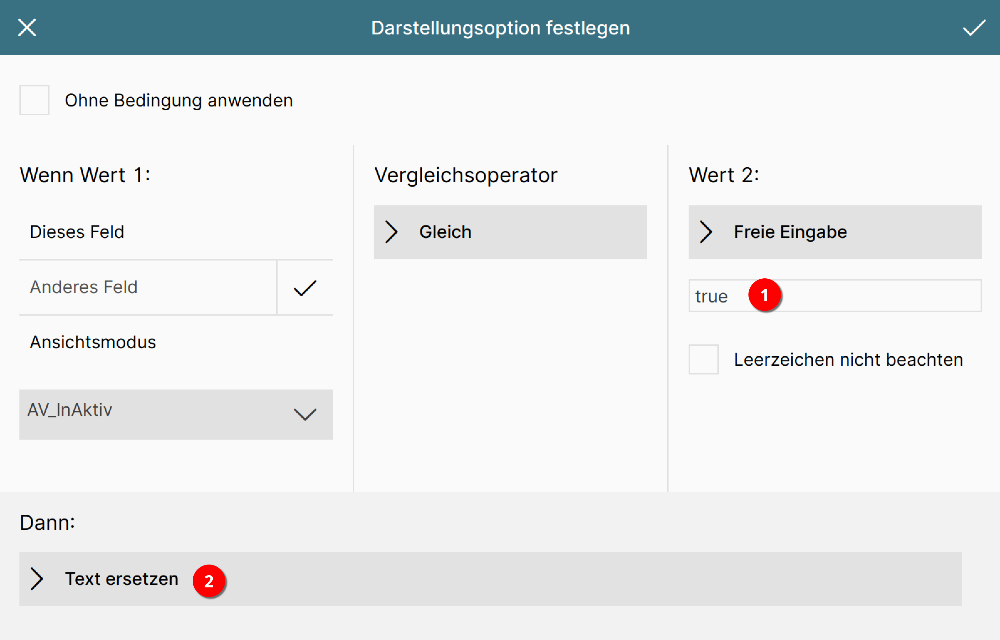
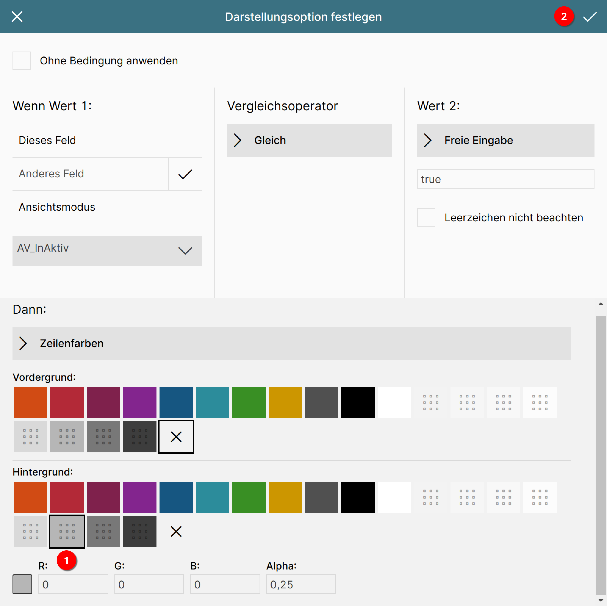

# Inaktive Ansprechpartner kennzeichnen

In diesem Beispiel sollen auf "inaktiv" gestellte Ansprechpartner in der Liste farblich etwas dunkler markiert werden.

Im folgenden Bildschirmfoto ist der Datensatz "Herr Norbert Maier" auf inaktiv gestellt.

## Liste aufrufen

Rufen Sie Ihre Liste für die Ansprechpartner im Listen-Editor auf oder legen Sie eine neue an. Details dazu finden Sie unter [Listen: neu anlegen oder bearbeiten?](http://localhost:8000/konfiguration/listen-editor/#neu-anlegen-oder-bearbeiten)

Je nachdem, ob das Datenbankfeld "inaktiv" in Ihrer Liste als eigenes Feld enthalten ist oder nicht, unterscheidet sich die Vorgehensweise.

## Das Datenbankfeld "inaktiv" ist in Ihrer Liste enthalten

### Feld auswählen

Klicken Sie im mittleren Bereich des Editors auf das Feld "Anrede", so dass es rot hinterlegt wird.

{ align=right }

Im rechten Bereich des Editors scrollen Sie nun ganz nach unten bis zum Abschnitt "Darstellungsoptionen".

### Darstellungsoption hinzufügen

{ align=right }

Betätigen Sie die Schaltfläche "Neue Option +".

{ align=right }

Es wird ein neuer Eintrag in der Liste der Darstellungsoptionen hinzugefügt.

Betätigen Sie nun die Schaltfläche "Bitte wählen".

### Darstellungsoption konfigurieren

Geben Sie nun im Abschnitt "Wert 2" im Eingabefeld den Wert "true" ein 1.

Betätigen Sie dann im Abschnitt "Dann:" die Schaltfläche "Text ersetzen" 2.

Es öffnet sich eine Liste mit möglichen Formatierungsoptionen. Wählen Sie die Option "Zeilenfarben".

Markieren Sie als Hintergrundfarbe den Grauwert mit geringer Opazität 1 und schließen Sie den Dialog über den Haken rechts oben 2.

Speichern Sie nun die Liste und laden Sie die Liste im Modul Ansprechpartner einmal neu, um die Änderung zu sehen.

!!! info "Hinweis"
    Sollten die Änderungen nicht dargestellt werden, vergewissern Sie sich, dass die Liste Ihrem Benutzer/Gruppe zugeordnet ist.
    Dies können Sie [hier](../../liste-zuordnen/) nachlesen.

## Das Datenbankfeld "inaktiv" ist in Ihrer Liste nicht enthalten

Möchte man Aktionen für ein Feld ausführen, das nicht in der Liste enthalten ist, empfiehlt es sich, diese gesammelt im ersten Feld der Liste unterzubringen.

### Erstes Datenbankfeld auswählen

Klicken Sie im mittleren Bereich des Editors auf das Feld "Anrede", so dass es rot hinterlegt wird.

{ align=right }

Im rechten Bereich des Editors scrollen Sie nun ganz nach unten bis zum Abschnitt "Darstellungsoptionen".

### Darstellungsoption hinzufügen

{ align=right }

Betätigen Sie die Schaltfläche "Neue Option +".

{ align=right }

Es wird ein neuer Eintrag in der Liste der Darstellungsoptionen hinzugefügt.

Betätigen Sie nun die Schaltfläche "Bitte wählen".

### Darstellungsoption konfigurieren

Es öffnet sich ein Dialog zur Konfiguration der Darstellungsoption.

Betätigen Sie hier im Abschnitt "Wenn Wert 1" die Schaltfläche "Anderes Feld".

{ align=right }

Es erscheint eine neue Schaltfläche mit der Bezeichnung "Bitte wählen".

Es öffnet sich ein Dialog zur Auswahl des gewünschten Datenbankfelds.

Geben Sie im rechten Bereich in der Stichwortsuche "inaktiv" ein 1 und drücken Sie die Bestätigen- oder Tabtaste.

Die Liste der Datenbankfelder reduziert sich auf das gewünschte Feld, welches Sie anklicken 2.

Schließen Sie nun den Dialog über den Haken rechts oben 3.

Geben Sie nun im Abschnitt "Wert 2" im Eingabefeld den Wert "true" ein 1.

Betätigen Sie dann im Abschnitt "Dann:" die Schaltfläche "Text ersetzen" 2.

Es öffnet sich eine Liste mit möglichen Formatierungsoptionen. Wählen Sie die Option "Zeilenfarben".

Markieren Sie als Hintergrundfarbe den Grauwert mit geringer Opazität 1 und schließen Sie den Dialog über den Haken rechts oben 2.

Speichern Sie nun die Liste und laden Sie die Liste im Modul Ansprechpartner einmal neu, um die Änderung zu sehen.

!!! info "Hinweis"
    Sollten die Änderungen nicht dargestellt werden, vergewissern Sie sich, dass die Liste Ihrem Benutzer/Gruppe zugeordnet ist.
    Dies können Sie [hier](../../liste-zuordnen/) nachlesen.