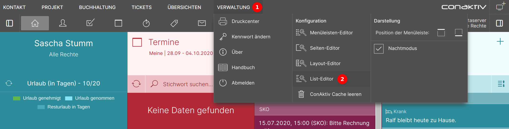
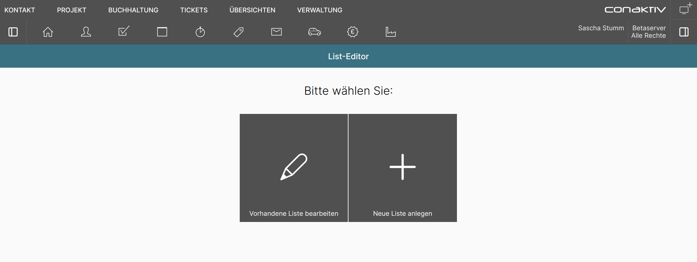

# Der ConAktiv® Mobile4 Listen-Editor

## Listen und Gestaltungsmöglichkeiten

In der ConAktiv® Mobile4 gibt es mehrere Arten von Listen, die sich über den Listen-Editor anpassen lassen.

|                        |                                                     |
| ---------------------- | --------------------------------------------------- |
| **Bildschirmlisten** Stellen Datensätze eines Moduls in Listenform dar.   |  |
| **Tabellen** Stellen Datensätze eines Moduls in Tabellenform dar.           |                  |
| **Suchergebnislisten** Werden in Suchfeldern genutzt, wenn mehrere Datensätze gefunden werden. |   |

Es können beliebige Datenbankfelder, Formeln und Diagramme in Listen eingebaut werden.

Werte lassen sich (optional auch abhängig von Parametern) mit Farben und Icons versehen, Schriftgrößen können angepasst, Zahlenformate definiert werden.

Darüber hinaus lassen sich die Sortierung/Gruppierung, die Darstellung von Gesamtsummen sowie Direktaktionen einstellen.

## Voraussetzungen für den Aufruf

Um den List-Editor in der ConAktiv® Mobile4 nutzen zu können, sind folgende Voraussetzungen notwendig:

### Rechte

{ align=right }

Es muss das Recht "Listeditor" -> "Detailkonfiguration erlauben" für den Benutzer oder die Gruppe gesetzt sein.

### Lizenz

Der Benutzer muss entweder über eine Komplettlizenz oder die Rolle "Administrator" verfügen.

## Aufruf des Editors

Über das Menü "Verwaltung" 1 wird der Listen-Editor 2 aufgerufen.

## Neu anlegen oder bearbeiten?

!!! info "Hinweis"
    Die ConAktiv® Mobile4 wird mit einer Vielzahl an Listen ausgeliefert. Diese sind allerdings nicht in der Datenbank hinterlegt, sondern kommen aus dem Dateisystem. Damit sind diese Listen nicht unter "Vorhandene Liste bearbeiten" sichtbar.

Unter "Vorhandene Liste bearbeiten" tauchen nur solche Listen auf, die Sie selbst angelegt haben.

Wenn Sie eine neue Liste anlegen wollen, bedeutet das aber nicht, bei Null zu starten. In diesem Fall wird die für Ihren Benutzer eingestellte Standardliste als Vorlage bereitgestellt.
