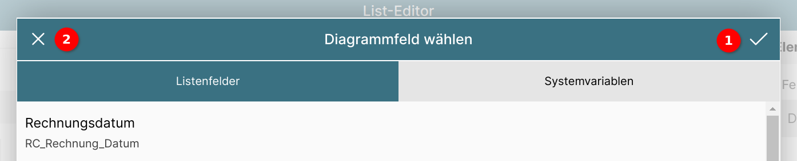
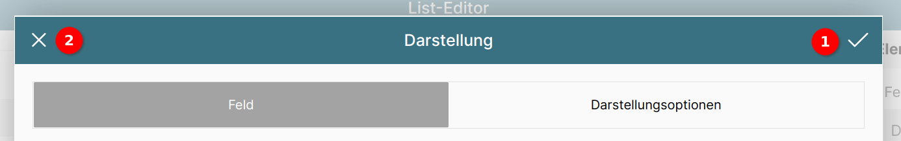

# Diagramm in Liste anzeigen

{ align=right }

Auch Diagramme lassen sich in Listen anzeigen; dies geschieht über die Auswahl von "Diagramm" als Feldtyp 1.

Über das Eingabefeld "Eigener Titel" 2 lässt sich eine Beschriftung hinzufügen.

Aufgrund des Umfangs dieses Abschnitts werden die weiteren Optionen in der Reihenfolge ihres Auftauchens beschrieben.

Die folgenden Abschnitte werden in Kürze ergänzt.

## Diagrammtyp festlegen

{ align=right }

Unter "Voreinstellung" lässt sich per Klick auf die Schaltfläche 1 der Typ des Diagramms auswählen.

Es öffnet sich ein Popupfenster 2 mit den zur Verfügung stehenden Diagrammtypen.

## Diagrammfelder verwalten

### Diagrammfelderliste

{ align=right }

Unter Diagrammfelder werden die für dieses Diagramm verwendeten Felder in einer Liste aufgeführt und lassen sich bearbeiten.

In einem "frischen" Diagramm ist diese Sektion leer bis auf die Schaltfläche "+ Feld hinzufügen" 1.

{ align=right }

Durch Klick auf diese Schaltläche wird ein leeres Feld eingefügt.

Um dessen Optionen anzuzeigen, muss es einmal angeklickt werden 2.

{ align=right }

Das ausgewählte Feld wird durch einen Haken rechts neben dem Feldnamen gekennzeichnet.

Es lässt sich nach oben oder unten schieben 1, womit die Darstellung im Diagramm beeinflusst wird.

Mit dem Stift 2 lässt sich das Datenbankfeld auswählen.

Der Pinsel 3 öffnet die Konfiguration für die Darstellung des Datenbankfelds.

Mit dem Mülleimer 4 lässt sich das Feld entfernen.

### Datenbankfeld für Diagramm auswählen

{ align=right }

Ein Diagrammfeld kann entweder ein Listenfeld 1 oder eine Systemvariable 2 sein.

#### Listenfeld auswählen

{ align=right }

Es können nur Felder im Diagramm angezeigt werden, die auch in der Listenstruktur vorhanden sind.

Durch Klick auf ein Feld 1 wird dieses ausgewählt, was durch einen Haken rechts neben dem Feldnamen symbolisiert wird.

Dem Feld kann statt des vorgegebenen Namens auch ein eigener Name über das Eingabefeld bei "Eigener Titel" vergeben werden 2.

Dieser Titel ist mehrsprachfähig, d.h. durch Klick auf die Schaltfläche "de" neben dem Eingabefeld 3 lassen sich Übersetzungstexte anlegen.

#### Systemvariable auswählen

{ align=right }

Die ConAktiv® Mobile4 bietet neben den Listenfeldern auch Zugriff auf sogenannte Systemvariablen. Diese enthalten z.B. Urlaubsinformationen oder Zeitbuchungsinformationen.

Interessant werden diese Variablen dann, wenn man sie mit Listenwerten zusammenstellt. Enthält ein Listenwert z.B. die Information, wieviel Zeit der Mitarbeiter an einem Tag gebucht hat, lässt sich dies der Sollzeit pro Tag für diesen Mitarbeiter gegenüberstellen.

#### Feld übernehmen

Durch Betätigen des Hakens rechts oben im Fenster 1 wird das gewählte Feld als Diagrammfeld übernommen.

Um die Änderungen zu verwerfen, genügt ein Klick auf das "X" 2 links oben im Fenster.

{ align=right }

Wurde das Feld übernommen, wird es in der Diagrammfeldliste entsprechend dargestellt.

### Darstellung des Diagrammfelds einstellen

{ align=right }

In der [Diagrammfelderliste](#diagrammfelderliste) lässt sich durch Betätigen des Pinsel-Symbols das Fenster für die Darstellungseigenschaften des Feldes öffnen.

Diese unterteilen sich in die Eigenschaften für Farben und Datensatz 1 sowie die Darstellungsoptionen 2.

#### Farben und Datensatz

{ align=right }

Die Vorder- und Hintergrundfarbe für das Feld, so wie sie später im Diagramm erscheinen sollen, lässt sich frei einstellen.

Die Einstellung wird für die Vordergrundfarbe beschrieben, für die Hintergrundfarbe gelten die Schritte gleichermaßen.

Die aktuell gewählte Farbe wird unter "Gewählte Farbe" 1 dargestellt.

Deren RGB (Rot/Grün/Blau)-Werte sind darunter zu sehen 2 und lassen sich auch über die Texteingabefelder genau einstellen.

Um eine vordefinierte Farbe aus dem ConAktiv® Mobile4 Farbschema zu wählen, klicken Sie auf eine Farbe unter "Systemfarben" 3.

{ align=right }

Über das Eingabefeld "Zuordnung zu Datensatz" lässt sich einstellen, ob das Feld für sich allein oder gruppiert mit anderen Feldern im Diagramm dargestellt werden soll.

{ align=right }

In diesem Beispiel hat das Feld "Sollzeit" den Datensatz "default", den Feldern "Gebucht" und "Restzeit Anw." ist der Datensatz "default2" zugeordnet.

#### Darstellungsoptionen

{ align=right }

Für das Feld lässt sich auch eine Darstellungsoption verwenden. Eine Liste der verfügbaren Optionen lässt sich durch Betätigen der Schaltfläche "---" 1 anzeigen.

{ align=right }

Die meistgenutzte Darstellungsoptionen an dieser Stelle dürfte "Zahl formatieren" sein.

{ align=right }

Hier wird eingestellt, dass der Zahlenwert mit Tausendertrennzeichen und zwei Nachkommastellen angezeigt werden soll.

#### Darstellung übernehmen

Durch Betätigen des Hakens rechts oben im Fenster 1 werden die Darstellungseigenschaften für das Feld übernommen.

Um die Änderungen zu verwerfen, genügt ein Klick auf das "X" 2 links oben im Fenster.

### Wertebereich festlegen

{ align=right }

Über den Wertebereich lässt sich der Maßstab für die Diagrammfelder einstellen.

#### Wertebereich "Höchster Wert"

Diese Einstellung ist sinnvoll, wenn mehrere Felder im Diagramm abgebildet werden, die in Relation zueinander gesetzt werden sollen (innerhalb jedes Listeneintrags).

#### Wertebereich "Absolut"

Soll dagegen ein Feld (oder auch mehrere) innerhalb der gesamten Liste vergleichbar gemacht werden, empfiehlt sich die Angabe eines absoluten Höchstwerts, zu dem das Feld/die Felder skaliert werden.

{ align=right }

Der absolute Wertebereich reicht von einem Von-Wert 1 bis zu einem Bis-Wert.

Der Bis-Wert kann entweder ein absoluter Wert sein 2 oder eine Systemvariable 3.

Füllt ein Feld nicht den kompletten Wertebereich aus, lässt sich eine Füllfarbe für den verbleibenden Bereich einstellen, die sich in die Füllfarbe 4 und die Rahmenfarbe 5 aufgliedert.

##### Systemvariable für Wertebereich wählen

{ align=right }

Unter dem Tab "Systemvariable" lässt sich durch Betätigen der Schaltfläche "..." eine Systemvariable wählen, die als Wert für das Bis-Feld genutzt wird.

{ align=right }

In dem erscheinenden Popup lässt sich in der Liste der Systemvariablen 1 die gewünschte auswählen.

Bei Bedarf kann ein eigener Titel über das entsprechende Eingabefeld 2 eingegeben werden.

Durch Betätigen des Hakens rechts oben im Fenster 3 wird die Systemvariable als Wertebereich Bis übernommen.

Um die Änderungen zu verwerfen, genügt ein Klick auf das "X" 4 links oben im Fenster.

### Diagrammkomponenten ein-/ausblenden

{ align=right }

Verschiedene Bestandteile des Diagramms lassen sich ein- und ausblenden. Dazu gehören die Legende und das Koordinatensystem.

Außerdem lässt sich steuern, ob die Werte der Felder im Diagramm selbst (in einem Balkendiagramm z.B. innerhalb der Balken) angezeigt werden sollen, oder nur bei Überfahren mit der Maus.

### Farben festlegen

{ align=right }

Es lassen sich verschieden Farbwerte des Diagramms einstellen.

Die Hintergrundfarbe ist die flächige Füllfarbe hinter dem Diagramm.

Die Beschriftungsfarbe regelt die Beschriftung der Legende und des Koordinatensystems.

Die Rasterfarbe regelt die Darstellung der Achsenunterteilungen.

{ align=right }

Durch Betätigen einer der "Farbe"-Schaltflächen öffnet sich ein Popup zur Farbauswahl.

Die aktuell gewählte Farbe wird unter "Gewählte Farbe" 1 dargestellt.

Deren RGB (Rot/Grün/Blau)-Werte sind darunter zu sehen 2 und lassen sich auch über die Texteingabefelder genau einstellen.

Um eine vordefinierte Farbe aus dem ConAktiv® Mobile4 Farbschema zu wählen, klicken Sie auf eine Farbe unter "Systemfarben" 3.

Um die Farbänderungen zu übernehmen, betätigen Sie den Haken rechts oben im Fenster 4.

Um die Änderungen zu verwerfen, klicken Sie auf das "X" links oben im Fenster 5.

### Basiswert festlegen

{ align=right }

Der Basiswert wird auf den Wert aller Diagrammfelder addiert. Er dient in erster Linie dazu, Nullwerte zu visualisieren.

## Abmessungen des Diagramms

{ align=right }

Für Diagramme in Listen muss zwingend eine Höhe angegeben werden. Diese beträgt in der Voreinstellung 100 Pixel, kann aber frei geändert werden.

