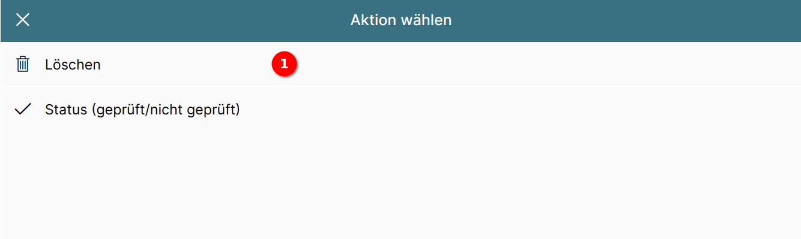

# Direktaktionen einstellen

Ein Eintrag in einer Liste kann über sogenannte "Direktaktionen" verfügen.

Diese bieten einen Schnellzugriff auf Standardaktionen wie "Bearbeiten" oder "Löschen" für den Listeneintrag, so dass nicht erst der Datensatz geöffnet werden muss.

Zusätzlich kann das Modul, für das die Liste definiert ist, auch eigene Direktaktionen anbieten. Bei Aufgaben gibt es z.B. "Auf erledigt setzen", bei Rechnungen "Auf geprüft setzen", bei Dokumenten "Herunterladen", usw.

## Beispiele

{ align=right }

Dokumentenliste mit immer sichtbaren Direktaktionen für Herunterladen und Löschen.

{ align=right }

Aufgabenliste mit Direktaktionen, die beim Überfahren mit der Maus (oder einer Wischgeste bei Touchgeräten) eingeblendet werden.

Diese Liste hat drei Direktaktionen, um eine Aufgabe auf erledigt zu setzen, sie zu bearbeiten und zu löschen.

## Der Direktaktionen-Abschnitt im Editor

{ align=right }

In unserem Beispiel zeigt der Direktaktionen-Abschnitt an, dass es eine Direktaktion für die Listeneinträge gibt, nämlich "Bearbeiten".

Durch Betätigen der Schaltfläche "Bearbeiten" 1 wird diese Direktaktion zur Bearbeitung markiert.

## Eine neue Direktaktion anlegen

{ align=right }

Durch Betätigen der Schaltfläche "+ Neue Aktion" 1 öffnet sich ein Popup, in dem der Typ der Direktaktion ausgewählt werden kann.

In dem Popup werden alle Direktaktionen für diese Liste angezeigt, die noch nicht aktiv sind.

Im Beispiel wird durch Klick auf 1 "Löschen" als neue Direktaktion ausgewählt.

{ align=right }

Die neue Direktaktion "Löschen" wird im Direktaktionen-Abschnitt angezeigt.

## Eine Direktaktion bearbeiten

{ align=right }

Die aktive Direktaktion wird durch einen Haken auf der rechten Seite gekennzeichnet.

Über die Schaltflächen mit den Pfeilen hoch/runter 1 lässt sich die Position der Direktaktion ändern, wenn es mehrere Direktaktionen gibt.

Mit dem Mülleimer 2 wird die Direktaktion gelöscht.

## Position der Direktaktionen festlegen

{ align=right }

Über die Positionsauswahl wird die Sichtbarkeit und Position der Direktaktionen festgelegt.

### Beispiele für die Positionierung

|                        |                                                     |
| ---------------------- | --------------------------------------------------- |
| **Buttons rechts** Immer sichtbar.   |  |
| **Buttons unterhalb** Immer sichtbar.           |                  |
| **Beim Überfahren** Anzeige bei Überfahren mit der Maus (oder einer Wischgeste bei Touchgeräten). |   |
