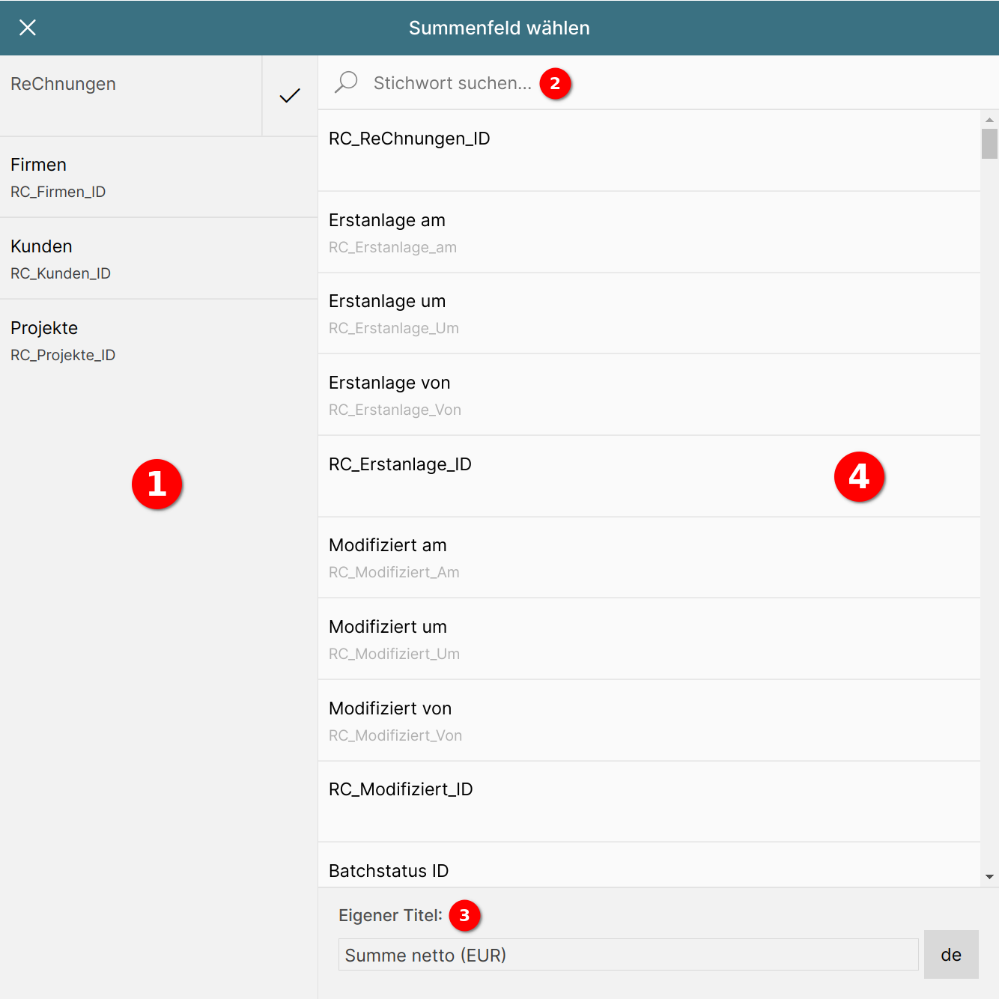

# Datenbankfeld für die Gesamtsumme auswählen

Das Popup zur Auswahl des Datenbankfelds für die Gesamtsumme teilt sich in drei Bereiche auf:

1 **Modulauswahl**

Die Summierung kann nicht nur nach den Datenbankfeldern des Listenmoduls erfolgen, sondern auch nach Feldern aus anderen Modulen. Alle Module, die mit dem Listenmodul verknüpft sind, tauchen in der Modulauswahl auf.

Ein Klick auf ein Modul lädt dessen Datenbankfelder in der Datenbankfeldliste.

2 **Stichwortsuche nach Datenbankfeldname**

{ align=right }

Mit der Stichwortsuche wird eine unscharfe Suche nach dem Datenbankfeldname und dem vom Benutzer vergebenen Feldnamen durchgeführt.

Durch Eingabe von "summe" in das Suchfeld und Betätigen der Tab- oder Eingabetaste werden für das Modul "Rechnungen" alle Felder gefunden, in denen dieses Wort vorkommt.

3 **Eigenen Namen für das Feld vergeben**

Über das Eingabefeld "Eigener Titel" kann ein eigener Name speziell für dieses Summierungsfeld vergeben werden, der nur in dieser Liste verwendet wird.

Durch Betätigen der Schaltfläche "de" rechts neben dem Eingabfeld lassen sich Übersetzungstexte für den eigenen Namen vergeben.

4 **Datenbankfeldliste**

In der Datenbankfeldliste tauchen alle Felder des in der Modulauswahl aktiven Moduls auf.

{ align=right }

Durch Klick auf ein Feld wird dieses markiert 1 und es erscheint die Schaltfläche "Übernehmen" in der Popup-Titelleiste 2.

Durch Klick auf diese Schaltfläche wird das Datenbankfeld als Summierungsfeld gesetzt und das Popup geschlossen.

Um die Änderungen nicht zu übernehmen, betätigen Sie die Schaltfläche "Abbrechen" 3.

