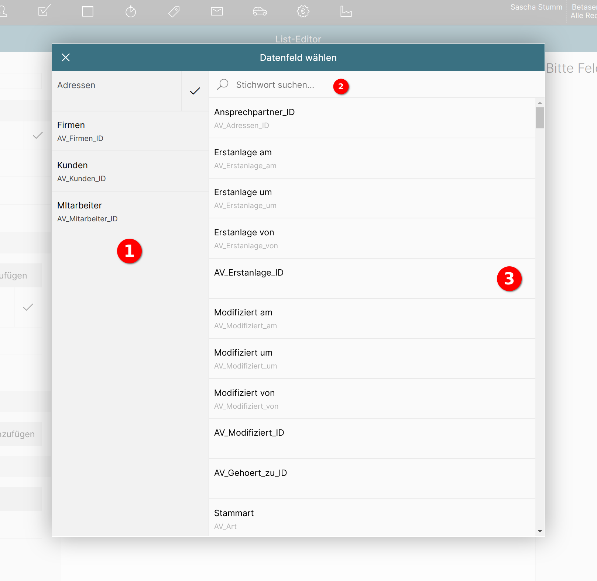

# Datenbankfeld für die Sortierung auswählen

Das Popup zur Auswahl des Datenbankfelds für die Sortierung teilt sich in drei Bereiche auf:

1 **Modulauswahl**

Die Sortierung kann nicht nur nach den Datenbankfeldern des Listenmoduls erfolgen, sondern auch nach Feldern aus anderen Modulen. Alle Module, die mit dem Listenmodul verknüpft sind, tauchen in der Modulauswahl auf.

Ein Klick auf ein Modul lädt dessen Datenbankfelder in der Datenbankfeldliste.

2 **Stichwortsuche nach Datenbankfeldname**

{ align=right }

Mit der Stichwortsuche wird eine unscharfe Suche nach dem Datenbankfeldname und dem vom Benutzer vergebenen Feldnamen durchgeführt.

Durch Eingabe von "modi" in das Suchfeld und Betätigen der Tab- oder Eingabetaste werden für das Modul "Adressen" folgende Felder gefunden:

* Modifiziert am
* Modifiziert um
* Modifiziert von
* AV_Modifiziert_ID

3 **Datenbankfeldliste**

In der Datenbankfeldliste tauchen alle Felder des in der Modulauswahl aktiven Moduls auf.

{ align=right }

Durch Klick auf ein Feld wird dieses markiert 1 und es erscheint die Schaltfläche "Übernehmen" in der Popup-Titelleiste 2.

Durch Klick auf diese Schaltfläche wird das Datenbankfeld als Sortierfeld gesetzt und das Popup geschlossen.

Um die Änderungen nicht zu übernehmen, betätigen Sie die Schaltfläche "Abbrechen" 3.

