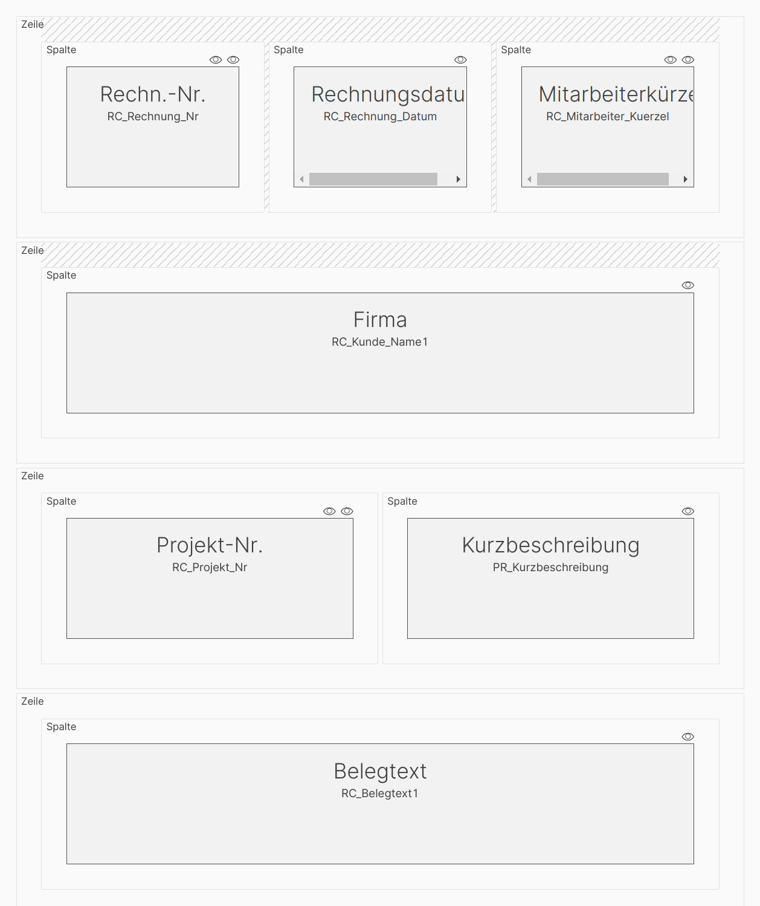
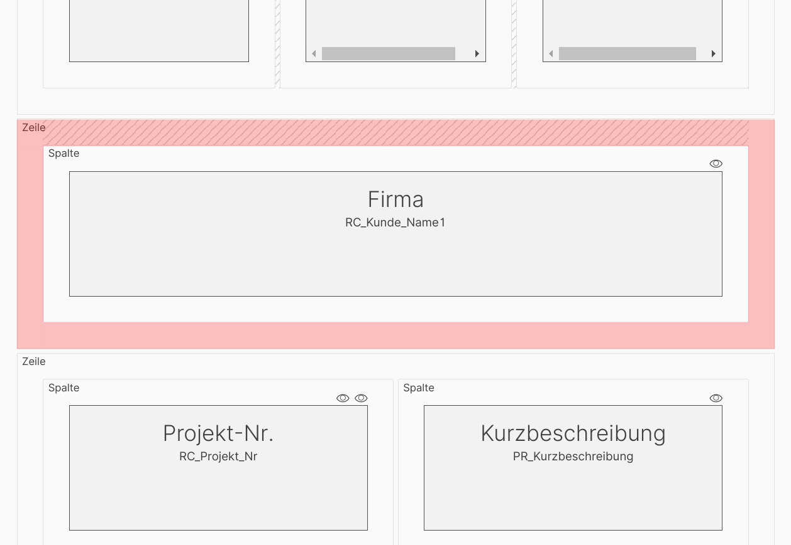
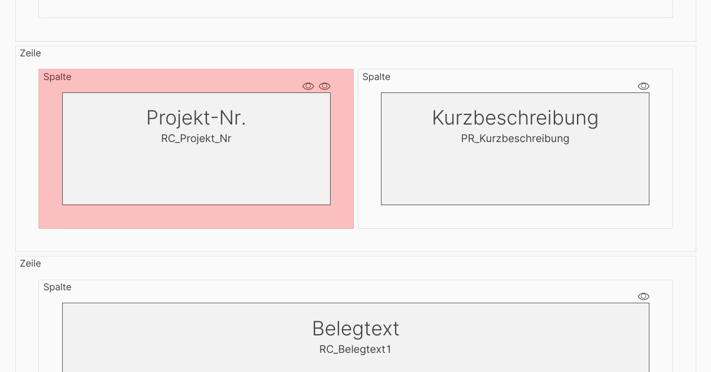
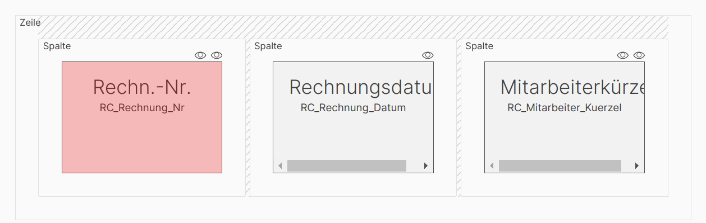
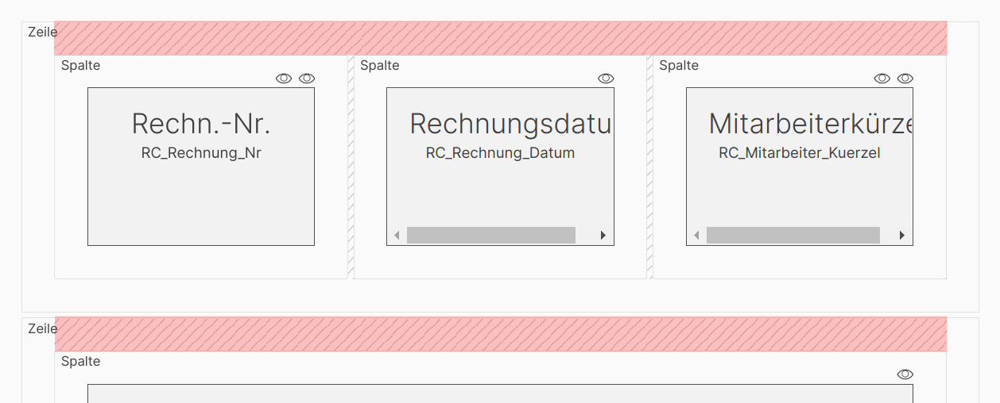
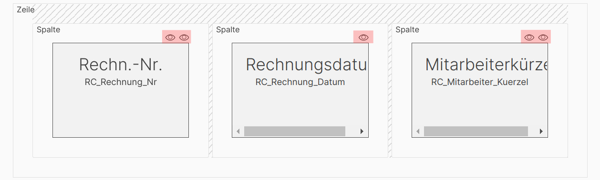

# Darstellung der Listenstruktur

Listen setzen sich in der ConAktiv® Mobile4 zusammen aus Zeilen, Spalten und Elementen.

Dieser Aufbau wird in der Listenstrukturansicht schematisch dargestellt.

Durch Auswahl einer Zeile, Spalte oder eines Elements werden die Bearbeitungsoptionen dafür im Detailbearbeitungsbereich des Editors angezeigt.

## Auswahl einer Zeile

Um eine Zeile auszuwählen, klicken Sie irgendwo in die Fläche der Zeile (rot markierter Bereich im Bildschirmfoto).

## Auswahl einer Spalte

Um eine Spalte auszuwählen, klicken Sie irgendwo in die Fläche der Spalte (rot markierter Bereich im Bildschirmfoto).

## Auswahl eines Elements

Um ein Element auszuwählen, klicken Sie irgendwo in die Fläche des Elements (rot markierter Bereich im Bildschirmfoto).

## Grafische Hinweise auf Einstellungen

An manchen Stellen finden sich grafische Hinweise auf Einstellungen für die Zeile, Spalte oder das Element.

### Zeilenabstände

Ist für eine Zeile ein Abstand nach oben oder unten definiert, wird das durch eine Schraffierung an der entsprechenden Stelle gekennzeichnet (siehe rote Unterlegungen im Bildschirmfoto).

### Darstellungsoptionen für Elemente

Wenn ein Element eine oder mehrere Darstellungsoptionen hat, wird über dem Element eine enstprechende Anzahl an Augen angezeigt (siehe rote Unterlegungen im Bildschirmfoto).
