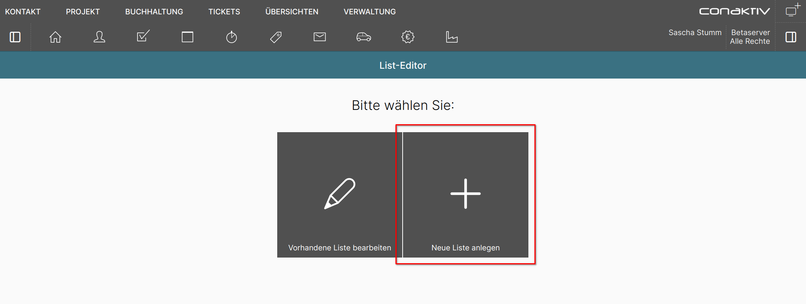
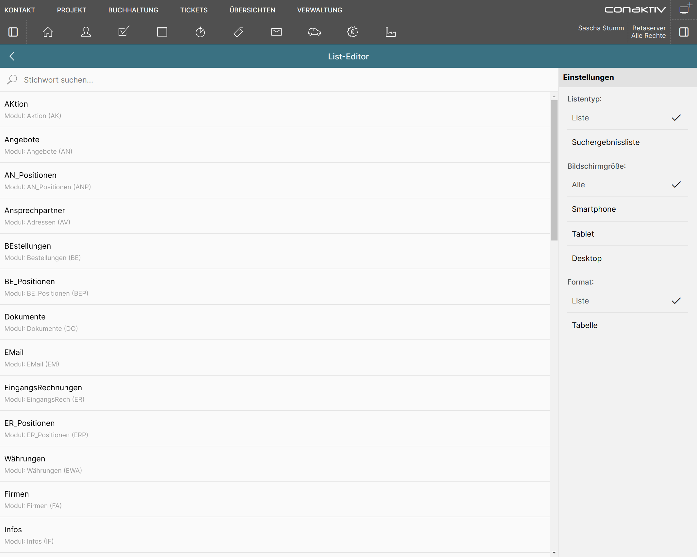
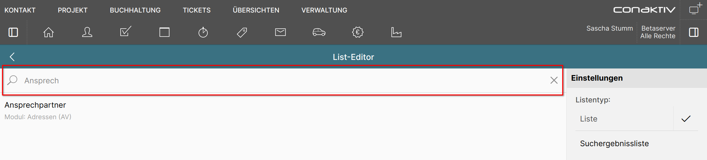
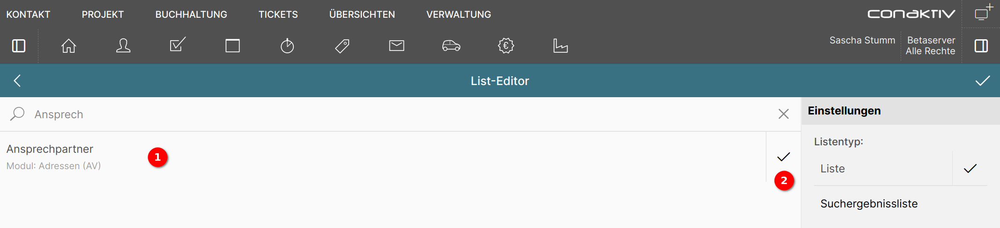
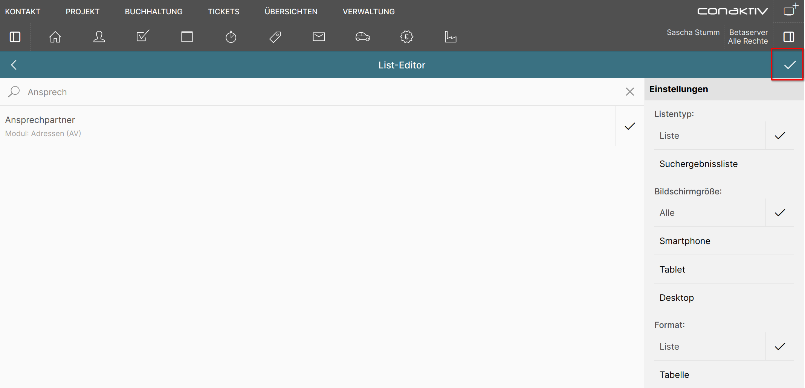

# Eine neue Liste anlegen

Betätigen Sie die Schaltfläche "Neue Liste anlegen", um zum Auswahlbildschirm für neue Listen zu gelangen.

Auf dem Auswahlbildschirm wird festgelegt, für welches Modul die neue Liste gelten soll, für welche Bildschirmgröße sie geeignet ist und in welchem Format sie dargestellt werden soll.

## Modulauswahl mit Schnellsuche eingrenzen

Die Liste der zur Auswahl stehenden Module kann sehr lang sein. Über die Schnellsuche kann die Anzahl der Module eingegrenzt werden.

Geben Sie in das Suchfeld z.B. "Ansprech" ein und drücken die Tab- oder Eingabetaste, verkürzt sich die Liste auf das Modul "Ansprechpartner".

Die Suche arbeitet also unscharf, d.h. es genügt, einen Teil eines Modulnamens einzugeben.

## Modul auswählen

Klicken Sie in der Liste auf das Modul "Ansprechpartner" 1.

Dadurch erscheint ein Haken rechts neben dem Modulnamen 2 der signalisiert, dass das Modul ausgewählt ist.

## Listentyp festlegen

{ align=right }

Es gibt in der ConAktiv® Mobile4 zwei Typen von Listen:

1. Listen

    (Bildschirm-) Listen werden auf Seiten angezeigt. Sie können in Form von Listen (wie man sie von Smartphones kennt) und Tabellen dargestellt werden.

2. Suchergebnislisten

    Diese werden in Popupfenstern verwendet. In der Standardauslieferung zeigen Sie meist reduzierte Informationen an. Auch Suchergebnislisten können in Form von Listen und Tabellen dargestellt werden.

Die Typen von Listen werden in der [Einleitung zum Listen-Editor](../index.md) veranschaulicht.

## Bildschirmgröße festlegen

{ align=right }

Die ConAktiv® Mobile4 weiß, welche Anzeigegröße ihr zur Verfügung steht.

Wird die Bildschirmgröße "Alle" gewählt, wird die Liste unabhängig von der Anzeigegröße benutzt.

Eine andere Auswahl führt dazu, dass die Liste nur herangezogen wird, wenn ihre gewählte Bildschirmgröße zur Anzeigegröße der ConAktiv® Mobile4 passt.

## Format festlegen

{ align=right }

Das Format bestimmt, wie die Liste aussieht.

1. Liste

    Eine Bildschirmliste orientiert sich in ihrer Gestaltung an Listen, wie man sie von Smartphones her kennt.

2. Tabelle

    Die Tabelle lehnt sich an die Darstellung einer Tabellenkalkulation an.

Die Formate von Listen werden in der [Einleitung zum Listen-Editor](../index.md) veranschaulicht.

## Liste erstellen

Wenn alle Einstellungen getroffen sind, klicken Sie in der türkis hinterlegten Werkzeugleiste auf den Haken ganz rechts, um die Liste zu erstellen.

Damit wird die Vorlage für das Modul und die Einstellungen geladen und Sie gelangen in den Bearbeitungsmodus.
