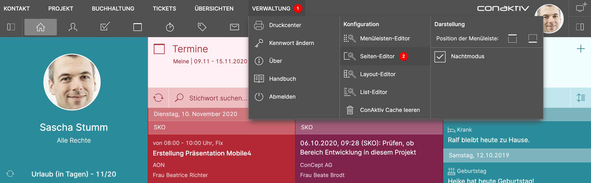
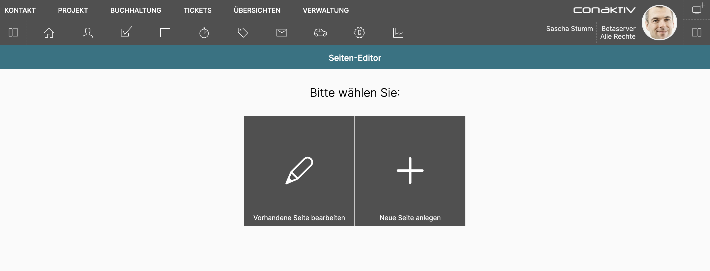

# Der ConAktiv® Mobile4 Seiten-Editor

## Was ist eine Seite?

Eine ConAktiv® Mobile4 Seite kann verschiedene Objekte, bzw. Elemente, enthalten. Dies können Listen, Diagramme, Benutzerinformationen, Kalender usw. sein.

Mit dem Seiten-Editor können neue Seiten angelegt und mit diesen Elementen ausgestaltet werden.

## Voraussetzungen für den Aufruf

Um den Seiten-Editor in der ConAktiv® Mobile4 nutzen zu können, sind folgende Voraussetzungen notwendig:

### Rechte

{ align=right }

Der Zugriff auf den Seiten-Editor wird über die Rechte für den Listen-Editor gesteuert.

Es muss das Recht "Listeditor" -> "Detailkonfiguration erlauben" für den Benutzer oder die Gruppe gesetzt sein.

### Lizenz

Der Benutzer muss entweder über eine Komplettlizenz oder die Rolle "Administrator" verfügen.

## Aufruf des Editors

Über das Menü "Verwaltung" 1 wird der Seiten-Editor 2 aufgerufen.

## Neu anlegen oder bearbeiten?

Auf der Startseite des Seiten-Editors können Sie wählen, ob eine neue Seite angelegt oder eine vorhandene bearbeitet werden soll.

!!! info "Hinweis"
    Die ConAktiv® Mobile4 wird mit einer Vielzahl an Seiten ausgeliefert. Diese sind allerdings nicht in der Datenbank hinterlegt, sondern kommen aus dem Dateisystem des Servers. Damit sind diese Listen nicht unter "Vorhandene Seite bearbeiten" sichtbar.

Unter "Vorhandene Seite bearbeiten" tauchen nur solche Seiten auf, die Sie selbst angelegt haben.

Wenn Sie eine neue Seite anlegen wollen, bedeutet das aber nicht, bei Null zu starten. Es lässt sich nachträglich eine beliebige Vorlage laden, die als Ausgangsbasis verwendet werden kann.
