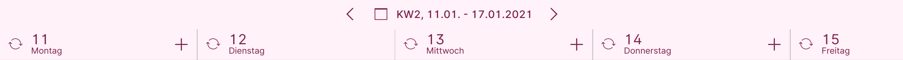
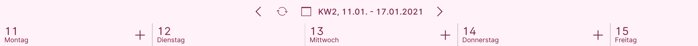

# Datum mit Blätterfunktion

## Funktion

{ align=right }

Das Element "Datum mit Blätterfunktion" stellt ein Element mit der Anzeige des aktuellen Datums, einer Schaltfläche zum Aufklappen eines Kalenders sowie Pfeilen zum Vor- und Zurückblättern zur Verfügung.

Andere Elemente der Seite können eine Abhängigkeit zu dem Element "Datum mit Blätterfunktion" definieren, so dass die Auswahl eines Datums zu diesen anderen Elementen gesendet wird.

{ align=right }

*Beispiel mit aufgeklapptem Kalender*

## Konfiguration

{ align=right }

Folgende Einstellungen stehen zur Verfügung:

### 1 Rahmen zeichnen

{ align=right }

Ist die Einstellung "Rahmen zeichnen" aktiv, wird um die Bedienelemente ein dünner Rahmen gezeichnet.

**Beispiele:**

{ align=right }

*"Rahmen zeichnen" aktiv*

{ align=right }

*"Rahmen zeichnen" inaktiv*

### 2 Listeneinträge einfärben

{ align=right }

Durch Setzen des Hakens bei "Listeneinträge einfärben" kann die Hintergrundfarbe des Elements geändert werden.

**Beispiele**

{ align=right }

*"Einfärben" inaktiv*

*Hier wird die Hintergrundfarbe der Seite genutzt*

### 3 Farbe der Seite verwenden

{ align=right }

Ist die Option "Einfärben" aktiv, kann man bestimmen, welche Farbe als Hintergrundfarbe genutzt werden soll

{ align=right }

*"Einfärben" mit "Farbe der Seite verwenden"*

{ align=right }

Wird der Haken bei "Farbe der Seite verwenden" entfernt, erscheint die Schaltfläche "Element einfärben".

Durch Betätigen des Schalters "Farbe" 1 öffnet sich ein Farbauswahldialog

{ align=right }

*"Einfärben" mit eigener Farbe*

### 4 Kalender-Auswahl aktivieren

{ align=right }

Um dem Benutzer größere Datumsprünge zu ermöglichen, kann eine Kalenderschaltfläche durch Setzen des Hakens bei "Kalender-Auswahl aktivieren" angezeigt werden.

**Beispiele**

{ align=right }

*Kalenderauswahl aktiv*

{ align=right }

*Kalenderauswahl inaktiv*

### 5 "Neu-Laden"-Button anzeigen

{ align=right }

Wenn ein oder mehrere Listenelemente an das Element "Datum mit Blätterfunktion" angebunden sind, kann es sinnvoll sein, die Funktion "Liste neu laden" statt bei jeder Liste einmal am Element "Datum mit Blätterfunktion" anzuzeigen.

**Beispiele**

**Im Terminkalender (Meine) hören alle Listen auf das Element "Datum mit Blätterfunktion".**

*Option "Neu-Laden"-Button anzeigen im Element "Datum mit Blätterfunktion" ist nicht aktiv. Jeder Tag zeigt einen eigenen "Neu-Laden"-Button an.*

*Option "Neu-Laden"-Button anzeigen im Element "Datum mit Blätterfunktion" ist aktiv. Der "Neu-Laden"-Button wird nur am Element "Datum mit Blätterfunktion" angezeigt.*

!!! info "Hinweis"
    Zusätzlich ist bei den Listen eine Abhängigkeit "Liste neu laden" auf das Element "Datum mit Blätterfunktion" gesetzt.
