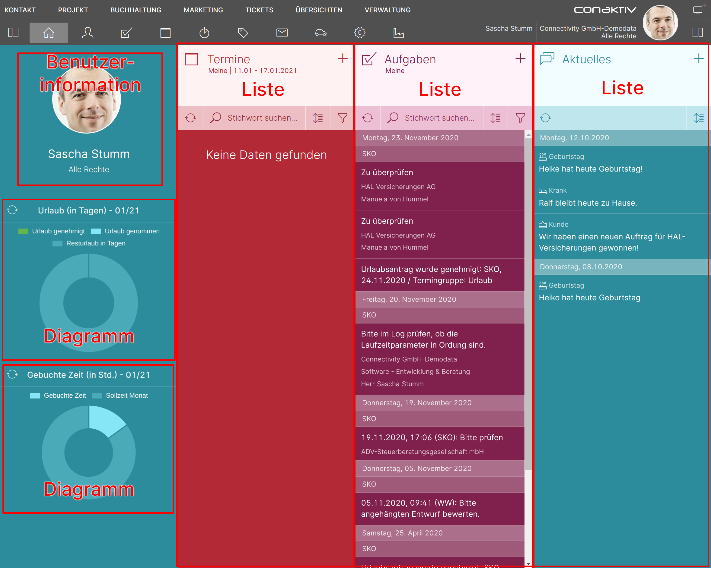

# Elemente bearbeiten

## Was sind Elemente?

Mit Elementen werden ConAktiv® Mobile4 Seiten erst lebendig.

Elemente umfassen Listen, Eingabemasken, Kalender, Webseitendarstellung und vieles mehr.

Mit Ihnen können Informationen dargestellt werden und sie bieten dem Anwender eine Fülle an Interaktionsmöglichkeiten.

*Beispiel für Elemente auf der ConAktiv® Mobile4 Startseite*

Darüber hinaus können Elemente miteinander verbunden werden. Dies geschieht durch die Auswahl sogenannter "Abhängigkeiten".

## Element einbinden

{ align=right }

Das Einbinden eines Elements umfasst folgende Schritte:

1. Auswahl des Elementtyps

2. Vergabe eines Titels (optional)

3. Konfiguration des Elements

4. Konfiguration der Abhängigkeiten

## Elementtyp auswählen

{ align=right }

Die Auswahl des Elementtyps erfolgt über das Auswahlfeld "Typ".

Nach dem Betätigen des Feldes öffnet sich ein Popupfenster, in dem der gewünschte Elementtyp gewählt werden kann.

## Titel vergeben

{ align=right }

Im Eingabefeld "Eigener Titel:" 1 kann eine eigene Beschriftung für das Element vergeben werden (dies wird nicht von allen Elementen unterstützt).

Um die Beschriftung für mehrere Sprachen festzulegen, muss die Schaltfläche "de" 2 betätigt werden.

Daraufhin öffnet sich das Übersetzungstexte-Popupfenster:

Über die Schaltflächen "en" und "fr" 1 können Übersetzungstexte für englisch und französisch angelegt werden.

In das Texteingabefeld 2 wird der Seitenname eingegeben.

Um die Eingaben zu übernehmen, betätigen Sie die Schaltfläche für "Übernehmen" 3.

Wollen Sie abbrechen ohne die Änderungen zu übernehmen, betätigen Sie die Schaltfläche für "Abbrechen" 4.

## Element konfigurieren

Aufgrund der Vielzahl an zur Verfügung stehenden Elementen wird deren Konfiguration auf jeweils eigenen Seiten beschrieben.

- [Kalender](./element-kalender/index.md)
- [Diagramm](./element-diagramm/index.md)
- [Datum mit Blätterfunktion](./element-tagesauswahl/index.md)
- [Wochenanzeige mit Blätterfunktion](./element-wochenauswahl/index.md)
- [Monatsanzeige mit Blätterfunktion](./element-monatsauswahl/index.md)
- [HTML Text](./element-htmltext/index.md)
- [Zeitbuchungsinformationen](./element-zeitbuchungsinformationen/index.md)
- [Urlaub Informationen](./element-urlaub-informationen/index.md)
- [Leeres Element](./element-leer/index.md)
- [Abmelden](./element-abmelden/index.md)
- [Tabelleneditor](./element-tabelleneditor/index.md)
- [Benutzer Informationen](./element-benutzer-informationen/index.md)
- [Webseite](./element-webseite/index.md)
- [Layout](./element-layout/index.md)
- [Liste](./element-liste/index.md)

## Elemente miteinander verknüpfen

Über die Definition von Abhängigkeiten 4 werden Elemente miteinander verknüpft.
