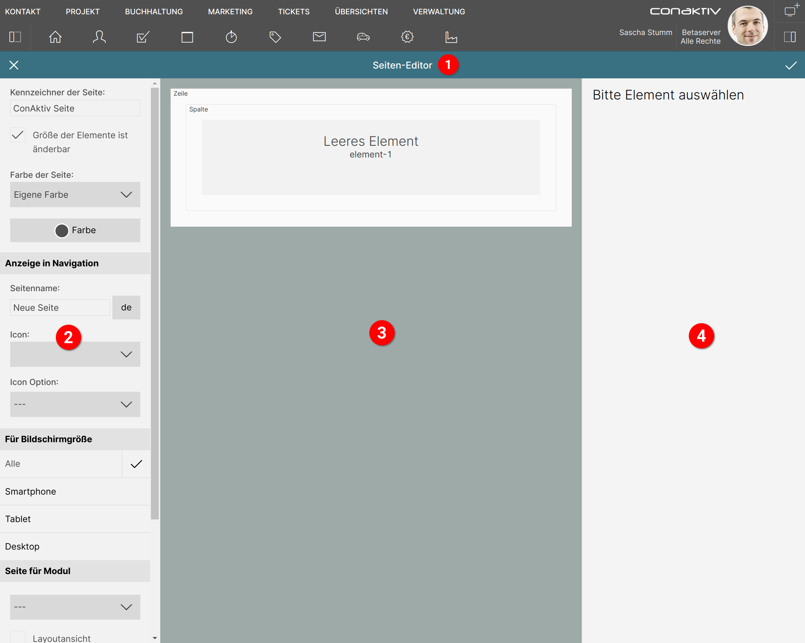

# Seite bearbeiten

Nach dem Erstellen einer neuen oder dem Laden einer vorhanden Seite landet man im Bildschirm für die Bearbeitung einer Seite.

Dieser ist in vier Bereiche unterteilt:

1 [Werkzeugleiste](./werkzeugleiste/index.md)

Hier kann die Seite gespeichert werden.

2 [Konfiguration der Seite](./konfiguration/index.md)

Farbauswahl, Anzeige in der Navigation, Bildschirmgröße, Modulzuordnung und Aktionen (Export, Import, Löschen) finden sich unter diesem Punkt.

3 [Darstellung der Seitenstruktur](./seitenstruktur/index.md)

Die schematische Darstellung der Seitenstruktur mit Auswahl des zu bearbeitenden Elements.

4 Bearbeitungsansichten

Zeigt Einstellungen für die ausgewählte [Zeile](./bearbeitungsansichten/zeilen.md), [Spalte](./bearbeitungsansichten/spalten.md) oder das ausgewählte [Element](./bearbeitungsansichten/elemente.md).
