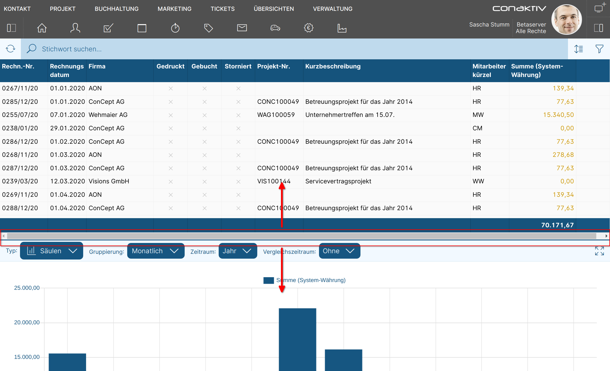
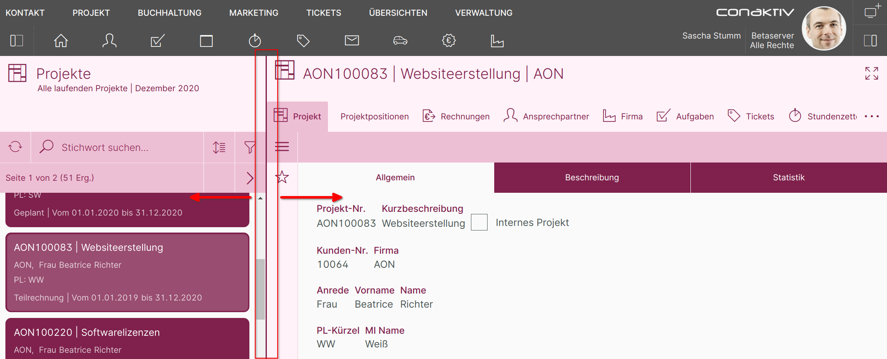
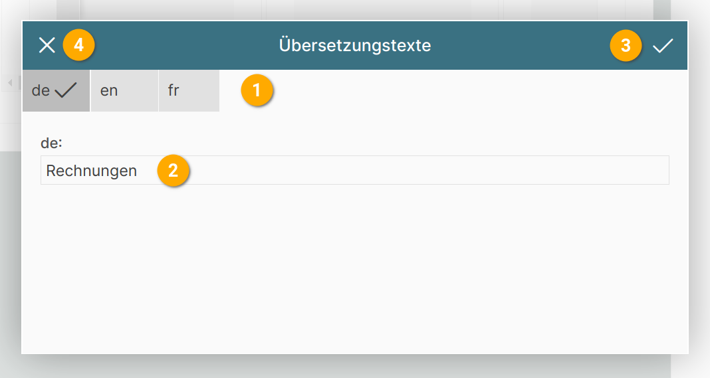

# Konfiguration der Seite

## Kennzeichner für die Seite vergeben

{ align=right }

Um die Seite später im Seiten-Editor oder ConAktiv® Client wieder finden zu können, ist es sinnvoll, einen sprechenden Name zu vergeben. Dies geschieht im Feld "Kennzeichner der Seite".

Der Kennzeichner muss eindeutig sein; gibt es schon eine Seite mit diesem Kennzeichner, wird der eingegebene Kennzeichner automatisch geändert.

## Änderbarkeit der Größe der Elemente

{ align=right }

Befinden sich mehrere Element auf der Seite, kann eingestellt werden, ob deren Größe über einen sogenannten "Splitter" änderbar ist.

*Beispiel für horizontalen Splitter zwischen Elementen.*

Hier kann das Größenverhältnis zwischen der Liste und dem Diagramm über Ziehen der blauen Linie geändert werden.

*Beispiel für vertikalen Splitter zwischen Elementen.*

Hier kann das Größenverhältnis zwischen der Liste und dem Datensatz über Ziehen der dunklen Linie geändert werden.

## Farbe der Seite

{ align=right }

Die Farbe einer Seite kann sich auf die auf der Seite befindlichen Elemente auswirken (sofern diese keine eigene Farbe definieren).

Es gibt mehrere Möglichkeiten, die Farbe einer Seite einzustellen.

### Eigene Farbe

{ align=right }

Mit "eigene Farbe" wird eine Farbe speziell für diese eine Seite festgelegt.

Durch Betätigen der Schaltfläche "Farbe" 1 wird ein Farbauswahlfenster geöffnet.

{ align=right }

Die aktuell gewählte Farbe wird unter "Gewählte Farbe" 1 dargestellt.

Deren RGB (Rot/Grün/Blau)-Werte sind darunter zu sehen 2 und lassen sich auch über die Texteingabefelder genau einstellen.

Um eine vordefinierte Farbe aus dem ConAktiv® Mobile4 Farbschema zu wählen, klicken Sie auf eine Farbe unter "Systemfarben" 3.

Um die Farbänderungen zu übernehmen, betätigen Sie den Haken rechts oben im Fenster 4.

Um die Änderungen zu verwerfen, klicken Sie auf das "X" links oben im Fenster 5.

### Gemäß Modul

Über den Menüleisten-Editor lassen sich Farben definieren, denen ganze Module zugeordnet werden können.

Wird bei der Seite die Einstellung "gemäß Modul" gewählt, passt sich die Farbe der Seite an die im Menüleisten-Editor gewählte Farbe für das Modul an.

Das Modul wird auf der Seite über die Einstellung "Seite für Modul" zugeordnet.

### Seitengruppe

Über den Menüleisten-Editor lassen sich Farben definieren, denen eine Seitengruppe zugeordnet werden kann.

Wird bei der Seite die Einstellung "Seitengruppe" (1 - 10) gewählt, passt sich die Farbe der Seite an die im Menüleisten-Editor gewählte Farbe für diese Seitengruppe an.

## Anzeige in Navigation

{ align=right }

Hier wird festgelegt, wie die Seite in der ConAktiv® Mobile4 Menüleiste dargestellt wird.

### 1 Seitenname

{ align=right }

Der Seitenname ist mehrsprachig festlegbar und taucht als Bezeichner für die Seite in der Menüleiste auf.

Er kann direkt in das Texteingabefeld 1 eingegeben werden.

Um den Seitenname für mehrere Sprachen festzulegen, muss die Schaltfläche "de" 2 betätigt werden.

Daraufhin öffnet sich das Übersetzungstexte-Popupfenster:

Über die Schaltflächen "en" und "fr" 2 können Übersetzungstexte für englisch und französisch angelegt werden.

In das Texteingabefeld 2 wird der Seitenname eingegeben.

Um die Eingaben zu übernehmen, betätigen Sie die Schaltfläche für "Übernehmen" 3.

Wollen Sie abbrechen ohne die Änderungen zu übernehmen, betätigen Sie die Schaltfläche für "Abbrechen" 4.

### 2 Icon

Über die Schaltfläche "Icon" lässt sich aus einer vorgegebenen Auswahl ein Icon für die Seite wählen.

{ align=right }

Im Popupfenster wird durch Klick auf eines der Icons das entsprechende Icon ausgewählt 1.

Um das Popupfenster zu schließen, betätigen Sie die "Abbrechen"-Schaltfläche 2.

### 3 Icon Option

Mit "Icon Option" kann das zuvor gewählte Icon optisch ergänzt werden.

{ align=right }

Für Icons gibt es momentan die Option "Datum in Icon anzeigen" 1. Diese wird vor allem in Zusammenhang mit den Seiten für Termine verwendet, da sie das aktuelle Tagesdatum zentriert im Icon einblendet.

Um das Popupfenster zu schließen, betätigen Sie die "Abbrechen"-Schaltfläche 2.

{ align=right }
*Beispiel für "Datum in Icon anzeigen"*

## Bildschirmgröße

{ align=right }

Soll die Seite für eine bestimmte Bildschirmgröße gelten, kann man diese hier einstellen.

Die Einstellung wirkt sich auf zwei Dinge aus:

1. Die Anzeige der Seite im ConAktiv® Client [bei der Zuordnung der Seite zu einem Modul](../../seite-zuordnen/index.md#matrix-zur-benennung-von-bereichen-fur-seiten).

2. Ist die Seite zugeordnet, wird sie bei der Anmeldung in der Mobile4 abhängig von der Bildschirmgröße des Ausgabegeräts bzw. des Browserfensters sowie dieser Einstellung herangezogen.

## Seite für Modul

{ align=right }

Wenn die Seite über den ConAktiv® Client einem Benutzer oder einer Gruppe [für ein bestimmtes Modul zuweisbar sein soll](../../seite-zuordnen/index.md), dann muss das gewünschte Modul hier eingestellt werden.

Dies geschieht durch Betätigen der Schaltfläche 1.

### Modul auswählen

{ align=right }

Es öffnet sich ein Popupfenster, in dem durch Anklicken eines Modulnamens 1 das entsprechende Modul ausgewählt und das Popupfenster geschlossen wird.

Um den Vorgang abzubrechen genügt das Betätigen der Schließen-Schaltfläche 2 links oben im Popupfenster.

### Seite als Layoutansicht definieren

Soll die Seite für Eingabezwecke verfügbar sein, kann dies durch Ankreuzen von "Layoutansicht" 2 festgelegt werden.

