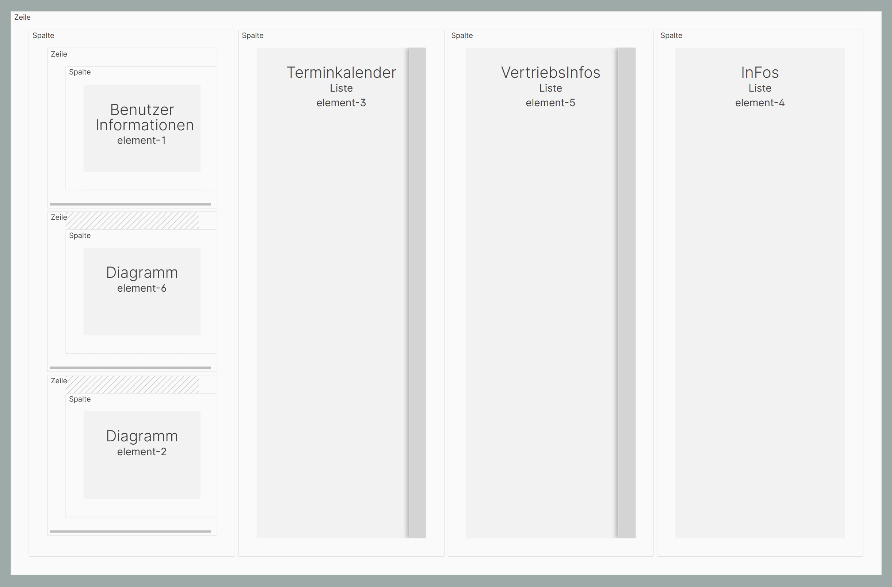
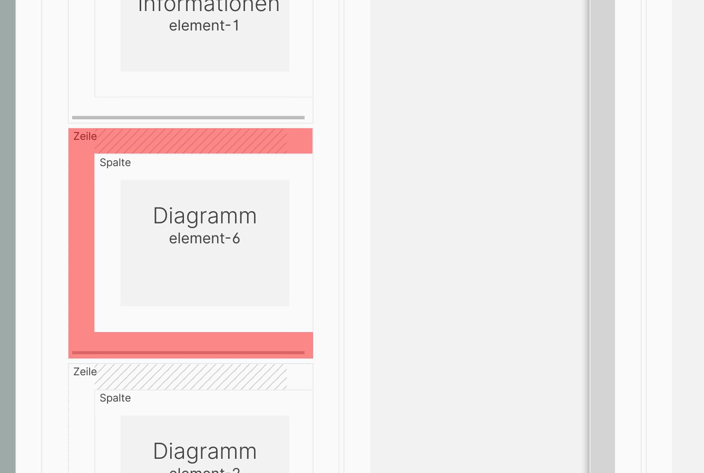
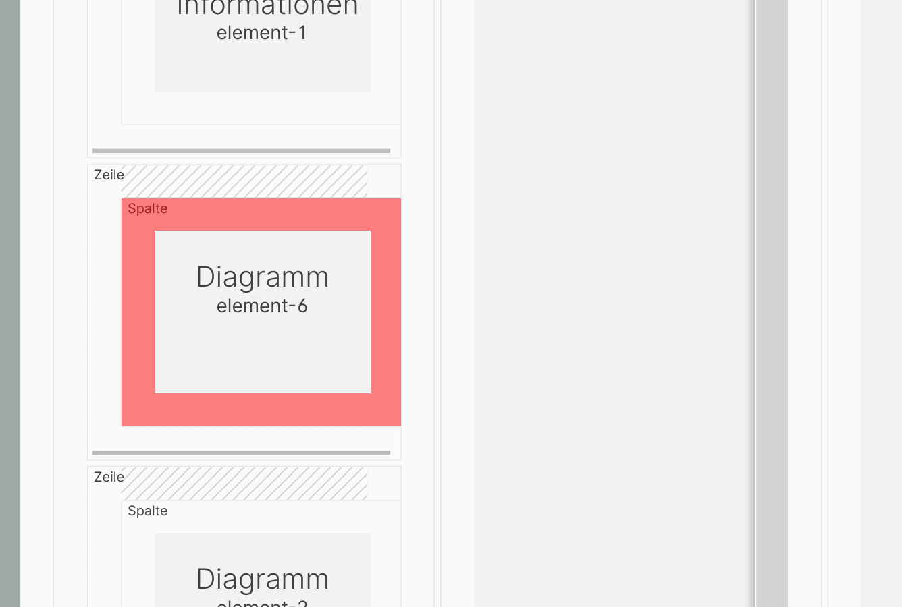
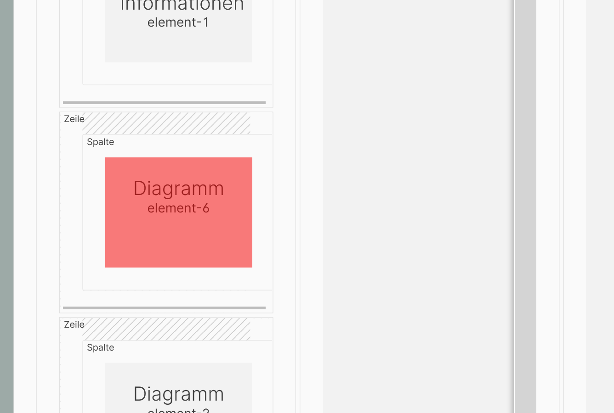
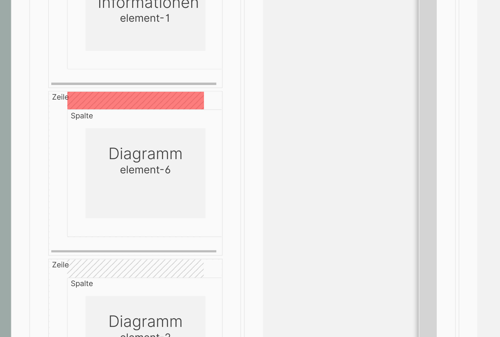
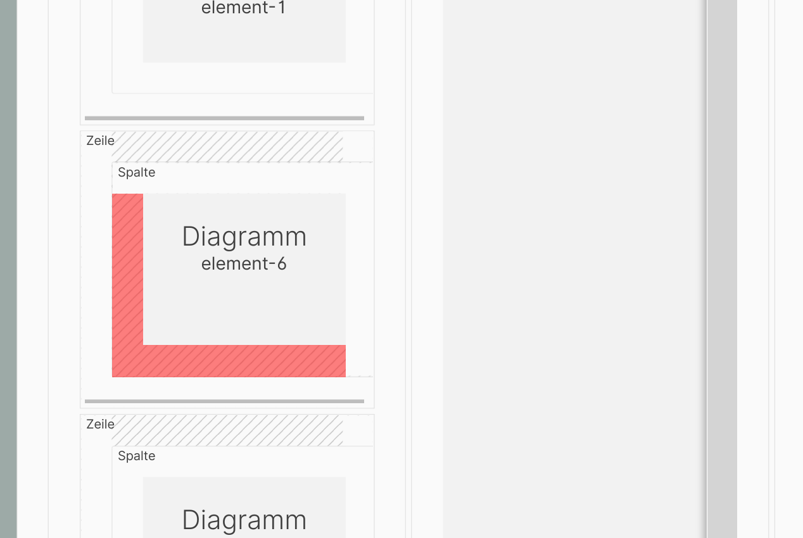

# Darstellung der Seitenstruktur

Seiten setzen sich in der ConAktiv® Mobile4 zusammen aus Zeilen, Spalten und Elementen.

Dieser Aufbau wird in der Seitenstrukturansicht schematisch dargestellt.

Durch Auswahl einer Zeile, Spalte oder eines Elements werden die Bearbeitungsoptionen dafür in der Bearbeitungsansicht des Editors angezeigt.

## Auswahl einer Zeile

Um eine Zeile auszuwählen, klicken Sie irgendwo in die Fläche der Zeile (rot markierter Bereich im Bildschirmfoto).

Nach der Auswahl [erscheint in der Bearbeitungsansicht die Maske für die Zeilenbearbeitung](../bearbeitungsansichten/zeilen.md).

## Auswahl einer Spalte

Um eine Spalte auszuwählen, klicken Sie irgendwo in die Fläche der Spalte (rot markierter Bereich im Bildschirmfoto).

Nach der Auswahl [erscheint in der Bearbeitungsansicht die Maske für die Spaltenbearbeitung](../bearbeitungsansichten/spalten.md).

## Auswahl eines Elements

Um ein Element auszuwählen, klicken Sie irgendwo in die Fläche des Elements (rot markierter Bereich im Bildschirmfoto).

Nach der Auswahl [erscheint in der Bearbeitungsansicht die Maske für die Bearbeitung des Elements](../bearbeitungsansichten/elemente.md).

## Grafische Hinweise auf Einstellungen

An manchen Stellen finden sich grafische Hinweise auf Einstellungen für die Zeile oder Spalte.

### Zeilenabstände

Ist für eine Zeile ein Abstand definiert, wird das durch eine Schraffierung an der entsprechenden Stelle gekennzeichnet (siehe rote Unterlegungen im Bildschirmfoto).

### Spaltenabstände

Ist für eine Spalte ein Abstand definiert, wird das durch eine Schraffierung an der entsprechenden Stelle gekennzeichnet (siehe rote Unterlegungen im Bildschirmfoto).
