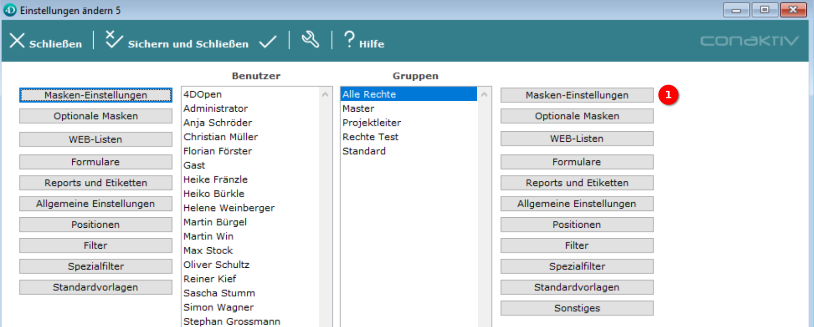

# Eine Seite einer Gruppe oder einem Benutzer zuordnen

Bevor eine neu angelegte Seite verwendet werden kann, muss sie einem Benutzer oder einer Gruppe zugeordnet werden.

## Einstellungen im ConAktiv® Client aufrufen

{ align=right }

Dies geschieht im ConAktiv® Client. Rufen Sie dort im Menü "Datei" 1 den Punkt "Einstellungen" 2 auf.

## Maskeneinstellungen aufrufen

Es öffnet sich ein Popup, in dem Sie den Benutzer oder die Gruppe auswählen, denen die Seite zugeordnet werden soll (im Beispiel ist die Gruppe "Alle Rechte" ausgewählt).

Nach der Auswahl gelangt man durch Betätigen der Schaltfläche "Masken-Einstellungen" 1 in den Bereich für die Maskeneinstellungen.

## Die Seite zuordnen

{ align=right }

Um z.B. eine neue Seite für Rechnungen zuzuordnen, navigiert man in der Modulliste zum Punkt "Rechnungen" 1.

Dort können nun, abhängig von der Konfiguration der Seite, verschiedene Bereiche auftauchen.

Angenommen, unsere Seite ist für die Bildschirmgröße "Desktop" konfiguriert und dient nicht als Layout, so erscheint sie unter dem Bereich "Seite Mobil Browser" 2.

Hier taucht unsere Seite "Rechnungen Mobile4" auf 3.

Um die Seite zuzuordnen, muss ein Doppelklick auf den Seitenname durchgeführt werden. Wenn der Seitenname in Fettschrift erscheint, ist die Zuordnung erfolgreich gewesen.

Um die Zuordnung zu speichern, betätigen Sie die Schaltfläche "Speichern und Schließen" oder "Speichern" 4.

Nachfolgend eine Matrix zur Benennung der Bereiche für die Zuordnung von Seiten unterhalb eines Moduls:

| Seite als Layout definiert | Bildschirmgröße | Benennung des Bereichs       |
|----------------------------|-----------------|------------------------------|
| Nein                       | Für alle        | Seite Mobil                  |
| Nein                       | Smartphone      | Seite Mobil Smartphone       |
| Nein                       | Tablet          | Seite Mobil Tablet           |
| Nein                       | Desktop         | Seite Mobil Browser          |
| Ja                         | Für alle        | Seite Mobil Input            |
| Ja                         | Smartphone      | Seite Mobil Smartphone Input |
| Ja                         | Tablet          | Seite Mobil Tablet Input     |
| Ja                         | Desktop         | Seite Mobil Browser Input    |

## Seite in der ConAktiv® Mobile4 anschauen

Um die zugeordnete Seite in der ConAktiv® Mobile4 anzuschauen, ist es erforderlich, sich einmal ab- und neu anzumelden.
