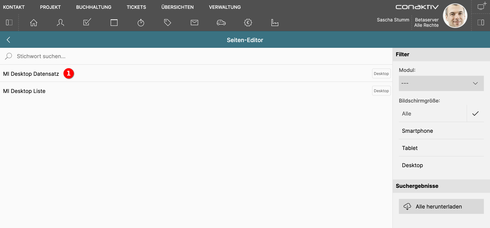

# Vorhandene Seite bearbeiten

Betätigen Sie die Schaltfläche "Vorhandene Seite bearbeiten", um zum Auswahlbildschirm für gespeicherte Seiten zu gelangen.

Auf dem Auswahlbildschirm werden die vorhandenen Seiten als Liste dargestellt. Außerdem gibt es Filter, mit denen diese Liste eingegrenzt werden kann.

## Modulauswahl mit Schnellsuche eingrenzen

{ align=right }

Um die Liste der vorhandenen Seiten einzugrenzen, können über den Modulfilter nur die Seiten angezeigt werden, die für das ausgewählte Modul als Standardseiten zugewiesen sind.

## Nach Bildschirmgröße filtern

{ align=right }

Auch nach der eingestellten Bildschirmgröße lässt sich die Liste der Seiten filtern.

## Alle Seiten exportieren

{ align=right }

Um die Definitionen aller in der Liste angezeigten Seiten herunterzuladen, genügt das Betätigen der Schaltfläche "Alle herunterladen".

{ align=right }

Je nach Browser kann hier eine Abfrage kommen, ob Sie diese Aktion erlauben wollen.

## Seite auswählen

Um eine Seite zum Bearbeiten auszuwählen, klicken Sie auf ihren Namen in der Liste 1. Dadurch gelangen Sie direkt [in die Bearbeitungsansicht](../seite-bearbeiten/index.md) für diese Seite.
